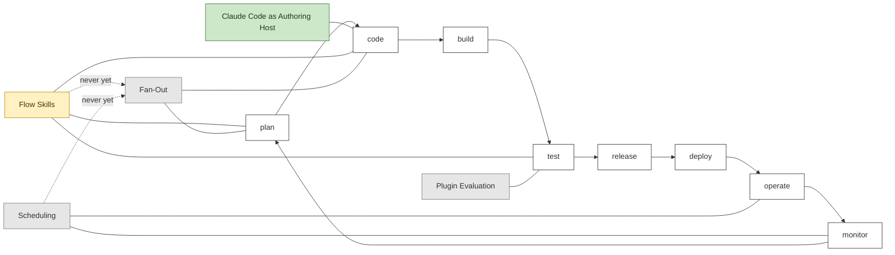

# AI Adoption Map

```meta
status: adopted
index: root
type: adoption-map
```

How this repository is itself built with AI. The assets it ships are the product and are
described in `.devbook/arc42` and `.devbook/domain`; what follows is only how the work gets
done here. The practices live one chapter each in the usage files; this file is the map.

## Files

Three files group the usages the way work happens for a repository whose product is
Markdown: an asset is written, a change is carried to a commit, and the result is checked. A
file is a reading unit and places nothing — each chapter says its own stages of the loop.

| File | Covers |
| --- | --- |
| [01-author.md](01-author.md) | Writing an asset in the host that loads it. |
| [02-deliver.md](02-deliver.md) | Carrying a change end to end: the flow skills, and the fan-out and scheduling lanes nothing here has used. |
| [03-verify.md](03-verify.md) | Checking an asset does what it says: plugin evaluation. |

## Adoption Picture

The eight stages of the loop, with each chapter attached to the stages its `stage` lists.
Shading is `status`. `build`, `release`, and `deploy` are empty because nothing here uses AI
there: the product is Markdown, so there is no build, and a release is a version bump a
person makes. Scheduling reaches fan-out and the `schedule-*` entry points, never a flow — the
missing edge to `Flow Skills` is the [decision](../arc42/adr/plugin-boundaries.md), not an
omission.



## How to Read It

`status` reuses the `tech/` ladder — `candidate`, `trial`, `adopted`, `hold`, `retired` — and
rates a way of working, not a tool. One chapter is `adopted` because it is how every change
here has been made. One is `trial` because everything it needs has landed and nothing has used
it. Three are `candidate` because the honest first use is somewhere else, or has not happened.
Each chapter's `date` is the day its current rating was set.

The picture above is the hand-drawn form of the loop a tool draws from the same fields: the
eight stages in loop order, and at each stage the chapters whose `stage` names it, shaded by
rating and carrying the `tech/` chapter their `depends-on` names. Two usages rest on the
Claude Code plugin API and one on the CLI; the other two name none, which is the normal case
for a practice.

To add a practice, write its `##` chapter in the file where it reads best, with `status`,
`type`, `stage`, `date`, and the four fields the chapter template asks for, then attach its
node to its stages in the picture above in the same change. To promote one, change the rating
and the `date` in the chapter and the `class` line here together, and say in the chapter what
the evidence was.
