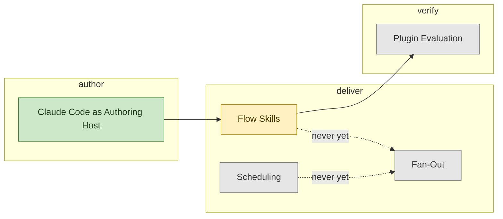

# AI Adoption Map

```meta
status: adopted
index: root
type: adoption-map
```

How this repository is itself built with AI. The assets it ships are the product and are
described in `.devbook/arc42` and `.devbook/domain`; what follows is only how the work gets
done here. The practices live one chapter each in the stage files; this file is the map.

## Stages

Three stages is the whole flow for a repository whose product is Markdown: an asset is
written, a change is carried to a commit, and the result is checked. A stage is added here in
the same change that adds its file.

| Stage | File | Covers |
| --- | --- | --- |
| author | [01-author.md](01-author.md) | Writing an asset in the host that loads it. |
| deliver | [02-deliver.md](02-deliver.md) | Carrying a change end to end: the flow skills, and the fan-out and scheduling lanes nothing here has used. |
| verify | [03-verify.md](03-verify.md) | Checking an asset does what it says: plugin evaluation. |

## Adoption Picture

Stages in flow order, with the chapters that sit at each one. Shading is `status`. Scheduling
reaches fan-out and the `schedule-*` entry points, never a flow — the missing edge to
`Flow Skills` is the
[decision](../arc42/adr/plugin-boundaries.md), not an
omission.



## How to Read It

`status` reuses the `tech/` ladder — `candidate`, `trial`, `adopted`, `hold`, `retired` — and
rates a way of working, not a tool. One chapter is `adopted` because it is how every change
here has been made. One is `trial` because everything it needs has landed and nothing has used
it. Three are `candidate` because the honest first use is somewhere else, or has not happened.

To add a practice, write its `##` chapter in the stage file where it applies, with `status`,
`type`, and the four fields the chapter template asks for, then add its node to the picture
above in the same change. To promote one, change the rating in the chapter and in the `class`
line here together, and say in the chapter what the evidence was.
