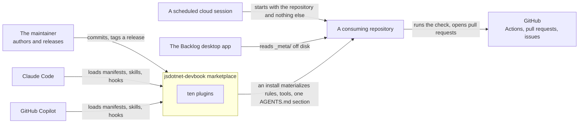

# Context and Scope

```meta
number: 3
related: [".devbook/arc42/building-blocks/README.md", ".devbook/arc42/08-crosscutting-concepts.md", ".devbook/tech/hosts.md", ".devbook/arc42/05-building-block-view.md#level-1-the-plugin-landscape"]
```

This repository ships authoring assets rather than a running product, so a *user* here is a
host that loads an asset and a repository that installs one. Both sit outside every building
block, and every block conforms to them rather than the other way round. What is inside the
boundary is the marketplace and its ten plugins, one block each under
[`building-blocks/`](building-blocks/README.md); everything below is outside it.

## Business Context

```meta
related: [".devbook/arc42/01-introduction-and-goals.md#stakeholders"]
```



| Partner | What it does with this system | Where that is answered |
| --- | --- | --- |
| The maintainer | Authors every asset by hand, runs the checks, releases every plugin at one version | [Chapter 1](01-introduction-and-goals.md#stakeholders), [the releases record](adr/releases.md) |
| Claude Code and GitHub Copilot | Read the same manifest, skill, and hook files; each ignores the keys it does not know | [Hosts](../tech/hosts.md), [the hosts record](adr/hosts.md) |
| A consuming repository | Installs a component, keeps its stamp in `.devbook/config.json`, and is reconciled on every upgrade | [Chapter 5, level 2](05-building-block-view.md#level-2-what-lands-in-a-repository), [the install record](adr/install.md) |
| GitHub | Runs the check on every pull request, refreshes the derived index on a schedule, and is the tracker a flow reports to | [devbook-derived](building-blocks/devbook-derived.md), [delivery](building-blocks/delivery.md) |
| A scheduled cloud session | Runs an entry point with nobody watching, starting from the repository alone | [delivery-schedule](building-blocks/delivery-schedule.md) |
| The Backlog desktop app | Reads the committed `_meta/` index and graph off disk and never writes them | [devbook-derived](building-blocks/devbook-derived.md#dependencies) |

## Technical Context

```meta
related: [".devbook/tech/hosts.md", ".devbook/arc42/08-crosscutting-concepts.md#host"]
```

Nothing here is a dependency in a manifest; each row is what the checked-in files are authored
for, and the ratings are in [`tech/`](../tech/hosts.md).

| Interface | Direction | Carried as | Owned by |
| --- | --- | --- | --- |
| Claude Code plugin API | inbound: the host reads | `.claude-plugin/marketplace.json`, `.claude-plugin/plugin.json`, `skills/`, `hooks/hooks.json` | [Chapter 8](08-crosscutting-concepts.md#host) |
| Copilot plugin API | inbound: the host reads | `.github/plugin/plugin.json`, `hooks.json`, and the `.github/instructions/` wrappers an install writes | [Chapter 8](08-crosscutting-concepts.md#host) |
| Claude Code CLI | outbound: one plugin invokes | `claude --bg` and `claude agents --json --all`, from `fleet` | [fleet](building-blocks/fleet.md), [debt record 2](tdr/2-fleet-names-the-cli-directly.md) |
| Copilot Extension SDK | inbound: the host loads at run time | `extensions/<name>/` with `copilot-extension.json` | [Chapter 8](08-crosscutting-concepts.md#surface) |
| A consuming repository's tree | outbound: an install writes | `.agents/rules/`, one wrapper per host, `.devbook/_tools/`, `.github/workflows/`, one marker-fenced `AGENTS.md` section, one stamp | [Chapter 8](08-crosscutting-concepts.md#stamp), [the install record](adr/install.md) |
| GitHub Actions | outbound: workflows an install materializes | `devbook-meta.yml`, `devbook-meta-nightly.yml`, `devbook-meta-drift.yml` | [devbook](building-blocks/devbook.md), [devbook-derived](building-blocks/devbook-derived.md) |
| The delivery surface contract | outbound: resolved from the live tool list | `delivery.surface.lifecycle@1`, `.render@1`, `.export@1` | [Chapter 8](08-crosscutting-concepts.md#published-languages), [the surfaces record](adr/surfaces.md) |
