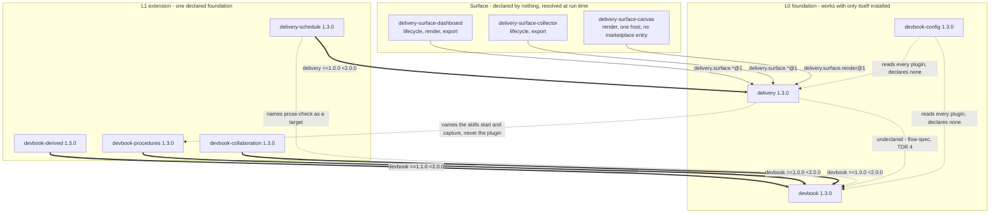
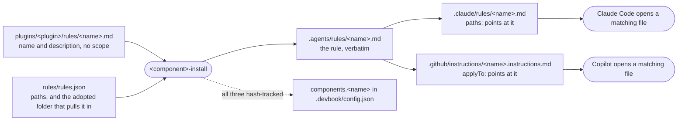
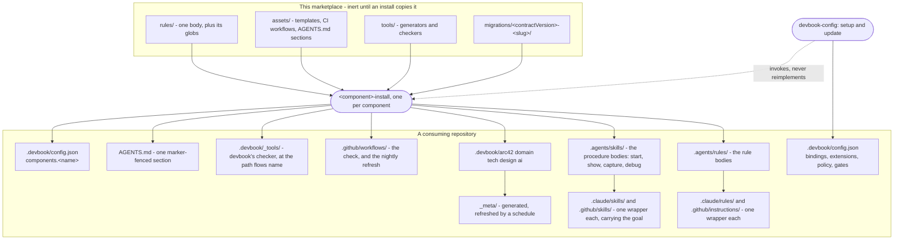

# Building Block View

```meta
number: 5
```

## Marketplace Root

```meta
related: [".devbook/arc42/08-crosscutting-concepts.md#marketplace"]
```

`.claude-plugin/marketplace.json` is the only file a host reads before installing anything: the
marketplace `name`, its owner, and one entry per plugin (`name`, `source`, `description`,
`version`). A plugin folder that is not listed here does not exist as far as a host is
concerned.

## Level 1: The Plugin Landscape

```meta
date: 2026-09-21
related: [".devbook/arc42/building-blocks/README.md", ".devbook/arc42/08-crosscutting-concepts.md#layer", ".devbook/arc42/tdr/4-delivery-depends-on-devbook.md"]
```

Ten plugin folders, grouped by [layer](08-crosscutting-concepts.md#layer) — which is
not a manifest field but what each `dependencies` array says, read as a sentence.



**Arrows point from the plugin that carries the coupling to the plugin it couples to**, which is
the manifest's own direction — `devbook-collaboration` declares `devbook`, so the arrow leaves
`devbook-collaboration`. The [relationships table](08-crosscutting-concepts.md#relationships-between-blocks)
in chapter 8 lists the same relationships the other way round, upstream to downstream, because
that is DDD's convention for model influence. Neither is wrong and they are not
interchangeable: read this one for what a host enforces, and that one for who has to live with
whose model. What each plugin owns, exposes, and depends on is its own file under
[`building-blocks/`](building-blocks/README.md); nothing below restates a block that has one.

| Style | Means | Where a missing target lands |
| --- | --- | --- |
| Thick, labelled with a range | Declared in `dependencies`, enforced by the host | Unreachable: the host installs the lower layer or the plugin is demoted |
| Plain, labelled with a capability | Conformance to a published language neither side declares | The caller resolves the group unanswered and continues |
| Dashed | Real in the assets and in no manifest | Reported and skipped, or — in one case — nothing warns at all |

The dashed `delivery → devbook` edge is the one to read twice. Three of the engine's four
flows work with devbook absent, so it is not an L1 extension; it is one stack rather than two, so
it is not a bridge. Undeclared is the only position left, and an undeclared coupling has nowhere
for a check to live — see [debt record 4](tdr/4-delivery-depends-on-devbook.md).

The dashed `delivery → devbook-procedures` edge is a different kind: the engine names two
skills, `start` and `capture`, and the path `.agents/skills/<name>.md` they live at, and
never the plugin that seeds them. A repository may write both by hand and the engine is none
the wiser; absent, a flow does without and says so. The seam is the skill name, which is why
`devbook-procedures` can sit over `devbook` and the engine can stay capability-free — see
[the plugin boundaries record](adr/plugin-boundaries.md).

`devbook-config` sits in no layer for the opposite reason: it names every plugin here and
declares none deliberately, so a plugin it cannot find is a row reading `not installed` rather
than a failed load.

## Plugin Folder

```meta
related: [".devbook/arc42/08-crosscutting-concepts.md#plugin", ".devbook/arc42/08-crosscutting-concepts.md#plugin-rule", ".devbook/arc42/adr/plugin-boundaries.md", ".devbook/arc42/adr/install.md"]
```

One folder per plugin, holding two manifests and the assets themselves:

| Path | Read by |
| --- | --- |
| `.claude-plugin/plugin.json` | Claude Code |
| `.github/plugin/plugin.json` | Copilot |
| `agents/`, `agents-internal/` | both |
| `skills/`, `resources/` | both |
| `rules/<name>.md`, `rules/rules.json` | neither host on its own; an install delivers them |
| `hooks/hooks.json` | Claude Code |
| `hooks.json` | Copilot |
| `mcp/<server>/` | Whatever the Claude manifest's `mcpServers` points at |
| `extensions/<name>/` | Copilot CLI |
| `scripts/` | Whatever skill in the plugin invokes it, from the plugin root |
| `assets/`, `tools/`, `migrations/` | nobody, until a skill copies them into a repository |
| `README.md`, and any sibling `*.md` at the plugin root | people, never a host |

Documentation for a reader sits at the plugin root beside `README.md` — `delivery`'s
`FLOW-DIAGRAMS.md`. `resources/` is not that shelf: what goes
there is reference an asset points at by path, so a file no skill or rule names has no
way to be loaded and only costs every consumer bytes.

A plugin ships the manifest of every host that can load something in it, which for almost every
plugin here is both. `delivery-surface-canvas` is the standing exception: a Copilot canvas extension
and nothing else, so it carries the Copilot manifest alone and takes no marketplace entry —
there is nothing in it for Claude to install. The exception is allowed on that test and no
other, so a plugin holding one host-only asset still ships both.

The manifests agree on `name`, `version`, and `description`. The Claude manifest lists agent
files explicitly and omits `skills` and `hooks`, which that host discovers on its own, and it
is the only one that carries `dependencies` — an array of `{ name, version, marketplace }`
naming each [layer](08-crosscutting-concepts.md#layer) beneath, one entry for an
extension and two for a bridge. Copilot's manifest has no verified equivalent, so a dependency
is declared once, on the Claude side, and stated in prose in the plugin's README for the other
host.

An `mcp/<server>/` folder holds a server's own tree — its entry point, its modules, its pages,
and its `dev/` checks. The Claude manifest names the entry point under `mcpServers`; nothing
else in the plugin has to know the folder exists. `delivery-surface-dashboard` and
`delivery-surface-collector` each ship exactly one; `delivery-surface-canvas` ships none — see
[the decision](adr/surfaces.md).

An `extensions/<name>/` folder ships a [surface](08-crosscutting-concepts.md#surface)
the other way: a `copilot-extension.json` naming it, and the module that registers its
canvases. No manifest lists it and nothing in the plugin loads it — whichever tool opens it
resolves it at runtime, and a host without an extension mechanism never sees it. `devbook-derived`
ships one, `devbook-graph`, which renders the reference graph devbook's checker builds. `delivery-surface-canvas` ships one too, and it is that plugin's only transport:
its two viewer pages sit in the extension's own `views/`, and the plugin carries no Claude
manifest and no marketplace entry.

What coupling exists runs one way and at runtime: `devbook-graph` loads devbook's graph,
outline, and metadata modules from `.devbook/_tools/devbook-meta/`, the path devbook's install
materializes, which is why the live view, the check, and the committed index cannot disagree.
Nothing in the checker knows the canvas exists. That runtime load is what let the folder leave
`devbook` — see [the decision](adr/surfaces.md).

A `scripts/` folder holds an executable a skill in the same plugin runs in place, rather than
payload copied anywhere: `devbook-config` ships `report.mjs`, which its read-only skills run
from the plugin root. It is the only one left. The pair of identical
`generate-diagram-svgs.ps1` scripts that used to sit in two specialist plugins — duplicated
because neither plugin may name the other — left with them.

A `rules/` folder holds exactly one thing: rules an install writes into a repository. Neither
host applies one on its own — no manifest here declares a rules key and neither host has a
rules component — so the folder's whole purpose is delivery. The plugin's
`<component>-install` writes each into a repository as one `.agents/rules/<name>.md` body and a
wrapper per host. `rules/<name>.md` carries name and description and no scope of its own;
`rules/rules.json` keys each rule by that name and holds its `paths` and the adopted folder
that pulls it in — see
[the decision](adr/install.md).



Three things follow from the shape and none of them is obvious from the folder listing. An
upgrade refreshes all three copies because the stamp tracks each hash; a copy somebody edited is
reported and left alone rather than overwritten; and dropping a folder from `adopted` orphans its
trio rather than deleting it.

Shared text a skill or an agent reads by path is not that, and lives in `resources/`: the
`rules/` folder announces a delivery mechanism, and a contract does not use it.
`delivery` and `delivery-schedule` ship no `rules/` folder at all.

The last row is the part no host reads. A plugin that installs something into a repository
carries it as inert payload — templates, generators, migration scripts — and its own
`<component>-install` is what puts it there and records it in the
[stamp](08-crosscutting-concepts.md#stamp).

## Level 2: What Lands in a Repository

```meta
date: 2026-09-21
related: [".devbook/arc42/05-building-block-view.md#stack-config", ".devbook/arc42/adr/configuration.md", ".devbook/arc42/adr/install.md", ".devbook/arc42/08-crosscutting-concepts.md#stamp"]
```

The other half of the building block view. Nothing above this line runs in a consuming
repository; everything below it was put there by an install skill and is tracked by a stamp.



The two trios are the same shape with the ownership reversed. A rule body is the plugin's — a
host-neutral copy the install refreshes while it still hashes to a release — and its wrappers
are ceremony. A procedure body is the repository's from the first edit onward, and its
wrappers are where the plugin keeps the one thing it does own: the goal, refreshed on every
upgrade, so `start` means the same across every repository while how it is done never does.

One file with two writers and no shared key is the shape worth naming. `devbook-config` writes
the four engine-owned keys and stops; each `components.<name>` stamp stays with the component
that knows what it materialized, which is why
[`devbook:install` did not move](adr/plugin-boundaries.md)
into the config plugin and why setup's last step is to invoke it.

Three of these boxes are the reason [debt record 4](tdr/4-delivery-depends-on-devbook.md) exists.
`.devbook/_tools/` holds devbook's checker at the path devbook's install writes it to, and
`flow-spec` is named for devbook's folders and expects every chapter to carry the `meta` block
devbook's schema defines — one skill wide since the 2026-09-15 fold, which also stopped it
naming that path — so the engine leans on a plugin it declares no knowledge of.

The dashed edge is the only one an upgrade re-runs wholesale. `_meta/` is written by neither
install skill: it is derived from the chapters and refreshed by the `devbook-check` schedule,
because two branches each touching one chapter both rewrite the same JSON.

## Roles and Services

```meta
date: 2026-09-07
related: [".devbook/arc42/08-crosscutting-concepts.md#role", ".devbook/arc42/08-crosscutting-concepts.md#extension-point", ".devbook/arc42/adr/plugin-boundaries.md"]
```

**No specialist plugin ships here.** Where a flow needs expertise it names a point, and a
repository names the plugin that fills it: a role in `bindings["delivery.roles"]`, a service in
`extensions`. The seven that used to live in this marketplace are
[published from their own](adr/plugin-boundaries.md).

| Point | Kind | What a provider brings |
| --- | --- | --- |
| `architecture` | role | arc42 sections, decision and debt records, C4, sequence, state and deployment diagrams |
| `qa` | role | Running the app, driving browser scenarios, and reading logs and traces while they run |
| `domain` | role | Bounded contexts, ubiquitous language, model and context-map design |
| `ux` | role | Wireframes, user flows, design guidelines, UI review |
| `docs` | role | How-to guides, explanations, articles, proposals, profiles |
| `product`, `security` | role | Nothing here fills them, and nothing did. Both are `null` in the stack config template, which the vocabulary distinguishes from absent: deliberately unbound |
| `spec` | service | The specification the rest of a flow builds on. Unbound, the flow-runner writes it inline |
| `implement` | service | A change set and what was tested |
| `validate` | service | Build and suite results. Default provider: `phase-build-test` |
| `app.start`, `qa.run` | service | A running application and evidence from it. Default provider: `phase-validation`. `app.start` is normally filled by the seeded `repo:start`, and the evidence rules hold from `capture-contract.md` whichever provider answers |
| `verify` | service | After the pull request, one verdict per item of the specification the run built on and the chapters the change set touches, with the evidence — report-only, where a documentation refresh used to run. No default provider: unbound, the flow-runner reaches the verdicts itself; a repository with devbook chapters binds `devbook:verify-change` |

A missing provider costs capability, not a load. `delivery` and `devbook-flows` used to carry
over two hundred `plugin:asset` references naming the seven; every one is now the point it was
filling, so the engine names no plugin it does not publish and there is nothing left to dangle.
A repository's own binding is the only place a specialist's name appears.

A role key is not a plugin name, and never becomes one. The role is the slot a flow asks for
and the plugin is whatever is installed in it; binding the key to its current occupant would
make the key un-rebindable, which is the one thing a binding must stay.

Implementation is not a role. It owns a phase, carries a toolchain, and loops with
validation, so it binds as the `implement` and `validate` services instead — commonly to one
provider, which is why model selection resolves those two per stage rather than per provider.

Nothing here holds flow control either, and that stays true now that no specialist ships from
this marketplace: sequencing, gates, session spawning, and delegation belong to whatever
consults a point — see [the decision](adr/plugin-boundaries.md).

## Surface Plugins

```meta
date: 2026-09-03
related: [".devbook/arc42/08-crosscutting-concepts.md#surface", ".devbook/arc42/adr/surfaces.md"]
```

Three plugins are where a run becomes visible or recorded. None declares a dependency, none
names the engine, and each is resolved at run time from the live tool list — so which one
answers is decided by what is installed, and none answering is a normal outcome.

| Plugin | lifecycle | render | export | Ships |
| --- | --- | --- | --- | --- |
| `delivery-surface-dashboard` | yes | yes | yes | An MCP server: run timeline, diagram and document viewers, hook-captured telemetry, Markdown and self-contained HTML reports |
| `delivery-surface-canvas` | no | yes | no | The same two viewers, as two Copilot canvases and nothing else — no MCP server, so it answers on that host only |
| `delivery-surface-collector` | yes | no | yes | An MCP server with no page and no port: the run on disk, and its Markdown report |

Each declares exactly the tool names its groups name and nothing more, which is what makes one
substitutable for another. `delivery-surface-dashboard` is also the only one that captures anything by
itself: its hooks fold tool calls, sub-agent use, and token usage into the run, so the numbers
in its panels are measured rather than self-reported.

That capture is Claude-only, and structurally so rather than by omission. It ships
`hooks/hooks.json` and no root `hooks.json`, because the hook reads the session transcript and
writes the run store — work a Copilot `type: prompt` hook cannot do. So the substitutability the
table describes holds per capability group and not per host: a Copilot run bound to this plugin
gets the same lifecycle tools and the same panels, with the telemetry figures absent rather than
wrong. Nothing in the contract names telemetry, which is why this costs a column and not a
group.

## Host Slots

```meta
date: 2026-09-05
related: [".devbook/arc42/08-crosscutting-concepts.md#host-slot", ".devbook/arc42/adr/hosts.md"]
```

`delivery` declares a closed set of five names a shared asset reads instead of a host's own
file. **No plugin binds them.** The two that did — `claude-desktop` and `copilot-app` — are
[deleted](adr/hosts.md), and nowhere in the stack is a
host's own file, path, or capability named now.

| Slot | Where an answer can come from | Unbound |
| --- | --- | --- |
| `repo-instructions` | `bindings["delivery.slots"]` | `AGENTS.md` if present, else nothing |
| `pr-lane` | `bindings["delivery.slots"]` | no pull request; `deliver` writes file artifacts only |
| `stage-delegation` | the live session | stages run inline |
| `surface` | the live tool list | file artifacts only |
| `model-override` | nothing, deliberately | category defaults |

The first three are host facts a repository can state. `stage-delegation` and `surface` are
capability answers resolved at run time, which is what keeps two hosts from re-diverging the
moment one gains what the other has. `model-override` takes no binding from anywhere: model
choice is personal, so a repository may not set it, and with no profile left to name a path,
every category takes its default.

Unbound is now the resting state of the whole table, and the table is what keeps that visible
rather than silent.

## Config Plugin

```meta
date: 2026-09-07
related: [".devbook/arc42/08-crosscutting-concepts.md#layer", ".devbook/arc42/08-crosscutting-concepts.md#flow-skill", ".devbook/arc42/05-building-block-view.md#stack-config", ".devbook/arc42/adr/plugin-boundaries.md"]
```

`devbook-config` is the one plugin whose subject is the marketplace rather than a unit of work.
It owns the repository's [stack config](#stack-config) and answers *what is this, what have I
got, and how is this repository wired* — the only place those questions are answered together,
because no other plugin is allowed to name every plugin.

| Skill | Writes |
| --- | --- |
| `setup` | The four engine-owned keys of a repository's stack config, for the first time, before any component installs itself |
| `update` | The same four keys, moved forward, after each component reconciled itself |
| `ask` | Nothing. It reads, and every fact it states names the file behind it |
| `adoption` | Nothing. It reports where `ai/` no longer matches what is installed and hands the write to `flow-spec` |
| `local` | What is true of one machine, outside the repository: a stack-config [overlay](adr/configuration.md) at the user or repository layer, the model-selection file, `AGENTS.local.md`. Never the committed config |

The five take no prefix. It is named `devbook-config` for the file it writes,
`.devbook/config.json`, and not for a plugin it needs: its `dependencies` array is empty,
`devbook` included.

`scripts/report.mjs` is the read-only half, run in place from the plugin root: it reads
the catalog in both the working tree and the host's clone, the host's installed-plugin state,
the three settings layers merged nearest-last, the stack config, the devbook folders in both
layouts, and the engine's own `skills/` folder. A clone older than the source is why "already
latest" is usually wrong, so the report prints both and the commit behind each.

`devbook-config:adoption` is the second reader, and it stops one step earlier than the report does. The
derivable half of `ai/` — which plugins are installed and enabled, which `flow-*` and
`schedule-*` the copies on disk ship, what the config wires — goes stale on every upgrade and is
exactly what the report already prints. The other half rates whether people work that way, which
no file on disk records, so a `status`, an **Adopted by**, or an **Evidence** line is never
derived from an install. Reporting drift is inside the plugin's subject; writing a chapter is
`flow-spec`'s.

The two write skills stop at the [engine keys](#stack-config). Every `components.<name>` stamp
stays with that component's own install skill, which is the only thing that knows what it
materialized — so `devbook:install` and `devbook:check` do not move here, and `devbook-config:setup`'s fifth
step is to invoke them rather than to reimplement them.

The report is also the one place a host's own paths are still named, which
[the slot decision](adr/hosts.md) otherwise ended —
recorded as a [deliberate divergence](adr/plugin-boundaries.md)
rather than left silent. Where a plugin is installed and whether it is enabled is a fact about
a host and about nothing else, so a report that answers it either names those files or answers
nothing. It reads one host's, names every file it read and every one that was absent, and
leaves the other host's rows empty while the catalog half still answers.

## Stack Config

```meta
date: 2026-09-21
related: [".devbook/arc42/08-crosscutting-concepts.md#stamp", ".devbook/arc42/adr/configuration.md"]
```

`.devbook/config.json` is the one file a consuming repository commits for the whole
stack, and it holds two kinds of top-level key:

| Key | Owned by | Holds |
| --- | --- | --- |
| `bindings`, `extensions`, `policy`, `gates` | `delivery` | Which provider fills each flow extension point, which plugin fills each role, which tracker the repository uses, which MCP servers each point uses, the closed set of policy switches, and any human gates beyond the mandatory one. |
| `components.<name>` | that component's own install skill — or the person, for a component that ships none | What the component materialized into the repository, and its migration ledger; or, for one that materializes nothing, its selection. |

Nobody writes another owner's key. `delivery` ships the schema for its four in
`resources/config.schema.json` and a checker that rejects an unknown key rather than
ignoring it, so a typo is an error rather than a silently absent setting.

Five components stamp themselves: `components.devbook` from `devbook:install`,
`components.derived` from `devbook-derived:install` for the refresh script, its workflows, and
its rule, `components.devbook-procedures` from `devbook-procedures:install` for the `start`,
`show`, `capture`, and `debug` copies it seeds and the `adopted` list that selects them,
`components.delivery` from `delivery:install` — `pluginVersion` alone, since the engine
materializes nothing — and `components.schedule` from `delivery-schedule:install`.
`devbook-collaboration` materializes nothing and stamps nothing
([the annotations record](adr/annotations.md)). That puts `delivery` on both sides
of the table at once — schema owner for the four engine keys, holder of one stamp — and the
boundary still holds, because the halves are different skills and neither reads the other's key.
`devbook-config` maps the five to their install skills by hand: a manifest cannot say which
plugin is behind a stamp whose plugin this machine has not installed.

It sits beside the devbook chapter folders and is read by every host, which is the whole reason
it left `.github/` — see [the decision](adr/configuration.md).
Reading it is not adopting devbook: the engine reads that path with no devbook folder present.
It is the only engine file in the folder: the runtime facts a run needs live in the
repository's own `start` skill, not in a second file here — see
[the configuration record](adr/configuration.md).

## Schedule Plugin

```meta
date: 2026-09-07
related: [".devbook/arc42/08-crosscutting-concepts.md#schedule", ".devbook/arc42/adr/plugin-boundaries.md", ".devbook/arc42/05-building-block-view.md#stack-config"]
```

`delivery-schedule` is where work that nobody watches lives, stacked on the engine it calls
into. Two halves in one folder: fourteen `schedule-*` entry points that pick their own input and
run a flow, a review, a sweep, or a report, and eleven files under `resources/schedules/`, each a cadence, a target
skill, the plugins that target needs, and the task half of a prompt, plus one preamble that
carries the unattended rules every prompt starts with.

| Schedule | Target | Cadence |
| --- | --- | --- |
| `package-update` | `delivery-schedule:schedule-package-update` | weekly |
| `merge-review` | `delivery-schedule:schedule-merge-review` | weekdays |
| `issue-sweep` | `delivery-schedule:schedule-issue-sweep` | weekdays |
| `morning-brief` | `delivery-schedule:schedule-morning-brief` | weekdays |
| `change-report` | `delivery-schedule:schedule-whats-new` | weekly |
| `devbook-check` | `delivery-schedule:schedule-devbook-check` | daily |
| `security-review` | `delivery-schedule:schedule-security-review` | weekly |
| `instruction-review` | `delivery-schedule:schedule-instruction-review` | weekly |
| `tech-update` | `delivery-schedule:schedule-tech-update` | weekly |
| `weekly-update` | `delivery-schedule:schedule-weekly-update` | weekly |
| `prose-check` | `devbook:prose-check` | weekly |

Three skills read the catalog. `delivery-schedule:install` builds each prompt, resolves the scheduler from
the live tool list, and creates or updates each entry matched by name — `<owner>/<repo> ·
<title>` — so a second sync updates rather than duplicates; `schedule-status` reads runs and
logs back; `schedule-run` fires one. `tools/schedule-catalog/check.mjs` fails a malformed
entry, a cron that could fire more than hourly, or a target that is a flow.

The plugin depends on `delivery` and names `devbook`, the L1 extension shape: the entry
points call the engine's flows and phases, so the dependency is real, while a target in
another plugin is named and skipped when the repository has not enabled it.
It named a third until the specialists
[left the marketplace](adr/plugin-boundaries.md):
what a target delegates to is a binding the consuming repository makes, not a plugin the
schedule can require.

State splits by who it belongs to. The selection and any cadence override are repository
facts and go in `components.schedule` of the [stack config](#stack-config), written by
`delivery-schedule:install` only. The environment, the model, and the scheduler ids are personal: the
ids live in the scheduler, and matching by name is what makes writing them down unnecessary;
the environment and the model may be remembered under `ext.schedule` in a machine's own
[overlay](adr/configuration.md), never in the committed file.

## Asset Kinds

```meta
related: [".devbook/arc42/08-crosscutting-concepts.md#agent"]
```

Agents, skills, instruction files, hooks, and MCP servers. Each kind has one file shape and one
place it may live; nothing is assembled at build time, because there is no build.
