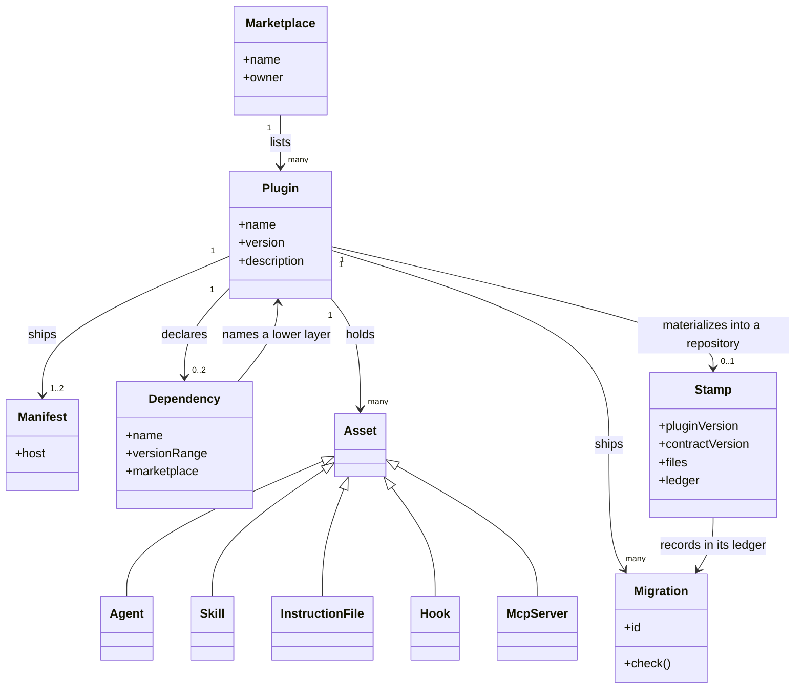

# Crosscutting Concepts

```meta
number: 8
related: [".devbook/arc42/building-blocks/README.md", ".devbook/arc42/05-building-block-view.md", ".devbook/arc42/06-runtime-view.md", ".devbook/arc42/12-glossary.md", ".devbook/tech/hosts.md#claude-code-plugin-api", ".devbook/tech/hosts.md#copilot-plugin-api"]
```

The language every plugin is written in — the shared kernel. **One plugin, one block:** a plugin
is the unit a host installs, versions, and can refuse to load, so it is already the line a
model cannot cross without somebody declaring it, and the eleven files under
[building-blocks/](building-blocks/README.md) follow the eleven plugin folders name for name. This
chapter is the one part of the picture that is not a plugin. It holds only what is true of
every plugin, so a new plugin costs a block file as well as a marketplace entry, and the two
land together.

What the kernel is responsible for: that an asset written once loads correctly in every host
that reads it, and that a plugin can be installed on its own. Inside its boundary: the folder
shape of a plugin, the two manifests, the frontmatter each host requires, the marketplace
listing, and the vocabulary below. Outside it: how a host resolves or ranks what it loaded, and
anything the assets themselves are used to build — a plugin that orchestrates .NET delivery
work says nothing here about .NET. Everything it defines is co-owned: a change to the plugin
folder shape, the manifest pair, the layer order, the stamp, or a migration is a change to
every block at once, which is why the kernel stays small on purpose and a term earns a place
here only by being true of every plugin.

This repository ships authoring assets rather than a running product, so a *user* here is a
host that loads an asset and a repository that installs one. Both sit outside every block, and
every block conforms to them rather than the other way round.

A term true of one plugin lives in that plugin's block file and in the
[glossary](12-glossary.md), with a `related` link back to whatever kernel term it refines —
[Schedule](#schedule) is a kind of trigger here and its parts are the glossary's;
[Flow Skill](#flow-skill) names a scope against its neighbours where
[delivery](building-blocks/delivery.md) says what one is made of. Where a host uses a different
word for the same thing, the host's word is recorded as an alias rather than adopted.
[Chapter 5](05-building-block-view.md) holds the shapes these concepts take in the repository;
this chapter links there rather than restating them.

## Marketplace

```meta
related: [".devbook/arc42/05-building-block-view.md#marketplace-root", ".devbook/arc42/adr/releases.md"]
```

A repository that offers plugins for installation, identified by the `name` in
`.claude-plugin/marketplace.json`. That name is the local primary key: a host keys its
registry, its cache, and every `plugin@marketplace` reference by it, so two marketplaces one
user has added may not share a name. This repository's marketplace is `jsdotnet-devbook`.

## Plugin

```meta
related: [".devbook/arc42/05-building-block-view.md#plugin-folder", ".devbook/arc42/08-crosscutting-concepts.md#layer"]
```

One folder under `plugins/`, holding assets that belong together, installable on its own and
listed once in the marketplace. It may declare a hard dependency on a plugin in a lower layer,
which the host enforces and which makes an illegal combination unreachable; it must never
depend on a role, a tracker, or a surface — those are bound per repository or resolved from the
live tool list, and a missing one must cost capability, not loading.

## Host

```meta
```

Also called: client.

A tool that loads a plugin's assets: Claude Code or GitHub Copilot. Hosts read the same files
and ignore the keys they do not recognise, which is why an asset has one authored copy.

## Agent

```meta
```

A named persona with its own tool allowlist, as `agents/<role>.agent.md`. Copilot calls it a
custom agent, Claude a subagent. Delegation targets live in the body prose, because only one of
the two hosts reads a `handoffs` key.

## Skill

```meta
```

A procedure a host loads on demand, as `skills/<name>/SKILL.md`. Its `description` is the
trigger — the sentence a host matches a request against — not a summary of its contents.
Every skill opens its reply with `<plugin>@<version>`, read from the manifest beside it rather
than recalled, so the answer names the release that gave it; `.agents/rules/skills.md` says
why the line is in every skill.

## Plugin Rule

```meta
related: [".devbook/arc42/05-building-block-view.md#plugin-folder"]
```

A scoped rule set, as `rules/<name>.md`, with the paths it governs declared beside it in
`rules/rules.json`. Named for the file it becomes: a plugin's `rules/` folder and the
`.agents/rules/` an install writes hold the same names, so a rule referencing a sibling resolves in
both. Every plugin rule is delivered: no host applies one from inside a plugin, so it reaches a
session only where the plugin's install skill has written it into a repository, with each host's
wrapper beside it — the delivery is drawn in
[chapter 5](05-building-block-view.md#plugin-folder). Shared text an asset reads by path is a
[contract](#contract), not a rule.

## Contract

```meta
```

Reference an asset points at by path, as `resources/<name>.md`, carrying `name` and
`description` and no scope of its own — the surface contract, the schedule catalog contract,
the issue sweep state contract. It is loaded by the explicit reference and by nothing else, so
a contract no skill or agent names is unreachable. It takes the rule budget, because it is the
same kind of prose, and it stays over that budget by kind. Distinct from a
[plugin rule](#plugin-rule), which exists to be installed somewhere else.

## Hook

```meta
related: [".devbook/arc42/adr/hooks.md"]
```

A host-executed action bound to a session event. The two hosts disagree on what a session-start
hook may be, so the event, not the intent, decides the form it takes.

## Devbook Folder

```meta
date: 2026-09-07
related: [".devbook/arc42/adr/chapter-schema.md"]
```

One of the five folders the `devbook` convention governs — `arc42`, `domain`, `tech`, `design`,
`ai` — holding addressed Markdown **chapters**, each carrying a fenced `meta` block, at
`.devbook/<name>/`. A repository adopts any subset; there is one layout.

The convention's own name is the only noun for these; there is no common-noun synonym, because
a convention that has a name does not need one — *knowledge* was that synonym until
2026-09-07, and a reader meeting "the knowledge folders" beside `devbook-meta` had to work out
that the two named one thing. Everything the plugin ships is named `devbook-` for the same
reason: the old prefix said only which plugin used to own the folder. What `_meta/graph.json`
derives from their `meta` blocks is the **reference graph**.

## Flow Skill

```meta
date: 2026-09-02
related: [".devbook/ai/02-deliver.md#flow-skills", ".devbook/arc42/06-runtime-view.md#a-flow-run"]
```

A staged procedure for one category of work, run start to finish inside one session, ending at
the personal validation gate. `flow-<category>`, one per category. What one run does with the
extension points is [A Flow Run](06-runtime-view.md#a-flow-run).

Four neighbours share the vocabulary and are not interchangeable with it:

| Prefix | Scope |
| --- | --- |
| `flow-` | One session, delegating to subagents. Never to another session. |
| `phase-` | A shared step inside a flow — build and test, QA validation, personal validation. Never invoked directly. |
| `schedule-` | Work that runs with nobody watching: an entry point that picks its own input, and the three skills that put its trigger in the host's scheduler. |

A prefix marks a procedure's scope against its neighbours, so a plugin whose skills all share
one scope needs none: `devbook-config` holds `setup`, `update`, `ask`, and `adoption` bare,
and the plugin name carries what a prefix would have.

Each prefix names one scope and no prefix names two, which is why none of them is called after
*orchestration* — the word once covered fan-out and single-session staging at once, and the
fan-out it described no longer ships. `delivery` holds four `flow-*` — the
code, the five devbook folders, the dependencies, and the project, since
[flows belong to delivery](adr/plugin-boundaries.md) — and three `phase-*`, `delivery-schedule`
holds sixteen `schedule-*` beside a bare `install`.

A plugin takes its subsystem's stem; the things inside it are named for what they are. So
`delivery`, `delivery-surface-dashboard`, and `delivery-surface-collector` are packages of one
subsystem while `flow-code` and `phase-build-test` are the procedures inside them — which is
why a surface is `delivery-surface-dashboard` and never `flow-dashboard`. A surface that answers
a contract other surfaces answer carries the contract word after the stem and the
implementation after that, so the three are read as one kind from the marketplace list alone.
A surface interchangeable with nothing does not: the contract word marks membership, and
`devbook-graph` beside `delivery-surface-canvas` would read as a second implementation of the
render group, which it is not.

No skill in this marketplace spawns a session. Fan-out across sessions and worktrees was its
own subsystem and prefix, `fleet-`, until 2026-09-21, when the one thing anyone wanted from it
— a backlog swept, closed, and worked with nobody watching — turned out to want one session
and hours rather than five sessions and minutes; it is the issue sweep in
[delivery-schedule](building-blocks/delivery-schedule.md#schedule-issue-sweep) now, and the
reason is in [the plugin boundaries record](adr/plugin-boundaries.md).

## Schedule

```meta
date: 2026-09-07
related: [".devbook/arc42/08-crosscutting-concepts.md#flow-skill", ".devbook/arc42/05-building-block-view.md#schedule-plugin", ".devbook/arc42/adr/plugin-boundaries.md"]
```

Also called: routine, automation.

A trigger that fires a procedure the stack already ships, in a cloud session that starts with
nothing but the repository: a cadence, a target skill, the plugins that skill needs, and a
prompt self-contained enough to run it with nobody watching. A schedule is a trigger and never
a procedure — the `schedule-*` entry point is what runs; the schedule is what asks.

Both hosts ship the capability under their own name: **Routines** in Claude Code,
**Automations** in the GitHub Copilot app. Neither word is adopted, because adopting one would
name a host; *schedule* is the term and both are aliases of it.

Four words carry the shape. An **entry point** is a `schedule-*` skill that picks its own
input, so it needs no person to hand it one. The **catalog** is the set of schedule files a
plugin ships. The **preamble** is the unattended rules every prompt starts with, stated once.
The **scheduler** is whatever the live session exposes that turns a name, a cron expression, a
repository, and a prompt into a scheduled session — resolved by capability, and absent as a
normal outcome.

A schedule names an entry point or a read-and-report skill, never a
[flow](#flow-skill): a flow ends at a gate, and an unattended run parks where a gate would be.

## Extension Point

```meta
date: 2026-09-03
related: [".devbook/arc42/adr/flow-engine.md", ".devbook/arc42/06-runtime-view.md#a-flow-run"]
```

A named place in a flow where a repository plugs a provider in. The set is closed and declared
by the engine: a repository picks what runs at a point, never what the points are.

A point is one of two kinds, and the difference is authority, not cardinality:

| Kind | Cardinality | Returns | May change the outcome |
| --- | --- | --- | --- |
| Service | Exactly one provider | A result the flow acts on | Yes — that is the point |
| Chore | Zero or more, in declared order | Side effects and a report | Never |

`spec`, `implement`, `validate`, `app.start`, `qa.run`, `verify`, and `deliver` are services.
`session.start`, `flow.start`, `data.prepare`, and `flow.end` are chores. A
chore may declare itself required and stop the run when it fails; it still may not rewrite a
stage's result or stand in for a gate.

## Gate

```meta
date: 2026-09-03
related: [".devbook/arc42/08-crosscutting-concepts.md#extension-point"]
```

A human checkpoint attached to an extension point. It presents that point's output and asks a
question with three answers: *approve* continues, *revise* re-runs the point carrying the
human's notes, and *decline* blocks the stage — never a silent skip.

Configuration may add a gate anywhere and may never remove one or hand one to a plugin, which
is the asymmetry that makes gates safe: adding a checkpoint can only make a flow more
conservative. Personal Validation is the mandatory instance of the same pattern, not a second
mechanism. An unattended run parks at a blocking gate with a handoff brief; it never waits, and
it never self-approves.

## Surface

```meta
date: 2026-09-03
related: [".devbook/arc42/05-building-block-view.md#surface-plugins", ".devbook/arc42/05-building-block-view.md#plugin-folder", ".devbook/arc42/adr/surfaces.md", ".devbook/arc42/adr/plugin-boundaries.md", ".devbook/arc42/08-crosscutting-concepts.md#mcp-server"]
```

Where work becomes visible or recorded, and nothing else. A dashboard, a canvas, a headless
collector, and the Backlog desktop application are four implementations of one capability,
split by operation group — lifecycle, render, export — because they do not implement the same
half of it.

A surface is never a dependency in either direction: the thing being rendered knows no surface
exists, and the surface knows nothing about what produced its input. Whichever tool opens it
resolves it at runtime, by pattern, from the live tool list. **Absence is a normal outcome:**
the run produces its file artifacts, says so once, and continues — it costs a view, never a
capability.

Three ship here. `delivery-surface-dashboard` answers all three groups, `delivery-surface-canvas`
render only, and `delivery-surface-collector` lifecycle and export only. Backlog is not a
plugin and ships from outside this marketplace; it answers lifecycle, is first in the binding
priority, and its absence means its window is closed. Each declares exactly
the tool names its groups name and nothing more, which is what makes one substitutable for
another — the table is in [chapter 5](05-building-block-view.md#surface-plugins), the reason in
[the decision](adr/surfaces.md).

A surface is not required to be an MCP server. `delivery-surface-canvas` is a Copilot canvas and
nothing else, so its two operations arrive as canvas actions rather than namespaced tools —
which is why the contract matches operation names and never a transport.

`devbook-graph` ships in `devbook-derived` and loads devbook's checker modules from their
materialized path at runtime; it renders the reference graph rebuilt from the
chapters on open, never from `_meta/`, and opens a single chapter beside its parsed `meta` block in a second canvas,
`devbook-chapter`. It answers no operation group and substitutes for nothing, which is why it
takes devbook's stem and the thing it draws rather than the surface word, per the
[naming rule](#flow-skill). It is packaged in `devbook-derived`, which declares `devbook`, and
reaches devbook's modules through the path devbook's install materializes rather than through
a relative import — the shape [the surfaces record](adr/surfaces.md) waited for.

## Host Slot

```meta
date: 2026-09-03
related: [".devbook/arc42/08-crosscutting-concepts.md#host", ".devbook/arc42/05-building-block-view.md#host-slots"]
```

A name a shared asset reads instead of a host's own file: `repo-instructions`,
`model-override`, `stage-delegation`, `surface`, `pr-lane`. A slot is
bound, never branched — an asset that carries an if-this-host clause has not used a slot.

Behavioural divergence binds as a capability rather than as a host: `stage-delegation` asks
whether subagents exist and `pr-lane` whether the CLI is present, so neither re-diverges the
moment one host gains a feature.

The set is closed and every slot has a documented unbound behaviour, so unbound is a resting
state rather than a gap. No plugin binds a slot: a repository sets one under
`bindings["delivery.slots"]`, the live session answers it, or the default stands — the table is
in [chapter 5](05-building-block-view.md#host-slots).

## Role

```meta
date: 2026-09-03
related: [".devbook/arc42/08-crosscutting-concepts.md#agent", ".devbook/arc42/05-building-block-view.md#roles-and-services", ".devbook/arc42/adr/plugin-boundaries.md"]
```

A specialist a flow consults by name — `architecture`, `qa`, `domain`, `ux`, `product`,
`docs`, `security` — bound to a plugin per repository and never a dependency, because one
missing advisor must not demote every skill that names it. Every role reference states its
fallback, so no flow is dead because a role is unbound. An explicit `null` means deliberately
unbound, which is not the same as absent.

No provider for any of them ships in this marketplace; see
[Roles and Services](05-building-block-view.md#roles-and-services). `product` and
`security` are `null`.

The key is not the plugin's name, and a plugin whose name matches a key matches it by
coincidence. A specialist filling a role also holds no flow control — no sequencing, no gate,
no session spawning, no delegation — because all four belong to whatever consults it. See
[the decision](adr/plugin-boundaries.md).

Implementation is not a role. It owns a phase, carries a toolchain, and loops with
validation, so it binds as the `implement` and `validate` services instead.

## Tracker

```meta
date: 2026-09-03
```

The work-item system a repository tracks work in — GitHub issues, Jira tickets, Markdown
chapters, Backlog entries, or a `plugin:skill` provider that reports a step's state off its
pull request — bound per repository behind one set of operations. It is a
binding and not a dependency for the same reason a role is: no repository should end up with Jira installed
because it enabled the flows.

## Stamp

```meta
date: 2026-09-03
related: [".devbook/arc42/08-crosscutting-concepts.md#migration", ".devbook/arc42/05-building-block-view.md#stack-config", ".devbook/arc42/06-runtime-view.md#materializing-a-component", ".devbook/arc42/adr/install.md"]
```

A component's entry under `components` in `.devbook/config.json`, recording what that plugin
put in the repository: the plugin version it is on, and every file copied in or marker-fenced
section written with the hash it had when it landed. A component whose install rewrites content
the repository authored carries three fields more — the contract version, which features it
adopted, and the [migration](#migration) ledger — and `devbook` is
[the only one](adr/install.md). One that writes no files stamps its own selection in place of
the file map. The same file's other top-level keys are the engine's — see
[Stack Config](05-building-block-view.md#stack-config).

It records what the *repository* has taken on, never who installed what — that is per-user and
would make the file wrong the moment a second person opened it. A plugin that materializes
anything ships one `<component>-install` that writes its own entry and one `<component>-check`
that reads it, and neither touches another component's. A component that materializes nothing
and ships no install skill has its selection written by hand — `delivery-surface-dashboard`'s
session-naming words are [the one case](adr/configuration.md) — and the boundary holds
unchanged: the entry is still that component's alone. How a stamp moves is
[Materializing a Component](06-runtime-view.md#materializing-a-component).

## Migration

```meta
date: 2026-09-03
related: [".devbook/arc42/08-crosscutting-concepts.md#stamp"]
```

One breaking change to a plugin's contract, shipped as a folder — `migrations/<contractVersion>-<slug>/` —
holding a `MIGRATION.md` and an idempotent `migrate.mjs` whose `--check` exits non-zero while
work remains. The id is immutable once released: a shipped migration is never rewritten, only
followed by a new one.

Presence in a repository's ledger decides whether a migration runs, never a comparison of
version numbers, which is what makes re-running one safe. A prose migration note is not a
migration — it does not run, so it becomes an unbounded manual chore in every consuming
repository. Which changes owe one is decided once, in `AGENTS.md` under *When a change ships a
migration*.

## MCP Server

```meta
related: [".devbook/tech/shared.md#model-context-protocol", ".devbook/arc42/adr/flow-engine.md"]
```

A tool server a plugin ships and declares in its manifest. Its tools are namespaced by
whichever plugin provides it, so an allowlist that names the server must carry both the
plugin-namespaced and the bare spelling.

The engine requires none. A repository declares its servers in its own MCP configuration and
binds them per extension point under `bindings["delivery.mcp"]`; a bound server is resolved
from the live tool list the way a surface is, and one that does not answer costs a stage its
grounding, never the run. See [the decision](adr/flow-engine.md).

## Layer

```meta
date: 2026-09-03
related: [".devbook/arc42/08-crosscutting-concepts.md#plugin", ".devbook/arc42/05-building-block-view.md#level-1-the-plugin-landscape", ".devbook/arc42/adr/plugin-boundaries.md"]
```

A plugin's position in the dependency order, and the only thing that decides which other
plugins it may name. A lower layer never names a higher one.

| Layer | Depends on | Example |
| --- | --- | --- |
| L0 foundation | Nothing. Works with only itself installed | `devbook` |
| L1 extension | One foundation | `devbook-derived`, `devbook-procedures`, `devbook-collaboration` |
| L2b bridge | Two stacks at once, deliberately | none |
| L3 surface | Neither direction. Reads generated files | none — `devbook-graph` ships inside `devbook-derived`, an L1, and reads the checker's modules rather than its files |

The layer is not a field in any manifest — it is what the `dependencies` array says, read as a
sentence. A surface is not a layer in the dependency sense at all: it is resolved from the live
tool list and no-ops when absent, so nothing may declare one. Every plugin's layer is drawn in
[chapter 5](05-building-block-view.md#level-1-the-plugin-landscape).

## Extension Namespace

```meta
date: 2026-09-03
related: [".devbook/arc42/08-crosscutting-concepts.md#layer", ".devbook/arc42/adr/annotations.md"]
```

The seam a higher layer stores state through without a release of the layer beneath it: a
reserved key the lower layer carries through untouched, unvalidated, and namespaced by whoever
owns it. In `devbook` it is `ext.<plugin>.<key>` in a chapter's `meta` block.

Two rules, and they are the whole value. The owner never adds a field of its own to the schema
beneath it, because that would trade one fact for a contract bump and a migration in every
consuming repository. Nobody reads another plugin's keys as if they were schema — an opaque
namespace two plugins interpret is no longer opaque.

An extension namespace is inert on its own: uninstall the owner and the keys stay parseable,
render as they always did, and mean nothing to anyone. That is what makes the seam safe to
reserve before anything needs it. It is reserved and unused: the first extension to store
state through it, `devbook-collaboration`, moved that state into devbook's schema instead,
because the fields mirrored ones devbook already owned
([the annotations record](adr/annotations.md)).

## Model

```meta
related: [".devbook/arc42/08-crosscutting-concepts.md#plugin", ".devbook/arc42/05-building-block-view.md#plugin-folder"]
```

How the terms relate: what a marketplace holds, what a plugin is made of, and what a plugin
leaves behind in a repository that adopts it.



- A plugin appears in exactly one marketplace and the marketplace name is part of every
  installed reference, which is why the marketplace is never renamed after release.
- A plugin ships two manifests. They are two views of the same three facts, not two sources
  of them.
- A dependency points down the layer order only, and only at a plugin: zero for a foundation,
  one for an extension, two for a bridge. A role, a tracker, or a surface is
  reached by name at run time and never appears here.
- An asset belongs to one plugin and one plugin only; the same file is never shipped twice.
  An agent's handoff targets and a skill's `plugin:asset` references are names, not
  associations — a target that resolves to nothing degrades one stage rather than failing a
  load.
- A stamp lives in the consuming repository, not in the plugin, and is written only by the
  plugin's own install skill. It relates to migrations by id presence in its ledger, never by
  comparing versions.

## Published Languages

```meta
related: [".devbook/arc42/building-blocks/README.md"]
```

What one block publishes and others conform to without either side declaring the other.

| Published language | Owned by | Consumed by | Carried as |
| --- | --- | --- | --- |
| The `meta` block schema and chapter addressing | [devbook](building-blocks/devbook.md) | Every block that writes a chapter | `rules/devbook-chapter-metadata.md`, materialized into a repository |
| The checker's CLI — `--check`, `--print`, `--write`, `--scope` | [devbook](building-blocks/devbook.md) | [devbook-derived](building-blocks/devbook-derived.md)'s refresh paths, CI, and every skill that runs the check | `tools/devbook-meta/build.mjs` |
| The procedure goal — one sentence per `start`, `show`, `capture`, `debug` that holds whatever the body says | [devbook-procedures](building-blocks/devbook-procedures.md) | [delivery](building-blocks/delivery.md)'s `app.start` point and Validation, and any session invoking the skill by name | The `goal` field of each seed, rendered into the managed wrapper per host |
| The derived-artifacts envelope — `_meta/graph.json`, `index.json`, `annotations.json` and their `schemaVersion` | [devbook-derived](building-blocks/devbook-derived.md) | [devbook-collaboration](building-blocks/devbook-collaboration.md)'s queue and the Backlog app off disk | `rules/devbook-derived-artifacts.md`, materialized into a repository |
| The review triad — `review`, `reviewer`, `review-at` | [devbook](building-blocks/devbook.md) | [devbook-collaboration](building-blocks/devbook-collaboration.md), and anyone writing review state by hand | Three optional fields in `rules/devbook-chapter-metadata.md`, validated together and against the chapter's open notes |
| The decision rungs — `approved` and `accepted` on `domain/`'s ladder alone, each with a signer, a day, and an optional content fingerprint | [devbook](building-blocks/devbook.md) | [devbook-collaboration](building-blocks/devbook-collaboration.md)'s approval and acceptance gates, and anyone writing a rung by hand | Two `domain/` `status` values and six `domain/`-scoped fields in `rules/devbook-chapter-metadata.md`; the fingerprint is computed by `tools/devbook-meta/chapter-hash.mjs` |
| The `ext.<plugin>.<key>` [extension namespace](#extension-namespace) | [devbook](building-blocks/devbook.md) | No current consumer; reserved for a later L1 extension | Reserved keys devbook carries through untouched and unvalidated |
| `delivery.surface.lifecycle@1`, `.render@1`, `.export@1` | [delivery](building-blocks/delivery.md) | The three [surfaces](#surface) | `resources/surface-contract.md`; tool names matched by pattern |
| The [extension-point](#extension-point) set and the [gate](#gate) contract | [delivery](building-blocks/delivery.md) | [delivery-schedule](building-blocks/delivery-schedule.md), and every provider a repository binds | `resources/surface-contract.md`, `resources/flow-phases.md` |
| `.devbook/config.json` — four engine keys plus one [stamp](#stamp) per component | [delivery](building-blocks/delivery.md) owns the four keys; each component owns its own stamp | [devbook-config](building-blocks/devbook-config.md) reads all of it; every install skill writes one key | `resources/config.schema.json` |
| The schedule catalog entry | [delivery-schedule](building-blocks/delivery-schedule.md) | Whatever scheduler the live session exposes | `resources/schedule-catalog-contract.md` |
| The plugin folder shape and the two manifests | This chapter | Every plugin; checked by `tools/check-assets.mjs` | [Chapter 5](05-building-block-view.md#plugin-folder) and the hosts' own schemas |

## Strategic Rules

```meta
related: [".devbook/arc42/08-crosscutting-concepts.md#layer", ".devbook/arc42/08-crosscutting-concepts.md#schedule"]
```

- **A lower layer never names a higher one.** The `dependencies` array is the whole statement
  of the [layer](#layer) order, and a block that would have to name something above it has
  found a published language it should be conforming to instead.
- **A role, a tracker, and a surface are bound per repository, never declared.** They are how a
  block reaches capability it does not own without acquiring a dependency on it, and a
  missing one costs capability rather than a load.
- **A missing upstream degrades; it never fails a load.** Every undeclared and published-language
  relationship below has a documented absent behaviour, and stating that behaviour is a
  condition of drawing the edge at all.
- **Nobody writes another block's state.** One component's stamp, another block's `ext`
  namespace, and the engine's four config keys each have exactly one writer.
- **Two blocks never share a term with two meanings.** Where a host's word differs from this
  repository's, the host's word is recorded as an alias — an "Also called" line under the
  concept or glossary entry that owns it — and never adopted: *Routines* and *Automations* both
  resolve to [Schedule](#schedule).

## Relationships Between Blocks

```meta
related: [".devbook/arc42/05-building-block-view.md#level-1-the-plugin-landscape", ".devbook/arc42/building-blocks/README.md", ".devbook/arc42/tdr/4-delivery-depends-on-devbook.md"]
```

[Chapter 5's landscape](05-building-block-view.md#level-1-the-plugin-landscape) draws every
edge from the plugin that carries the coupling to the plugin it couples to, the manifest's own
direction. This table reads the same relationships the way DDD does, upstream to downstream —
from the block that owns a model to the block that has to live with it. Two blocks are core
because everything else exists to serve them: the delivery engine carries work, and devbook is
what the work is grounded in and what it writes back to. The three surfaces are generic on
purpose — they answer one published contract and are interchangeable — and the rest are
supporting.

| Upstream | Downstream | Pattern | Declared |
| --- | --- | --- | --- |
| This chapter | every block | Shared Kernel | No — it is the vocabulary, not a plugin |
| [devbook](building-blocks/devbook.md) | [devbook-derived](building-blocks/devbook-derived.md) | Customer/Supplier | Yes, `devbook >=1.1.0 <2.0.0` |
| [devbook](building-blocks/devbook.md) | [devbook-collaboration](building-blocks/devbook-collaboration.md) | Customer/Supplier | Yes, `devbook >=1.0.0 <2.0.0` |
| [devbook](building-blocks/devbook.md) | [devbook-procedures](building-blocks/devbook-procedures.md) | Customer/Supplier | Yes, `devbook >=1.0.0 <2.0.0` |
| [devbook-procedures](building-blocks/devbook-procedures.md) | [delivery](building-blocks/delivery.md) | Separate Ways | No — the engine names the skills `start` and `capture` and their path, never the plugin; absent, a flow does without |
| [delivery](building-blocks/delivery.md) | [delivery-schedule](building-blocks/delivery-schedule.md) | Customer/Supplier | Yes, `delivery >=1.0.0 <2.0.0` |
| [delivery](building-blocks/delivery.md) | the three surfaces — [dashboard](building-blocks/delivery-surface-dashboard.md), [canvas](building-blocks/delivery-surface-canvas.md), [collector](building-blocks/delivery-surface-collector.md) | OHS + Published Language | No, deliberately — a surface is resolved from the live tool list |
| [devbook](building-blocks/devbook.md) | [delivery-schedule](building-blocks/delivery-schedule.md) | Separate Ways | No — `prose-check` is named as a target and skipped when absent |
| [devbook-derived](building-blocks/devbook-derived.md) | [delivery-schedule](building-blocks/delivery-schedule.md) | Separate Ways | No — `schedule-devbook-validate` refreshes where the script exists and skips where it does not |
| [devbook](building-blocks/devbook.md) | [delivery](building-blocks/delivery.md) | **Undeclared** | No, and it should be — see [debt record 4](tdr/4-delivery-depends-on-devbook.md) |
| every block | [devbook-config](building-blocks/devbook-config.md) | Conformist, read-only | No, deliberately — it names every plugin and depends on none |
| the two hosts | every block | Conformist | Not declarable; the host decides what loads |

The undeclared row is the one to read twice. `delivery`'s `flow-spec` is named for devbook's
folders and expects every chapter to carry devbook's `meta` block, while both manifests say
nothing. It is recorded as debt rather than drawn as a dependency, because declaring it would
demote all fourteen of the engine's skills wherever devbook is absent.

## Dependencies

```meta
related: [".devbook/tech/hosts.md#claude-code-plugin-api", ".devbook/tech/hosts.md#copilot-plugin-api", ".devbook/arc42/adr/hosts.md"]
```

What the kernel itself depends on and who depends on it. The hosts sit outside the boundary
and are conformed to; the repositories that adopt a plugin sit outside it and are supplied.

### Outbound

```meta
```

| Depends on | Pattern | Mechanism | Contract | Why |
| --- | --- | --- | --- | --- |
| Claude Code Plugin API | Conformist | Files read at load: `.claude-plugin/marketplace.json`, `.claude-plugin/plugin.json`, `skills/`, `hooks/hooks.json` | The manifest schema `claude plugin validate --strict` enforces | The host decides what loads; the kernel has no say in the shape and writes to it. |
| Copilot Plugin API | Conformist | Files read at load: `.github/plugin/plugin.json`, `hooks.json`, `applyTo` globs, `handoffs` | The manifest and frontmatter shapes that host documents | Same host relationship, second reader. Both hosts ignoring unknown keys is what lets one file serve both. |

Both rows are Conformist by choice: there is no anti-corruption layer between an asset and its
host because the asset *is* the host's format. The cost is paid in the authored file — see
[the hosts record](adr/hosts.md). Nothing here depends on a host's runtime behaviour — how it
ranks a skill, when it applies an instruction — which is what keeps the boundary stated at the
top of this chapter honest.

### Inbound

```meta
```

| Consumer | Pattern | Mechanism | Contract | What it relies on |
| --- | --- | --- | --- | --- |
| A consuming repository | Customer-Supplier, the kernel supplying | Install by `plugin@jsdotnet-devbook`; an install skill copies payload and writes the [stamp](#stamp) under `components.<name>` in `.devbook/config.json` | Plugin name and version, the contract version, migration ids, the stack-config schema `delivery` ships | Names never renamed after release, migrations never rewritten, one component never writing another's key. |
| A specialist marketplace | Customer-Supplier, the kernel supplying | [Role](#role) and service bindings a consuming repository writes in `.devbook/config.json`, naming a specialist plugin published elsewhere | The engine's closed point set and the provider-id form the schema accepts | Point names never renamed after release. Nothing here names a specialist, so a rename on their side costs a repository's binding, not an asset in this one. |
| Every block in [building-blocks/](building-blocks/README.md) | Shared Kernel | The plugin folder shape, the manifest pair, the marketplace entry, the layer order, the stamp, and the migration folder | This chapter, and the checks in `tools/check-assets.mjs` | That the kernel changes rarely and never quietly: a change to any of the six lands in every block at once, which is why none of them declares this chapter and all of them conform to it. |

## Authoring and Packaging

```meta
related: [".devbook/arc42/08-crosscutting-concepts.md#agent", ".devbook/arc42/08-crosscutting-concepts.md#skill", ".devbook/arc42/08-crosscutting-concepts.md#plugin-rule", ".devbook/arc42/08-crosscutting-concepts.md#hook", ".devbook/arc42/06-runtime-view.md#authoring-an-asset", ".devbook/arc42/adr/hosts.md", ".devbook/arc42/tdr/1-body-budgets-unenforced.md"]
```

The kernel ships no skill; what it offers is a way of authoring, and each part of it is a thing
a host or a consuming repository can observe.

**Author an asset.** Write one file that both hosts load — an agent, a skill, an instruction
file, or a hook. The value is a single copy per asset: nothing to keep two variants of,
nothing that drifts. Authoring for both hosts means carrying both hosts' tool ids in one
allowlist, pinning only a model both accept, and restating in prose what one host ignores —
handoff targets, and the paths of the instruction files a host does not apply by itself
([the hosts record](adr/hosts.md)). Staying within budget means keeping an asset short enough
that a model attends to all of it, and saying why in the file when it must be longer: the
budget triggers a disclosure decision and is not a gate, and `AUTHORING.md` holds the budgets
and the kinds that are long by nature ([debt record 1](tdr/1-body-budgets-unenforced.md)).
The path from a written file to a loaded one is
[Authoring an Asset](06-runtime-view.md#authoring-an-asset).

**Package and offer a plugin.** Group assets that belong together into one folder a host can
install on its own, ship the manifest of every host that can load something in it, declare
the lower layer it cannot work without so the host makes an illegal combination unreachable,
and list it once in the marketplace so a host can offer it. Which files, which manifests, and
the one host-only exception are in [chapter 5](05-building-block-view.md#plugin-folder) and
[Marketplace Root](05-building-block-view.md#marketplace-root).

**Materialize a component.** Copy a plugin's inert payload into a consuming repository, record
what landed in that repository's [stamp](#stamp), and carry it forward with runnable
[migrations](#migration) rather than prose notes. What lands is
[chapter 5, level 2](05-building-block-view.md#level-2-what-lands-in-a-repository); how it
moves is [Materializing a Component](06-runtime-view.md#materializing-a-component).
