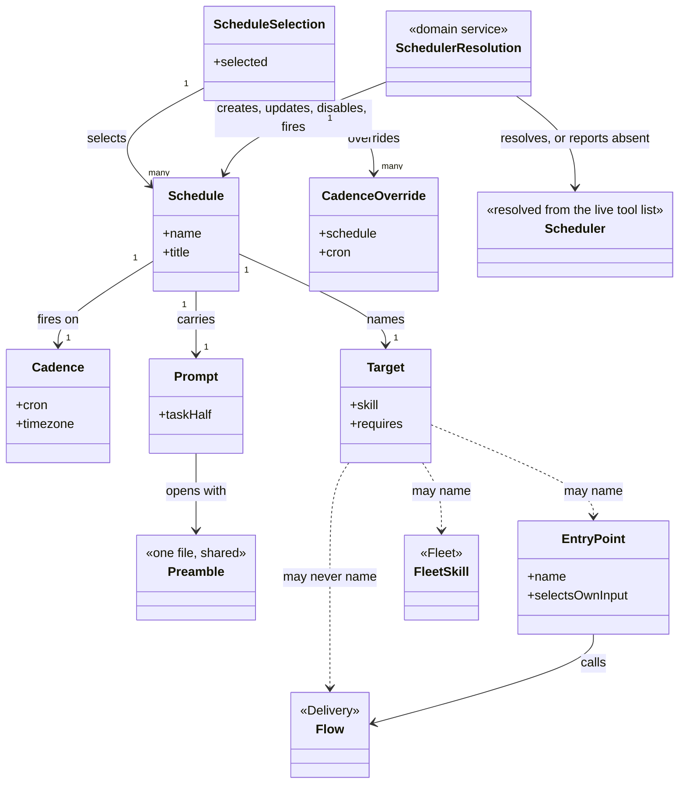
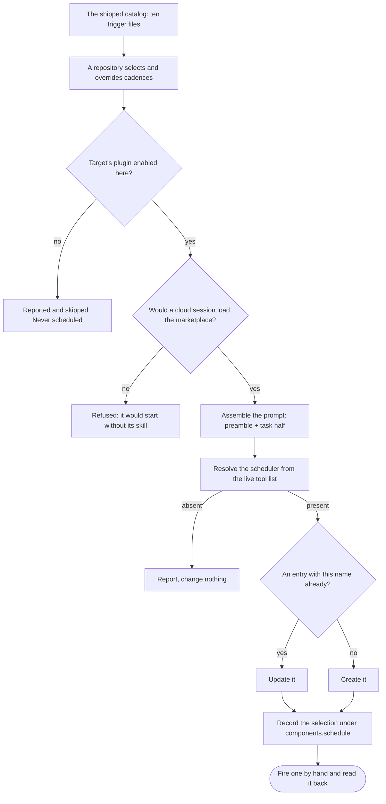
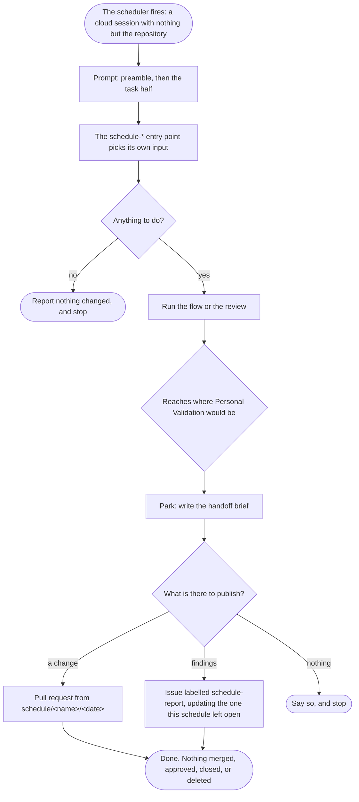

# delivery-schedule

```meta
related: [".devbook/arc42/building-blocks/README.md", ".devbook/arc42/building-blocks/delivery.md#dependencies", ".devbook/arc42/adr/plugin-boundaries.md", ".devbook/arc42/05-building-block-view.md#schedule-plugin"]
```

Work that runs with nobody watching, and the catalog of triggers that fires it. Responsible for
one thing: that a procedure can run in a session nobody is watching without ever passing a
gate, without merging anything, and without carrying anything personal into the repository.

Inside the block: the entry points that pick their own input, the catalog of triggers that
fires them, the preamble every unattended prompt starts with, and the selection a repository
records.

Outside it: the flows the entry points call, which are [delivery](delivery.md)'s; the scheduler
itself, which is a host capability resolved from the live tool list and never named; and
anything a target delegates to, which is a binding the consuming repository makes.

## Interfaces

```meta
```

Seventeen skills in two halves: fourteen entry points that pick their own input, and three that
put a trigger in the scheduler and read it back. Every one of them is also runnable by hand,
which is how a cadence gets proved before it is trusted. Beside them: the shipped catalog, four
contracts, the catalog checker, one hook, and one stamp.

| Interface | Kind | Reached by |
| --- | --- | --- |
| `schedule-bug-fix` through `schedule-whats-new`, fourteen entry points | skills | The scheduler, on a cadence, or a person by hand |
| `install` | skill | A person, or `devbook-config:setup` and `devbook-config:update` during a fan-out |
| `schedule-status`, `schedule-run` | skills | A person, from a session |
| `resources/schedules/*.schedule.md` | catalog, the shipped trigger files | `install`, reading a repository's selection against it |
| `schedule-catalog-contract.md`, `schedule-preamble.md`, `change-window-contract.md`, `instruction-tightening.md` | contracts | The skills, by path: the schedule file and the stamp; the preamble every prompt opens with; the change window `schedule-morning-brief` and `schedule-weekly-update` share; the tightening standard `schedule-instruction-review` applies |
| `tools/schedule-catalog/check.mjs` | tool | Run before committing a catalog change |
| `SessionStart` hook | hook | Either host, at session start: the routing text that sends recurring unattended work here and says never to schedule a flow |
| `components.schedule` | stamp in the stack config | Written by `install` alone, read by [devbook-config](devbook-config.md) |

### schedule-bug-fix

```meta
related: [".devbook/arc42/building-blocks/delivery.md#flow-code"]
```

Pick the top open `bug` item and run the bug flow on it, unattended. It lands as a branch parked
where Personal Validation would be, with a handoff brief naming what a person has to judge.

### schedule-devbook-check

```meta
related: [".devbook/arc42/building-blocks/devbook.md#check", ".devbook/arc42/building-blocks/devbook-derived.md#install", ".devbook/arc42/adr/checks-and-indexes.md"]
```

Run `devbook:check` over every adopted folder, fix what it reports in the chapters, refresh the
committed indexes where `devbook-derived` keeps them, and land one pull request — or a
schedule-report issue when the ledger or the stamp needs a person. The daily `devbook-check`
trigger's target: the catalog names a schedule skill, never a foundation skill directly.

### schedule-instruction-review

```meta
related: [".devbook/arc42/08-crosscutting-concepts.md#skill", ".devbook/arc42/08-crosscutting-concepts.md#plugin-rule"]
```

Read every instruction asset a model loads — repository instructions, rules, skills, agents,
prompts, contracts — and cut what changes nothing: a sentence the model does by default, a rule
stated twice, a hedge, a prohibition with a positive form. It lands as a draft pull request with
one commit per file and a ledger of every cut, because no check proves a rewritten instruction
and a reviewer must be able to drop one file without losing the rest. A file the previous run's
rejected pull request touched is skipped: a rejection is an answer, and the run converges on what
the repository will accept. It adds nothing but a pointer that replaces a duplicate.

### schedule-merge-review

```meta
```

Review every pull request waiting on a reviewer and leave one comment per pull request. It
reviews and never approves — approving is a decision, and no unattended run takes one.

### schedule-morning-brief

```meta
```

Report what changed in this repository since yesterday and what needs a person today, in one
screen, needs-you first. It is triage, read once: the
[weekly update](#schedule-weekly-update) is the record. Both read the same sources over
different windows, stated once in the plugin's change window contract.

### schedule-package-update

```meta
related: [".devbook/arc42/building-blocks/delivery.md#flow-update-packages"]
```

Update what is outdated, verify the build, and open a pull request. The shipped trigger restricts
it to minor and patch, because a major version is a decision rather than an update.

### schedule-performance-review

```meta
```

Score ten performance findings and implement the best one, landing as a pull request. Ten scored
and one implemented is the shape: an unattended run that fixed all ten would be ten unreviewed
changes in one branch.

### schedule-review

```meta
```

Sweep TODOs, open suggestions, and the code review checklist, and report the findings —
optionally as issues.

### schedule-security-review

```meta
```

Check dependencies, secrets, CI hardening, and code, and open one issue per new high finding.
New is the operative word: a run updates what its previous run left open rather than
re-reporting it.

### schedule-tech-update

```meta
related: [".devbook/arc42/building-blocks/devbook.md#tech-update", ".devbook/arc42/adr/checks-and-indexes.md"]
```

Run `devbook:tech-update` over every `tech/` layer and land what moved as one draft pull
request, never a merge — a rating is a person's decision. The weekly `tech-update` trigger's
target.

### schedule-week-starter

```meta
```

Digest what the tracked topics published this week, as one report.

### schedule-weekly-cost-analysis

```meta
related: [".devbook/arc42/building-blocks/delivery-surface-dashboard.md#telemetry"]
```

Read the week's token telemetry from the run surface and report the cost. It reads measured
numbers or it reports none — a surface that does not capture telemetry leaves this empty rather
than estimated.

### schedule-weekly-update

```meta
```

Report the repository's week as one update a stakeholder can read — shipped, in flight, issues,
releases, what the schedules landed, and what carries over — with the numbers beside the
narrative. One per week, kept as the record of everything that changed; the
[morning brief](#schedule-morning-brief) is the same sources over a day.

### schedule-whats-new

```meta
```

Report what changed in the tracked repositories since the last run, over a stated window.

### install

```meta
```

Create or update the selected schedules through whatever scheduler the live session exposes,
disable the deselected, and record the selection under this component's stamp — the
[Schedule Selection](#schedule-selection) aggregate, drawn under
[From Catalog to Scheduler](#from-catalog-to-scheduler).

Refuse what would not run: a cloud session loads this marketplace only if the repository's
committed host settings enable it and the plugins the target needs. A schedule that would start
without its skill is refused rather than created.

Match by name: entries are matched by `<owner>/<repo> · <title>`, so a second sync updates
rather than duplicates — and no scheduler id has to be written into the repository, which is
what keeps anything personal out of it.

### schedule-status

```meta
```

List the schedules with their last runs, what each published, and the log where one failed. It
goes through [Scheduler Resolution](#scheduler-resolution) like the other two catalog skills.

### schedule-run

```meta
```

Fire one schedule now and report the run, through [Scheduler Resolution](#scheduler-resolution).
The first run is the proof, not the creation: a cadence that has never fired is a guess about
somebody else's environment.

## Structure

```meta
related: [".devbook/arc42/05-building-block-view.md#schedule-plugin", ".devbook/arc42/adr/plugin-boundaries.md"]
```

Three aggregates, two services, and one event: the two halves of the block — the triggers and
the things they fire — and the line between what a repository commits and what stays in the
scheduler.

### Model

```meta
related: [".devbook/arc42/building-blocks/delivery-surface-dashboard.md"]
```



- **`Target ..> Flow` is the one forbidden association, and it is drawn on purpose.** A flow ends
  at a gate and an unattended run parks where a gate would be, so scheduling a flow schedules a
  park. The catalog checker is what turns that sentence into a failing build.
- **`EntryPoint → Flow` is allowed and is the whole design.** The entry point is the adapter: it
  picks the input a flow would otherwise need a person for, then calls the flow.
- **`Preamble` is one file associated by every prompt.** Restating the unattended rules per
  schedule would put six copies of the most safety-critical prose in the plugin, drifting
  independently.
- **`ScheduleSelection` sits in the consuming repository, `Scheduler` sits in the host, and
  nothing joins them but a name.** Matching by `<owner>/<repo> · <title>` is what removes the
  need to write a scheduler id anywhere — an id would be personal, and personal facts do not go
  in a committed file.
- **`Scheduler` is dashed and terminal.** It is resolved at run time and no scheduler is a normal
  outcome, which is the same shape a [surface](delivery-surface-dashboard.md) has and for the
  same reason.
- **The two halves share only `Target`.** The catalog is host-neutral data and the entry points
  are procedures; the plugin holds both because they are one subject — work that runs with nobody
  watching — not because either needs the other's internals.

### Schedule

```meta
related: [".devbook/arc42/05-building-block-view.md#schedule-plugin", ".devbook/arc42/12-glossary.md#catalog"]
```

Also called: routine, automation, trigger, cron entry.

One trigger: a cadence, a target, the plugins that target needs, and a prompt self-contained
enough to run with nobody watching. It is the consistency boundary because those four are only
meaningful together — a cadence with a target the repository has not enabled is a session that
starts and immediately has nothing to run.

**A schedule is a trigger and never a procedure.** The `schedule-*` entry point is what runs;
the schedule is what asks. That separation is why every entry point is also runnable by hand,
and why a trigger can be created, disabled, and re-created without touching what it fires.

| Invariant | Enforced at | Evidence |
| --- | --- | --- |
| A target is an entry point, a `fleet-*` skill, or a read-and-report skill — never a flow | `check.mjs` | untested |
| A cron expression that could fire more than hourly is rejected | `check.mjs` | untested |
| The `requires` list names the target's own plugin | `check.mjs` | untested |
| Every prompt begins with the preamble, stated once and not restated per schedule | prompt assembly | untested |
| A trigger whose target plugin the repository has not enabled is reported and skipped, never scheduled | `install()` | untested |
| Schedules are matched by name, so a second sync updates rather than duplicates | `install()` | untested |
| No placeholder the contract does not name appears in a prompt | `check.mjs` | untested |

The values it holds:

- **Cadence** — a value object. When the trigger fires, as a cron expression in UTC. Hourly is
  the ceiling: anything that could fire more often is rejected, because an unattended run that
  overlaps its own previous run has no way to notice it is doing so. A repository changes a
  cadence in its own selection rather than in the catalog, which is what keeps the shipped
  [catalog](../12-glossary.md#catalog) readable as the default rather than as somebody's current
  setting.
- **Target** — a value object. The skill a trigger fires, plus the plugins it needs to be
  present. Three kinds are admissible — an [entry point](#entry-point), a fan-out skill, a
  read-and-report skill — and one is not: a flow ends at a gate, and an unattended run parks
  where a gate would be, so scheduling a flow schedules a park.
- **Prompt** — a value object. What the cloud session is given, assembled from the shared
  [preamble](../12-glossary.md#preamble) and the schedule's own task half. It has to be
  self-contained: the session starts with nothing but the repository, so anything the prompt
  does not say is not available to be remembered.

### Entry Point

```meta
```

Also called: schedule skill, schedulable procedure.

A `schedule-*` skill that picks its own input, so it needs no person to hand it one — the top
open bug, every pull request waiting on a reviewer, the outdated packages, the week's changes in
the tracked repositories, the repository's own day or week, the instruction assets a model loads.
Fourteen ship here.

Picking its own input is the entire distinguishing property. A procedure that needs an argument
needs a person, and a person is exactly what an unattended run does not have.

| Invariant | Enforced at | Evidence |
| --- | --- | --- |
| It selects its own input and requires no argument | authoring | untested |
| It is runnable by hand as well as on a cadence | authoring | untested |
| It never passes a gate — it parks with a handoff brief where Personal Validation would be | run | untested |
| It never merges, approves, closes, or deletes | run | untested |
| A change lands as a pull request from `schedule/<name>/<date>`; a report lands as a labelled issue | run | untested |
| A run updates what its previous run left open rather than opening a second | run | untested |

### Schedule Selection

```meta
related: [".devbook/arc42/08-crosscutting-concepts.md#stamp", ".devbook/arc42/05-building-block-view.md#stack-config"]
```

Which schedules this repository chose and any cadence it overrode, recorded under
`components.schedule` in the stack config and written by this block's install skill alone.

The split is by who the fact belongs to. The selection and the overrides are repository facts
and are committed; the environment, the model, and the scheduler's own ids are personal. The
ids stay in the scheduler — matching by name is what makes writing them down unnecessary —
and the environment and the model may be remembered under `ext.schedule` in a machine's own
stack-config overlay, where the engine merges them and this block alone reads them.

| Invariant | Enforced at | Evidence |
| --- | --- | --- |
| Nothing personal is written into the repository | `install()` | untested |
| The selection is written by this block's install skill and by nothing else | `install()` | untested |
| A deselected schedule is disabled rather than deleted, so re-selecting it does not duplicate | `install()` | untested |
| A schedule that would start without its skill is refused rather than created | `install()` | untested |

The value it holds:

- **Cadence Override** — a value object. A repository's replacement for a catalog cadence. It is
  a value in the selection rather than an edit to the catalog file, so an upgrade can move the
  shipped default without silently reverting somebody's choice — or silently keeping it.

### Scheduler Resolution

```meta
related: [".devbook/arc42/12-glossary.md#scheduler", ".devbook/tech/hosts.md#scheduled-cloud-sessions"]
```

Finds whatever the live session exposes that turns a name, a cron expression, a repository, and
a prompt into a scheduled session — the [scheduler](../12-glossary.md#scheduler) — and creates,
updates, disables, reads, or fires an entry through it.

Invocation semantics: command-invoked, by the three catalog skills. **No scheduler is a normal
outcome:** the operation reports it and stops without failing anything, the same shape a surface
takes.

It is a service rather than behaviour on [Schedule](#schedule) because it is the one place a
host capability is touched at all — everything else here is host-neutral data, and keeping the
resolution in one place is what makes that true.

### Catalog Check

```meta
related: [".devbook/arc42/12-glossary.md#catalog"]
```

Validates the shipped catalog: a malformed entry, a cron that could fire more than hourly, a
target that is a flow or does not exist, a `requires` list omitting the target's plugin, a
placeholder the contract does not name.

Invocation semantics: command-invoked, and run before committing. It is the only thing that
enforces the rule a schedule may not target a flow, which is otherwise a sentence in a document
nobody re-reads.

### Schedule Report Published

```meta
related: [".devbook/arc42/08-crosscutting-concepts.md#tracker"]
```

Published when an unattended run of an [entry point](#entry-point) has something to say: a
report as an issue labelled `schedule-report`, or a change as a pull request from a dated
branch. It is the only way a run nobody watched reaches a person, so a run that publishes
nothing has, from outside, not happened.

Payload:

- `kind` — a report issue, or a pull request from `schedule/<name>/<date>`
- `schedule` — which trigger fired it, so the next run can find what this one left open
- `findings` or `changes` — what was found or what was changed, in the run's own words

Consumers:

- **The maintainer**, who reads it on the tracker rather than in a session they were not in.
- **The next run of the same schedule**, which updates what this one left open instead of
  opening a second.

Published language rules:

- **Never merge, approve, close, or delete.** Every change lands as a pull request and every
  report as a labelled issue; the run's authority ends at publishing.
- **Update, do not accumulate.** A weekly report that opens a new issue every week is a backlog
  of its own within two months.
- **Nothing personal travels.** The scheduler ids stay in the scheduler, the environment and
  the model there or in a machine's own overlay; nothing published here would be wrong for
  the next person who opens the file.

## Runtime

```meta
related: [".devbook/arc42/building-blocks/delivery.md"]
```

How a trigger becomes a run, and where that run stops.

### From Catalog to Scheduler

```meta
```

Three skills read the catalog, and all three resolve the scheduler rather than naming one. No
scheduler is a normal outcome at every step below.



- **Matching by name is what makes a second sync an update.** The name is
  `<owner>/<repo> · <title>`, which is also why no scheduler id has to be written down — and an
  id would be personal, so it could not be committed anyway.
- **Refusing beats creating something that cannot run.** A cloud session loads this marketplace
  only if the repository's committed host settings enable it and the plugins the target needs.
- **The first run is the proof, not the creation.** A cadence that has never fired is a guess
  about somebody else's environment.

### An Unattended Run

```meta
```

The same spine [delivery](delivery.md) draws, cut short at exactly one place. Everything below
the gate is what changes when nobody is in the session.



- **The gate is never passed and never waited at.** It is parked at, with a brief — which is the
  whole reason a schedule may not target a flow, and why the catalog checker enforces it.
- **A run that publishes nothing has, from outside, not happened.** That is acceptable and
  common: most weeks the security review finds nothing new. What is not acceptable is a run that
  changed something and published nothing.
- **The next run updates what this one left open.** A weekly report opening a new issue every
  week becomes its own backlog within two months.
- **Nothing personal crosses into the repository.** The scheduler ids stay in the scheduler,
  the environment and the model there or under `ext.schedule` in a machine's own overlay; the
  stamp records only the selection and the overrides.

## Dependencies

```meta
related: [".devbook/arc42/building-blocks/delivery.md#dependencies", ".devbook/arc42/adr/plugin-boundaries.md", ".devbook/arc42/08-crosscutting-concepts.md#layer"]
```

An L1 extension over the engine it calls into, and the one plugin here whose subject is a host
capability — a divergence taken on purpose.

### Outbound

```meta
```

| Depends on | Pattern | Mechanism | Contract | Why |
| --- | --- | --- | --- | --- |
| [delivery](delivery.md#dependencies) | Customer-Supplier, declared `delivery >=1.0.0 <2.0.0` | Its entry points call the engine's flows and phases | `resources/flow-phases.md`, `resources/surface-contract.md`, the parking rule at a gate | The entry points are adapters onto flows. The dependency is real, and it is the only declared one. |
| [devbook](devbook.md#dependencies) | Separate Ways | One catalog entry names `prose-check`, and two of its own wrappers invoke `devbook:check` and `devbook:tech-update` as targets | The skill names alone | Naming is not depending: a trigger whose target plugin the repository has not enabled is reported and skipped, never scheduled. |
| [fleet](fleet.md#dependencies) | Separate Ways | A schedule may name a `fleet-*` skill as a target | The skill name alone | Same relationship. A `fleet-*` skill holds no gate, which is what makes it schedulable where a flow is not. |
| The host's scheduler | Conformist, resolved at run time | Whatever the live session exposes that turns a name, a cron, a repository, and a prompt into a scheduled session | Resolution by capability, never by name | One capability with two host names — Routines and Automations — and adopting either would name a host. **No scheduler is a normal outcome.** |
| A bound tracker | Binding, never a dependency | Pull requests from dated branches, issues labelled `schedule-report` | The engine's tracker binding | Publishing is how an unattended run reaches a person, and which system holds it is the repository's choice. |
| [The plugin kernel](../08-crosscutting-concepts.md) | Shared Kernel | Plugin folder, two manifests, marketplace entry, `resources/` contracts, the `components.schedule` stamp | [Chapter 8](../08-crosscutting-concepts.md) | It is packaged, installed, and stamped like everything else here. |
| A consuming repository | Customer-Supplier, this block supplying | `components.schedule` in the stack config: the selection and any cadence overrides | The stamp shape, and the schedule names | The selection is a repository fact; everything personal about a schedule stays in the scheduler or in a machine's own overlay. |

### Inbound

```meta
```

| Consumer | Pattern | Mechanism | Contract | What it relies on |
| --- | --- | --- | --- | --- |
| [devbook-config](devbook-config.md#dependencies) | Conformist, read-only | Reads this plugin's `skills/` folder to report which `schedule-*` procedures the copy on disk ships, and reads `components.schedule` | The `schedule-` prefix and the stamp shape | That the prefix keeps its meaning and the stamp keeps its shape. It writes neither. |
| A maintainer, later | Customer-Supplier, this block supplying | A pull request from `schedule/<name>/<date>`, or an issue labelled `schedule-report` | The branch and label conventions | That every run publishes what it did, and that the next run updates rather than duplicates. |

**Naming a target is deliberately weaker than depending on one.** One of the ten schedules
targets another plugin's skill, and the plugin declares one dependency. A target that is not
enabled costs that trigger and nothing else, which is the same degrade-rather-than-fail shape
the engine uses for a role.

**The host-capability divergence is recorded, not hidden.** Nothing else in this marketplace
names a host capability as its subject. The catalog itself stays host-neutral data and only the
scheduler resolution knows a tool answered — see
[the plugin boundaries record](../adr/plugin-boundaries.md).

**This block owns no flow, holds no gate, and adds no extension point.** That is what makes it
an extension rather than a second engine: everything it runs, the engine already had.

**The line between committed and personal is the one to hold.** The selection and the cadence
overrides go in the repository; the scheduler ids stay in the scheduler, and the environment
and the model in the scheduler or a machine's own overlay under `ext.schedule`, so nothing in
the committed file would be wrong for the next person who opens it.
