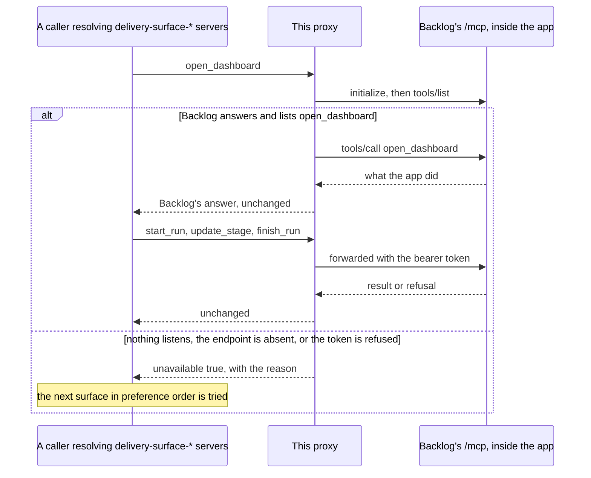

# delivery-surface-backlog

```meta
related: [".devbook/arc42/building-blocks/README.md", ".devbook/arc42/building-blocks/delivery.md#dependencies", ".devbook/arc42/adr/surfaces.md", ".devbook/arc42/08-crosscutting-concepts.md#surface"]
```

A run shown in the application where its work item already lives. Responsible for one thing:
that the Backlog desktop app answers as a surface when, and only when, this plugin is
installed — and says plainly when it cannot.

Inside the block: one stdio MCP server that forwards calls to the MCP endpoint inside the
running app, the resolution of that endpoint and its bearer token, and the one answer it
composes itself — `unavailable` at open time. The run store, the Sessions pane, and every
refusal are Backlog's, in `JSdotNet/Backlog`.

Outside it: what produced the run, and Backlog's tracker. The general `backlog` MCP server a
repository registers to reach its work items is a different server under a different name, and
never a surface. This block declares no dependency and names no engine. The kernel vocabulary —
surface, capability group, MCP server — is [chapter 8](../08-crosscutting-concepts.md)'s.

## Interfaces

```meta
related: [".devbook/arc42/adr/surfaces.md", ".devbook/arc42/08-crosscutting-concepts.md#surface"]
```

One capability group whole, a second while Backlog answers it, and no skills. Everything a
caller sees is a tool name it forwards.

| Interface | Kind | Reached by |
| --- | --- | --- |
| `open_dashboard`, `start_run`, `record_prompt`, `set_run_context`, `update_stage`, `finish_run`, `list_runs`, `get_run` | MCP tools, `delivery.surface.lifecycle@1` | A caller resolving a server named `delivery-surface-*` from the live tool list |
| `export_report` | MCP tool, `delivery.surface.export@1` | The same, listed only while Backlog lists it |
| `render_diagram`, `render_markdown` | Absent — `delivery.surface.render@1` is unanswered | Nobody |

### Forward a Call

```meta
related: [".devbook/arc42/building-blocks/delivery-surface-backlog.md#endpoint"]
```

Hand each lifecycle call to Backlog's `/mcp` over streamable HTTP — initialize once, keep the
`Mcp-Session-Id` when Backlog issues one, read a JSON or an event-stream answer — and return
Backlog's result or JSON-RPC error as it came. Nothing is checked on the way through: a second
set of guards beside Backlog's would be a second contract drifting beside the first.

### Answer Unavailable

```meta
related: [".devbook/arc42/adr/surfaces.md"]
```

Tell a caller at open time that Backlog cannot be the surface: `open_dashboard` returns
`unavailable: true` with the reason when nothing listens, the endpoint is absent, the token is
refused, or Backlog lists no `open_dashboard`. The contract's skip rule does the rest. Any
later operation that cannot reach Backlog is a tool error — the run already lives there.

## Structure

```meta
related: [".devbook/arc42/05-building-block-view.md#surface-plugins"]
```

A value and a session, and nothing stored.

### Endpoint

```meta
```

Also called: Backlog endpoint, port and token.

Where Backlog listens and how it is let in: `http://127.0.0.1:<port>/mcp` with a bearer token.
Resolved from `BACKLOG_MCP_PORT` and `BACKLOG_MCP_TOKEN`, then `mcpServer.port` and
`mcpServer.token` in the app's `settings.json`, then port `5757` — the order Backlog's own
`backlog-tools` telemetry forwarder reads them in. Re-resolved after Backlog stops answering, so
an app restarted on another port is found again.

| Invariant | Enforced at | Evidence |
| --- | --- | --- |
| The environment wins over `settings.json`, which wins over the default port | `resolveEndpoint()` | `unit:node:plugins/delivery-surface-backlog/mcp/delivery-surface-backlog/dev/proxy-test.mjs` |
| Every forwarded request carries the bearer token when one resolves | `BacklogClient` | `unit:node:plugins/delivery-surface-backlog/mcp/delivery-surface-backlog/dev/proxy-test.mjs` |
| A session id Backlog issues is sent back on every later request | `BacklogClient` | `unit:node:plugins/delivery-surface-backlog/mcp/delivery-surface-backlog/dev/proxy-test.mjs` |

### Declared Tools

```meta
```

The names this server lists and forwards: the eight lifecycle operations always, with Backlog's
own schemas while it is running, and `export_report` only while Backlog lists it. A promised
group is not a bound one, so the name appears when the operation does.

| Invariant | Enforced at | Evidence |
| --- | --- | --- |
| Only lifecycle names, and `export_report` while Backlog lists it, are listed or forwarded; any other name is refused without asking Backlog | `tools/list`, `tools/call` | `unit:node:plugins/delivery-surface-backlog/mcp/delivery-surface-backlog/dev/proxy-test.mjs` |
| Backlog's answers and refusals reach the caller unchanged | `tools/call` | `unit:node:plugins/delivery-surface-backlog/mcp/delivery-surface-backlog/dev/proxy-test.mjs` |
| Backlog not listening makes `open_dashboard` answer `unavailable`, never an error | `open_dashboard` | `unit:node:plugins/delivery-surface-backlog/mcp/delivery-surface-backlog/dev/proxy-test.mjs` |

## Runtime

```meta
related: [".devbook/arc42/building-blocks/delivery.md#run-started"]
```

### A Run, Bound or Skipped

```meta
```



- **Unavailable is an answer, not an error.** It is the one thing this proxy composes, and it
  is given at open time because that is where a caller can still choose another surface.
- **Mid-run is different.** A Backlog that closes after `start_run` fails the next call as a
  tool error, and the caller treats it as the tooling failure it is.

## Dependencies

```meta
related: [".devbook/arc42/building-blocks/delivery.md#dependencies", ".devbook/arc42/08-crosscutting-concepts.md#surface"]
```

Like every surface here, it declares nothing and nothing declares it.

### Outbound

```meta
```

| Depends on | Pattern | Mechanism | Contract | Why |
| --- | --- | --- | --- | --- |
| [delivery](delivery.md#dependencies) | Conformist to a Published Language | Lists the lifecycle names, and `export_report` while Backlog answers it, under a server named `delivery-surface-backlog` | `resources/surface-contract.md`: `delivery.surface.lifecycle@1`, `.export@1` | The server name is what makes a caller bind it; the operation names are what make it substitutable. |
| The Backlog desktop app | Conformist, at runtime only | Streamable HTTP to `127.0.0.1:<port>/mcp` with a bearer token, answers passed through | Backlog's published surface tools, `JSdotNet/Backlog` local ADR 0012 | Backlog owns the run store and every decision about a run; this block only reaches it. |
| [The plugin kernel](../08-crosscutting-concepts.md) | Shared Kernel | Plugin folder, two manifests, marketplace entry, `mcp/<server>/` | [Chapter 8](../08-crosscutting-concepts.md) | It is packaged like everything else here. |
| Model Context Protocol | Conformist | One stdio server, plain Node, no npm dependencies | The protocol's own schemas | A stdio server reads the token from a file on both hosts, which neither host's HTTP server entry can. |

### Inbound

```meta
```

| Consumer | Pattern | Mechanism | Contract | What it relies on |
| --- | --- | --- | --- | --- |
| Whatever drives a run | Customer-Supplier, this block supplying | A `delivery-surface-*` server name in the live tool list | The groups it answers | That `unavailable` at open means skip, and that everything else is Backlog's own answer. |
| [devbook-config](devbook-config.md#dependencies) | Conformist, read-only | Reports whether this plugin is installed, enabled, and at what version | The marketplace entry and the manifest | Nothing but the name and version. |
