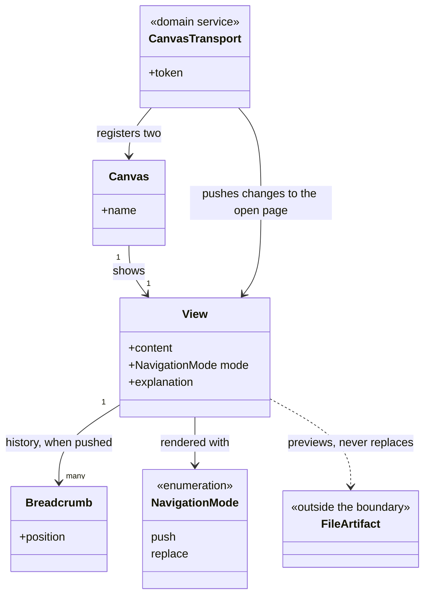
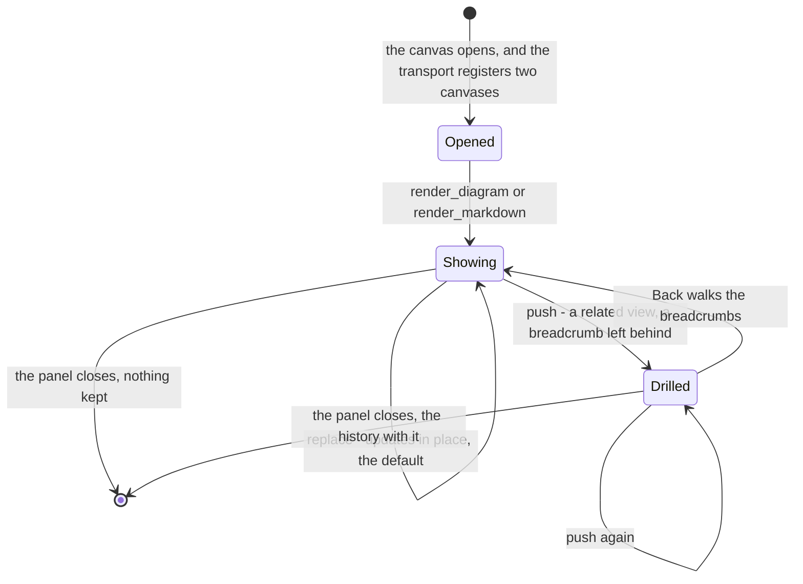
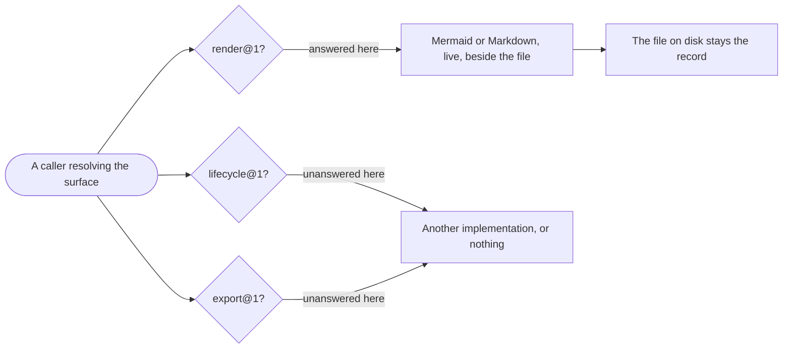

# delivery-surface-canvas

```meta
related: [".devbook/arc42/building-blocks/README.md", ".devbook/arc42/building-blocks/delivery.md#dependencies", ".devbook/arc42/adr/surfaces.md", ".devbook/arc42/12-glossary.md#canvas", ".devbook/arc42/12-glossary.md#preview"]
```

Mermaid and Markdown rendered live beside the files they came from. Responsible for one thing:
that a diagram or a document written to a file can be looked at, live, beside the file — and
that looking at it creates nothing anyone could mistake for a record.

Inside the block: the two viewers, the navigation between views, and the transport that puts
them on a canvas panel.

Outside it: everything else. It tracks no runs, exports nothing, persists nothing, and knows
nothing about what produced the content it is handed. It answers one capability group and is
the one plugin here that ships a single host's manifest and takes no marketplace entry. The
kernel vocabulary — surface, capability group, plugin — is
[chapter 8](../08-crosscutting-concepts.md)'s; the two terms this block owns, canvas and
preview, are in the [glossary](../12-glossary.md#canvas).

## Interfaces

```meta
related: [".devbook/arc42/adr/surfaces.md", ".devbook/arc42/08-crosscutting-concepts.md#surface"]
```

One capability group, whole, and nothing else. It ships no skills — two canvas operations and
nothing else — and the absences below are as much a feature as the renders are.

| Interface | Kind | Reached by |
| --- | --- | --- |
| `render_diagram`, `render_markdown` | Canvas actions, `delivery.surface.render@1` | A caller resolving the render group as a capability group, on the one host with a canvas panel |
| Two canvases, one for diagrams and one for documents | Copilot extension, `extensions/delivery-surface-canvas/` | Copilot CLI, from the live tool list |
| The viewer pages | Loopback origin at an ephemeral port, per-instance token | The open canvas panel, with view changes pushed to it |

The two operations arrive as canvas actions rather than as namespaced tools, and the contract
is still satisfied — a surface is not required to be an MCP server.

### Render a Diagram

```meta
related: [".devbook/arc42/building-blocks/delivery-surface-canvas.md#view"]
```

Show Mermaid source live and pannable, with an optional explanation panel beside it — C4,
sequence, state, deployment, aggregate, context map, domain-event flow, subdomain landscape,
wireframes, user flows. Whatever the source says, drawn.

Drill down and step back: `push` into a related diagram and walk back through the
breadcrumbs; `replace` updates in place. The history is the only thing this block remembers,
and it dies with the panel.

### Render a Document

```meta
related: [".devbook/arc42/building-blocks/delivery-surface-canvas.md#view"]
```

Show Markdown as formatted HTML, with the same push-and-replace navigation. Same viewer shape,
different content — which is why the two are one plugin rather than two.

### Stay a Preview

```meta
related: [".devbook/arc42/12-glossary.md#preview"]
```

Persist nothing. Render the same source that was written to disk; the file stays the source of
truth, and a rendered view nobody saved is not a record of anything.

This is what keeps the render group honest across all three implementations: a surface that
started storing what it drew would become a second, staler copy of the artifact — and the run
would then have two answers to what it produced.

### Declare Two Names

```meta
related: [".devbook/arc42/adr/surfaces.md"]
```

Answer `render_diagram` and `render_markdown`, and nothing else. Viewer navigation and view
inspection are served over the extension's own origin rather than added as extra actions — a
surface that declares more than the contract stops being swappable for one that declares
exactly it.

## Structure

```meta
related: [".devbook/arc42/building-blocks/delivery-surface-dashboard.md#structure", ".devbook/arc42/adr/surfaces.md"]
```

The smallest model in this repository, and the size is the statement: one aggregate, no store,
and a transport that knows the host.

### Model

```meta
```



- **`View ..> FileArtifact` is dashed and one-way, and it is the whole ethic of a surface.**
  The file was written by something this block cannot name; the view is a preview of it and
  never a copy, so nothing here can become a second answer to what a run produced.
- **There is no run, no stage, and no store.** The other two implementations of this contract
  have all three; this one answers a different capability group, and a group is what a surface
  is substitutable by.
- **`Breadcrumb` is the only memory, and it is scoped to the panel.** It exists so a
  drill-down can be stepped back, and it dies when the panel closes — which is why `View` is
  an aggregate rather than a pure function, and why that is the extent of it.
- **`CanvasTransport` holds the token because it outlives the panel.** A canvas server that
  keeps running after the panel is gone is reachable by anything local, which is the one
  security question this model has and the dashboard's loopback pages do not.
- **`Canvas` is a host concept, and it is the only one in the diagram.** The two operations
  arrive as canvas actions rather than as namespaced tools, which is exactly why the surface
  contract matches operation names and never a transport.

### View

```meta
```

Also called: render, panel content.

What is currently shown on a canvas, and the history behind it. It is the only aggregate here,
and it is deliberately ephemeral: a view is a preview of a file that already exists, so storing
one would create a second, staler copy of something one call can re-render.

The history is the only state that is not derivable from the current call, which is exactly
why the aggregate exists at all rather than the render being a pure function.

| Invariant | Enforced at | Evidence |
| --- | --- | --- |
| Nothing is persisted; a view is re-rendered rather than restored | render | untested |
| Rendered source is the same source written to disk — the file stays the record | render | untested |
| `push` leaves a breadcrumb the Back button walks; `replace` updates in place and is the default | `render_diagram()`, `render_markdown()` | untested |
| The declared tool surface is exactly two names | extension start | untested |
| Navigation and view inspection are served over the extension's own origin, never as extra actions | page load | untested |
| The canvas server checks a per-instance token, because it outlives the panel that opened it | request handling | untested |

The aggregate owns one enum and one entity:

- **Navigation Mode** (enum) — `push` or `replace`. `push` drills into a related view and
  leaves a breadcrumb; `replace` — the default — updates what is on screen. Two values and no
  third: a mode that cleared the history would make the Back button lie, and one that merged
  views would make the breadcrumb meaningless.
- **Breadcrumb** (entity) — one step in the history a `push` left behind, identified by its
  position. It exists so a drill-down can be stepped back, and it dies with the panel — which
  is the whole extent of this block's memory.

### Canvas Transport

```meta
related: [".devbook/arc42/12-glossary.md#canvas", ".devbook/tech/hosts.md#copilot-extension-sdk"]
```

Registers the two canvases, serves the viewer pages on a loopback origin at an ephemeral port,
and pushes view changes to the open page.

Event-triggered — it starts when a canvas opens. It is a service rather than behaviour on
[View](#view) because it is the one part of this block that knows a host exists, and keeping
that knowledge in one place is what lets the viewers themselves stay plain pages.

**This is the plugin's only transport, and it is why the contract matches operation names
rather than a transport.** The two operations arrive as canvas actions rather than namespaced
tools, and the surface contract is still satisfied — a surface is not required to be an MCP
server.

| Invariant | Enforced at | Evidence |
| --- | --- | --- |
| It registers exactly the two canvases, and pushes view changes to the open page | canvas registration | untested |
| Viewer pages are served on a loopback origin at an ephemeral port | server start | untested |
| The transport starts when a canvas opens, never before | extension start | untested |

## Runtime

```meta
related: [".devbook/arc42/building-blocks/delivery-surface-canvas.md#view", ".devbook/arc42/building-blocks/delivery-surface-canvas.md#canvas-transport"]
```

One flow: a view arriving, being navigated, and disappearing — and the resolution every caller
performs, from this surface's side.

### A View's Life

```meta
```

Everything below dies with the panel. That is not a limitation being worked around — it is
what keeps a preview from becoming a record.



- **`replace` is the default because most renders are an update, not a descent.** A default of
  `push` would grow a history nobody asked for and make Back mean something different each
  time.
- **Nothing survives the panel.** A view is a preview of a file that already exists, so
  persisting one would create a second, staler copy of something one call can re-render.
- **The transport outlives the panel and the view does not**, which is the whole reason the
  canvas server checks a per-instance token: it is reachable after the thing that opened it is
  gone.

### Where It Fits Among the Three

```meta
```

One group answered, two unanswered, and no fallback of its own.



- **One group, whole.** Answering render badly and lifecycle worse would make this
  substitutable for nothing, which is the failure the three-implementation split exists to
  avoid.
- **It answers on one host only, and that is a property of the group.** Its transport is a
  canvas panel and there is no equivalent on the other host — where the
  [dashboard](delivery-surface-dashboard.md) answers the same group instead.
- **A caller finding no render group renders nowhere and says so once.** Absence is a normal
  outcome for every group, including this one.

## Dependencies

```meta
related: [".devbook/arc42/building-blocks/delivery.md#dependencies", ".devbook/arc42/08-crosscutting-concepts.md#surface"]
```

The one plugin here that ships a single host's manifest and takes no marketplace entry, and
the reason is in the first outbound row.

### Outbound

```meta
```

| Depends on | Pattern | Mechanism | Contract | Why |
| --- | --- | --- | --- | --- |
| Copilot Extension SDK | Conformist, and structurally | `extensions/delivery-surface-canvas/`, a `copilot-extension.json` and the module that registers two canvases | The host's extension shape | A canvas panel is the one thing this block needs, and only one host has one. That is why it carries no second manifest — there is nothing in it for the other host to install. |
| [delivery](delivery.md#dependencies) | Conformist to a Published Language | Implements the render group's two operation names, and nothing else | `resources/surface-contract.md`: `delivery.surface.render@1` | The contract matches operation names rather than a transport, which is exactly what lets a canvas satisfy it without being an MCP server. |
| [The plugin kernel](../08-crosscutting-concepts.md) | Shared Kernel, with one documented exception | Plugin folder and one manifest; **no marketplace entry** | [Chapter 8](../08-crosscutting-concepts.md) | A plugin ships the manifest of every host that can load something in it. Here that is one host, so the folder-shape rule is satisfied rather than broken. |
| The local loopback origin | Conformist | The viewer pages served at an ephemeral port, with a per-instance token, and view changes pushed to the open page | Its own transport | The canvas server outlives the panel that opened it, which is the one thing here that needs a token. |

### Inbound

```meta
```

| Consumer | Pattern | Mechanism | Contract | What it relies on |
| --- | --- | --- | --- | --- |
| Whatever renders a diagram or a document | Customer-Supplier, this block supplying | Two operations, resolved as a capability group | `delivery.surface.render@1` | That the group is resolved separately from the other two, so a caller can get render here and lifecycle nowhere. |
| Nothing else | — | — | — | No plugin declares it, nothing lists it, and no host installs it from this marketplace. |

Being absent from the marketplace is the standing exception, and it is allowed on one test. A
plugin ships the manifest of every host that can load something in it; here that is one host,
so this is the folder rule applied rather than waived — see
[the surfaces record](../adr/surfaces.md). A plugin holding one host-only asset still ships
both manifests.

It knows nothing about what produced its content, and nothing knows it exists. It is resolved
at run time like every surface, and none answering is a normal outcome.

It answers one group and is substitutable within it. On the other host, the
[dashboard](delivery-surface-dashboard.md#dependencies) answers the same group — which is what
makes this a second implementation rather than a host-specific fork.

It persists nothing, so it depends on no store and nobody depends on it for one. The file the
view previews is somebody else's record and stays the source of truth.
