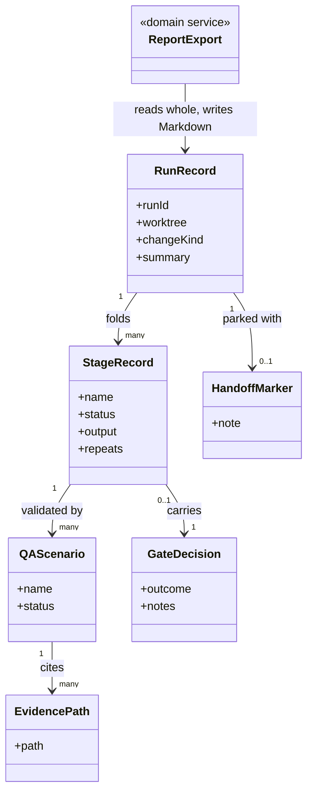
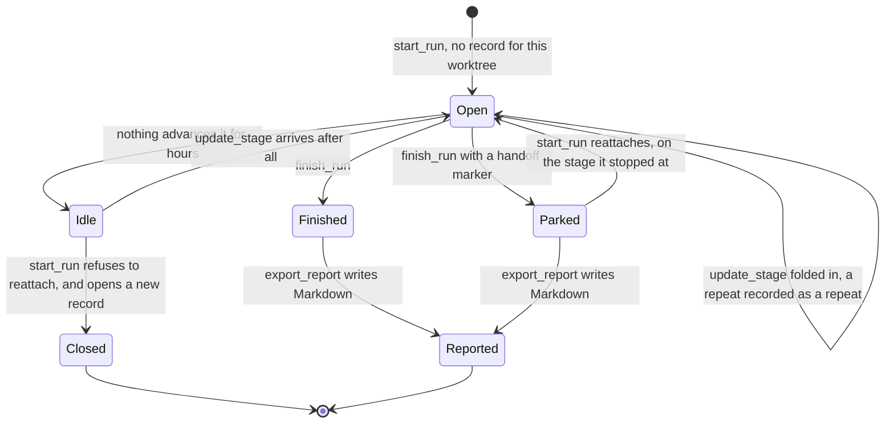
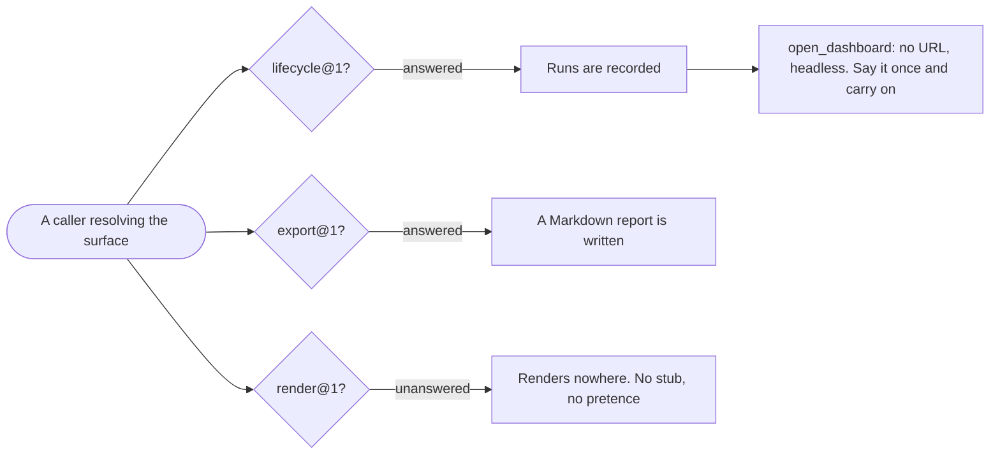

# delivery-surface-collector

```meta
related: [".devbook/arc42/building-blocks/README.md", ".devbook/arc42/building-blocks/delivery.md#dependencies", ".devbook/arc42/adr/surfaces.md", ".devbook/arc42/12-glossary.md#headless", ".devbook/arc42/12-glossary.md#unanswered-group"]
```

A run recorded to disk rather than watched, for unattended sessions. Responsible for one thing:
that a run nobody watched is still legible afterwards — which stages ran, how many times, what
a person decided at each gate, what the evidence was, and whether the run was handed off or
abandoned.

Inside the block: the run store, the handoff round trip a resumed session depends on, and the
Markdown report. It answers two of the three capability groups.

Outside it: rendering, deliberately, and everything about what produced the run. It declares
no dependency and names no engine. The kernel vocabulary — surface, capability group, MCP
server — is [chapter 8](../08-crosscutting-concepts.md)'s; the two terms this block owns,
headless and unanswered group, are in the [glossary](../12-glossary.md#headless).

## Interfaces

```meta
related: [".devbook/arc42/adr/surfaces.md", ".devbook/arc42/08-crosscutting-concepts.md#surface"]
```

Two capability groups, and one deliberate absence. It ships no skills — one MCP server over
stdio, no page, no port, and nothing a person invokes by name. Everything here is about what is
still true after the session has ended.

| Interface | Kind | Reached by |
| --- | --- | --- |
| `open_dashboard`, `start_run`, `record_prompt`, `set_run_context`, `update_stage`, `finish_run`, `list_runs`, `get_run` | MCP tools, `delivery.surface.lifecycle@1` | A caller matching the names by pattern from the live tool list |
| `export_report` | MCP tool, `delivery.surface.export@1` | The same, at the end of a run or long after it |
| `render_diagram`, `render_markdown` | Absent — `delivery.surface.render@1` is unanswered | Nobody: a caller resolving the group finds nothing and renders nowhere |

The nine declared names are exactly the two answered groups' names, and the render names are
absent rather than stubbed.

### Record a Run

```meta
related: [".devbook/arc42/building-blocks/delivery-surface-collector.md#run-record"]
```

Answer the lifecycle group and keep the result on disk, keyed by worktree, outside the
repository. Runs survive a session restart and never show up in `git status`.

Keep what outlives the session: stage status, output, and repeat count; the gate decision a
person returned; QA scenarios and their evidence paths; the handoff marker and its note. Each
earns its place by answering a question a later reader actually has.

Reattach or refuse: resume a handed-off run and decline an abandoned one. Both look idle by
every derived signal; the [marker](#handoff-marker) is the only thing that separates them.

### Answer Nothing for Render

```meta
related: [".devbook/arc42/12-glossary.md#headless", ".devbook/arc42/12-glossary.md#unanswered-group"]
```

Leave the render tool names absent rather than stubbing them. A caller resolves each capability
group separately, so it finds this one unanswered and renders nowhere — instead of finding a
stub that pretends to have shown someone something.

`open_dashboard` answers with no URL and says the run is being recorded rather than shown.
There is nothing to open, and saying so once is the whole behaviour.

### Report Without Telemetry

```meta
related: [".devbook/arc42/building-blocks/delivery-surface-collector.md#report-export"]
```

Write the run's Markdown report — prompts, stages, output, QA evidence paths, monitoring
findings, the handoff note, the summary. Asking for another format still writes Markdown and
says so, rather than failing a run over a file extension.

No token counts, no per-stage cost, no context gauge. Nothing here observes a session, so those
numbers would be a column of zeroes reading as a measurement rather than as an absence — and a
caller must never fill them in by hand.

## Structure

```meta
related: [".devbook/arc42/building-blocks/delivery-surface-dashboard.md#structure", ".devbook/arc42/adr/surfaces.md"]
```

The [dashboard](delivery-surface-dashboard.md#structure)'s model with two things removed, and
the removals are the content: no viewer, and no telemetry.

### Model

```meta
```



- **There is no `Viewer` and no `Telemetry`, and neither is an omission.** The render group's
  tool names are absent so a caller resolves it unanswered; the telemetry fields are absent
  because nothing here observes a session, and a column of zeroes reads as a measurement
  rather than as an absence.
- **`EvidencePath` is cited and never inlined.** Inlining evidence into a self-contained report
  is a rendering job. The consequence is that the screenshot has to stay in the worktree that
  produced it, which is a real cost accepted rather than hidden.
- **`HandoffMarker` is the only stored derived-looking thing in the model, and it is stored
  for a reason.** Idleness is computed on read; the marker cannot be, because "was this handed
  off on purpose" is not visible in any timestamp.
- **`GateDecision` is recorded so a resumed session can re-run the gate**, not so it can skip
  it. The record is what makes the resumed session aware there was a decision at all, in a
  conversation it cannot read.
- **`RunRecord` is fed by a caller this model cannot name**, exactly as in the dashboard. Both
  are implementations of one published contract, and their models being nearly identical is
  the evidence that the contract is doing its job.

### Run Record

```meta
related: [".devbook/arc42/building-blocks/delivery-surface-dashboard.md#run-record", ".devbook/arc42/12-glossary.md#idleness"]
```

Also called: run, run store, run file.

One run kept for later rather than shown now: stages with status, output and repeat count,
gate decisions, QA scenarios with their evidence paths, and the handoff marker. One JSON file
per run, outside the repository, keyed by worktree path.

The selection is the design. What earns its keep in a session nobody watched is the half that
outlives the session — which is why lifecycle and export are answered here and render is not.

| Invariant | Enforced at | Evidence |
| --- | --- | --- |
| One record per run, keyed by worktree; a parked run is reattached to rather than duplicated | `start_run()` | `unit:node:plugins/delivery-surface-collector/mcp/delivery-surface-collector/dev/collector-test.mjs` |
| A stage finishing twice is recorded twice | `update_stage()` | `unit:node:plugins/delivery-surface-collector/mcp/delivery-surface-collector/dev/collector-test.mjs` |
| The gate decision is recorded, so a resumed session re-runs the gate rather than trusting a conversation it cannot read | `update_stage()` | untested |
| No token counts, no per-stage cost, no context gauge — nothing here observes a session | all mutations | `unit:node:plugins/delivery-surface-collector/mcp/delivery-surface-collector/dev/collector-test.mjs` |
| Idleness is derived on read and never stored | `get_run()`, `list_runs()` | untested |
| The declared tool surface is exactly the two answered groups' names, and the render names are absent | server start | `unit:node:plugins/delivery-surface-collector/mcp/delivery-surface-collector/dev/collector-test.mjs` |
| The record survives a session restart and never appears in `git status` | store | untested |

The record owns two entities besides the [Handoff Marker](#handoff-marker):

- **Stage Record** (entity) — one stage as recorded: name, status, output, links, and how many
  times it finished. The repeat count matters more here than anywhere else — a stage repeated
  after a revise decision is the one thing a report written days later cannot reconstruct
  from anything else.
- **QA Scenario** (entity) — one validation scenario with its status and evidence paths. The
  report cites the path; the screenshot stays in the worktree that produced it, which is the
  trade this surface makes by writing Markdown and not HTML.

### Handoff Marker

```meta
related: [".devbook/arc42/building-blocks/delivery-surface-dashboard.md#handoff-marker", ".devbook/arc42/12-glossary.md#park"]
```

The note a deliberately handed-off run leaves behind, and the difference between a run to
reattach to and one to close. A parked run and an abandoned run are idle by identical signals;
only one carries this.

That distinction is exactly what `start_run` needs in order to resume one and refuse the other,
and it is the reason a marker is a stored value while idleness is derived.

### Report Export

```meta
related: [".devbook/arc42/12-glossary.md#headless"]
```

Writes the run's report from what was recorded: prompt history, the stage table, each stage's
output and links, QA scenarios with their evidence paths, monitoring findings, the handoff
note, and the summary.

Command-invoked, at the end of a run or long after it. **Markdown, and only Markdown.** A
self-contained HTML report with evidence inlined is a rendering job, and rendering is the half
this surface does not answer — so asking for another format still writes Markdown and says so
in the result rather than failing the run over a file extension.

## Runtime

```meta
related: [".devbook/arc42/building-blocks/delivery-surface-collector.md#run-record", ".devbook/arc42/building-blocks/delivery-surface-collector.md#handoff-marker"]
```

The one flow that matters here: a run recorded, left, and picked up again — and what a caller
finds when it resolves this surface.

### A Record's Life

```meta
```

Three ends, and the difference between two of them is a single stored value.



- **`Idle` and `Parked` look identical to every derived signal.** Only the marker separates
  them, which is why it is stored where idleness is computed — and why `start_run` can reattach
  to one and refuse the other.
- **A reattached run resumes on its stage.** Opening a second record beside a parked run is
  the duplicate this whole round trip exists to prevent, and it is what the collector's own
  test drives over stdio the way a host does.
- **Every end reports.** A run that finished and exported nothing is a run nobody can read
  afterwards, which for a surface whose entire purpose is *afterwards* is a total loss.

### What a Caller Finds

```meta
```

Two groups answer and one does not, and the one that does not is the interesting half.



- **Each group is resolved separately**, which is the mechanic that lets one surface answer
  two groups honestly rather than three groups badly.
- **A stub would be worse than an absence.** A render call that returns success without
  showing anyone anything makes the caller believe a person saw something.
- **`open_dashboard` returning no URL is a normal outcome**, not a degraded one — for a
  scheduled or unattended run it is the correct one.

## Dependencies

```meta
related: [".devbook/arc42/building-blocks/delivery.md#dependencies", ".devbook/arc42/08-crosscutting-concepts.md#surface"]
```

Like every surface here, it declares nothing and nothing declares it.

### Outbound

```meta
```

| Depends on | Pattern | Mechanism | Contract | Why |
| --- | --- | --- | --- | --- |
| [delivery](delivery.md#dependencies) | Conformist to a Published Language | Implements the lifecycle and export tool names, and deliberately not the render ones | `resources/surface-contract.md`: `delivery.surface.lifecycle@1`, `.export@1` | Declaring exactly the names of the groups it answers is what makes it substitutable for another implementation of those groups. |
| [The plugin kernel](../08-crosscutting-concepts.md) | Shared Kernel | Plugin folder, two manifests, marketplace entry, `mcp/<server>/` | [Chapter 8](../08-crosscutting-concepts.md) | It is packaged like everything else here. |
| Model Context Protocol | Conformist | One MCP server over stdio, plain Node, no listening socket | The protocol's own schemas | The transport is how a caller reaches it. There is no page and no port. |
| The local filesystem, outside the repository | Conformist | One JSON file per run, keyed by worktree path, root overridable | Its own store layout | A run must survive a session restart and must never appear in `git status`. |

### Inbound

```meta
```

| Consumer | Pattern | Mechanism | Contract | What it relies on |
| --- | --- | --- | --- | --- |
| Whatever drives a run | Customer-Supplier, this block supplying | Tool names matched by pattern from the live tool list | The two groups it answers | That groups are resolved separately, so the missing render group is read as unanswered rather than as a broken surface. |
| [delivery-schedule](delivery-schedule.md#dependencies) | Customer-Supplier, this block supplying | Lifecycle calls from an unattended cloud session | The same contract | That a run recorded with nobody watching is readable afterwards — which is the case this implementation exists for. |
| [fleet](fleet.md#dependencies) | Customer-Supplier, this block supplying | Lifecycle calls from a worker session | The same contract | The same, per worker. Its own result files remain the source of truth for the sweep. |
| [devbook-config](devbook-config.md#dependencies) | Conformist, read-only | Reports whether this plugin is installed, enabled, and at what version | The marketplace entry and the manifest | Nothing but the name and version. |

The absent render group is a declaration, not a gap. A caller finds it unanswered and renders
nowhere, rather than finding a stub that pretends to have shown someone something — which is
the reason [the surfaces record](../adr/surfaces.md) forbids declaring a name you do not
implement.

No telemetry dependency, and therefore no telemetry. Nothing here observes a session, so there
is no hook, no host-specific half, and no numbers — which also means this block works
identically on both hosts, where the [dashboard](delivery-surface-dashboard.md#telemetry)'s
capture does not.

No page, no port, no authentication question. The whole HTTP surface the dashboard has to
reason about does not exist here, which is most of why this implementation is the right one
for a run nobody is watching.

A surface is never a dependency in either direction. Nothing declares one, and none answering
is a normal outcome.
