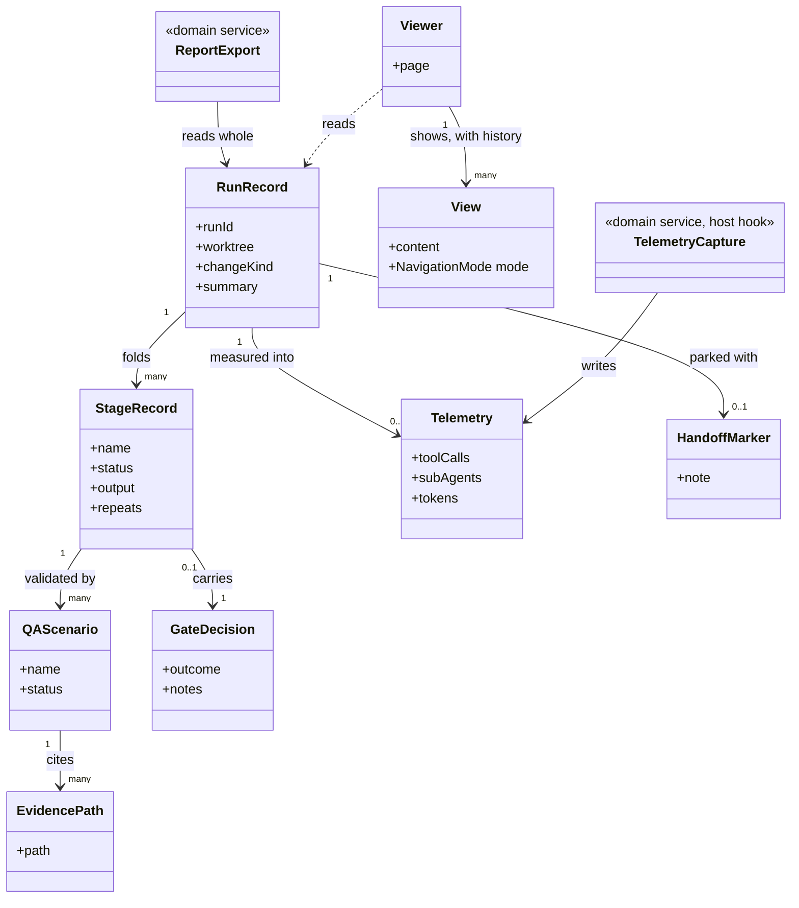
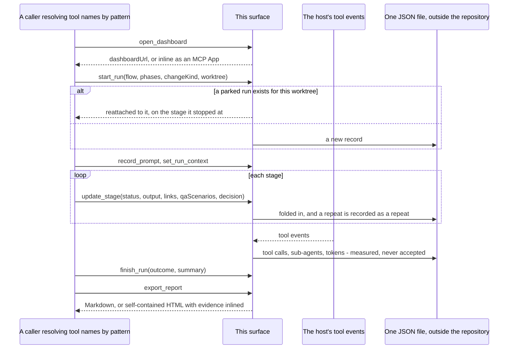
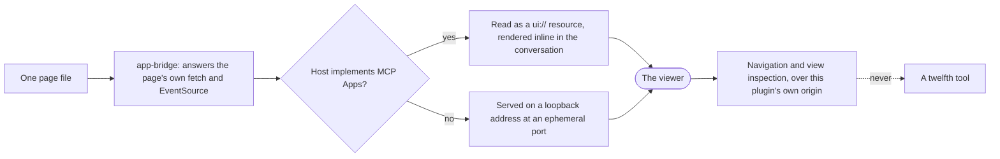

# delivery-surface-dashboard

```meta
related: [".devbook/arc42/building-blocks/README.md", ".devbook/arc42/building-blocks/delivery.md#dependencies", ".devbook/arc42/adr/surfaces.md", ".devbook/arc42/12-glossary.md#idleness"]
```

The live view of a run, measured by hooks rather than told. Responsible for three things: that
a run is visible while it happens, that what it shows was measured rather than claimed, and
that uninstalling it costs a view and never a capability.

Inside the block: the run store, the three pages, the telemetry the hooks capture, and the
report exported at the end. It answers all three capability groups of the surface contract.

Outside it: what produced the run. This block knows nothing about flows, gates, or extension
points — it receives lifecycle calls, and whoever made them resolved its tool names by pattern
from the live tool list. It declares no dependency and names no engine. The kernel vocabulary —
surface, capability group, MCP server — is [chapter 8](../08-crosscutting-concepts.md)'s; the one
term this block owns, idleness, is in the [glossary](../12-glossary.md#idleness).

## Interfaces

```meta
related: [".devbook/arc42/adr/surfaces.md", ".devbook/arc42/08-crosscutting-concepts.md#surface"]
```

Three capability groups, whole, plus the one thing no other surface here does: measure. It
ships no skills — its whole surface is an MCP server's tools and three pages, and there is
nothing a person invokes by name.

| Interface | Kind | Reached by |
| --- | --- | --- |
| `open_dashboard`, `start_run`, `record_prompt`, `set_run_context`, `update_stage`, `finish_run`, `list_runs`, `get_run` | MCP tools, `delivery.surface.lifecycle@1` | A caller matching the names by pattern from the live tool list |
| `render_diagram`, `render_markdown` | MCP tools, `delivery.surface.render@1` | The same caller, resolving the group on its own |
| `export_report` | MCP tool, `delivery.surface.export@1` | The same, at the end of a run or long after it |
| The run timeline, the diagram viewer, the document viewer | Three pages, one file each | Inline as a `ui://` resource where the host implements MCP Apps, on a loopback origin where it does not |
| `telemetry-hook.mjs` | Command hook, `hooks/hooks.json` | The host that has command hooks, on its tool events — outside any run's control flow |

The eleven tool names are the declared surface, exactly and nothing more. They carry a
plugin-namespaced prefix when installed as a plugin and a bare one from a repository's own MCP
configuration; a consumer matches by pattern and never by one spelling.

### Track a Run

```meta
related: [".devbook/arc42/building-blocks/delivery-surface-dashboard.md#run-record", ".devbook/arc42/building-blocks/delivery.md#run-started"]
```

Answer the lifecycle group — open, start, record the prompt, set the context, update a stage,
finish, list, get — and keep the result on disk, keyed by worktree, outside the repository. A
run survives a session restart and never shows up in `git status`.

Reattach to a parked run: pick a handed-off run up where it stopped rather than opening a
second beside it. Both a parked run and an abandoned one look idle; the
[handoff marker](#handoff-marker) is the only thing that tells them apart.

Read idleness and title from the run: derive whether a run has stalled and what to call it from
where its output has landed, rather than storing either as status. A list of parallel sessions
is then readable at a glance without anyone having to name them.

### Watch a Run Live

```meta
related: [".devbook/arc42/building-blocks/delivery-surface-dashboard.md#viewer"]
```

Show the run list, each run's stages with status and output, QA scenarios with their evidence
inline, and the tool-activity and context panels. Rendered inline where the host implements
MCP Apps, and on a loopback origin where it does not — one page file either way.

Render a diagram or a document — the render group: Mermaid rendered live and pannable, Markdown
rendered as formatted HTML, both with push-and-replace navigation so a drill-down can be
stepped back. A rendered view is a preview of a file that exists, never a replacement for it.

### Measure the Session

```meta
related: [".devbook/arc42/building-blocks/delivery-surface-dashboard.md#telemetry-capture", ".devbook/arc42/building-blocks/delivery-surface-dashboard.md#telemetry"]
```

Fold tool calls, sub-agent use, and token usage into the run from hook-captured tool events,
and warn when the context gauge crosses its threshold. Nothing asks the agent to count
anything, which is what separates these numbers from an estimate.

This is the one capability outside the contract, and it degrades to nothing rather than to
something wrong: on a host without command hooks the run is tracked in full and the panels are
simply empty.

### Export the Report

```meta
related: [".devbook/arc42/building-blocks/delivery-surface-dashboard.md#report-export"]
```

Answer the export group: the prompt history, the stage table, each stage's output and links, QA
scenarios with their evidence, monitoring findings, the handoff note, and the summary — as
Markdown, or as self-contained HTML with the evidence inlined so the report survives the
worktree that produced it.

## Structure

```meta
related: [".devbook/arc42/05-building-block-view.md#surface-plugins", ".devbook/arc42/adr/surfaces.md"]
```

Two aggregates and two domain services: what a run record holds, what the pages read, and
where the one host-specific part sits.

### Model

```meta
```



- **Nothing in this model points at the engine, and that is the design.** `RunRecord` is fed
  by lifecycle calls from a caller it cannot name; the caller resolved these tool names by
  pattern from the live tool list. Installing this plugin makes runs visible and uninstalling
  it costs a view.
- **`Telemetry` is the only association written from outside the tool surface.** The hook runs
  on the host's tool events, not inside a run, which is why it is `0..1` and why its absence is
  a legitimate state rather than a failure.
- **Idleness and the session title are absent from this diagram on purpose.** Both are derived
  on read — from the last update and from where the output landed — and storing either would
  make a stale value indistinguishable from a current one.
- **`EvidencePath` is a value, and its whole content is a constraint.** It resolves against the
  worktree root and refuses anything outside it; the HTML export inlines what it points at so
  the report outlives the file.
- **`Viewer` reads `RunRecord` and is not part of it.** The pages are a projection served over
  the plugin's own origin, which is why navigation is not an extra tool: a surface declaring
  more than the contract stops being swappable for one that declares exactly it.
- **`GateDecision` is recorded and never made here.** A resumed session re-runs the gate rather
  than trusting this record, which is why the surface holding it is not a party to it.

### Run Record

```meta
related: [".devbook/arc42/building-blocks/delivery.md#run", ".devbook/arc42/adr/configuration.md", ".devbook/arc42/12-glossary.md#idleness"]
```

Also called: run, run store, run file.

One run as this block holds it: stages with status and output, the prompt history, QA
scenarios with their evidence, gate decisions, telemetry, and a handoff marker. One JSON file
per run, outside the repository and keyed by worktree path — so a run survives a session
restart and never shows up in `git status`.

It is a record and not the run. Nothing here advances a run or decides anything about it; it
folds what it is told, adds what its own hooks measured, and answers questions about the
result.

| Invariant | Enforced at | Evidence |
| --- | --- | --- |
| One record per run, keyed by worktree; a `start_run` naming a parked run reattaches rather than opening a second | `start_run()` | `unit:node:plugins/delivery-surface-dashboard/mcp/delivery-surface-dashboard/dev/handoff-test.mjs` |
| A stage finishing twice is recorded twice | `update_stage()` | untested |
| Evidence paths resolve inside the git worktree root; anything outside is refused | `update_stage()` | untested |
| Telemetry is captured from tool events and never accepted from a caller | telemetry hook | `unit:node:plugins/delivery-surface-dashboard/mcp/delivery-surface-dashboard/dev/subagent-telemetry-test.mjs` |
| Idleness and the session title are derived on read, never stored as status | `get_run()`, `list_runs()` | `unit:node:plugins/delivery-surface-dashboard/mcp/delivery-surface-dashboard/dev/session-title-test.mjs` |
| The record holds destination kinds, never the words shown for them; the words are read from the repository's own stack-config entry on every title | `start_run()`, `update_stage()` | `unit:node:plugins/delivery-surface-dashboard/mcp/delivery-surface-dashboard/dev/session-title-integration-test.mjs` |
| The declared tool surface is exactly the contract's eleven names and nothing more | server start | untested |
| The record survives a session restart | store | `unit:node:plugins/delivery-surface-dashboard/mcp/delivery-surface-dashboard/dev/handoff-test.mjs` |

The record owns two entities and two values besides [Telemetry](#telemetry) and the
[Handoff Marker](#handoff-marker):

- **Stage Record** (entity) — one stage as recorded: name, status, output, links, and how many
  times it finished. Identity inside the record is the stage name, and the repeat count is
  what keeps a revise decision legible — a stage that ran twice must not read as one long
  stage.
- **QA Scenario** (entity) — one validation scenario with its status and the evidence it
  produced. It has identity because it is reported individually and because its evidence is
  cited from the exported report by path.
- **Evidence Path** (value) — a path to a screenshot or a recording, resolved against the git
  worktree root. Anything resolving outside it is refused — a surface that will cite an
  arbitrary path is a surface that will read one. The HTML export inlines these as data URIs,
  so an exported report stays readable after the worktree is gone. The Markdown one cites
  them, which is why the file has to stay where it was produced.
- **Session Title** (value; also called session name, prefix) —
  `<prefix>[:<context>] — <run title>`, computed from where the run's writes landed: a
  published Artifact, one of the five devbook folders, or code, with the bounded context
  appended when the winning files sit in exactly one. The record tallies kinds; the word each
  kind is shown as comes from `components.delivery-surface-dashboard.sessionNaming.labels` in
  the repository's stack config, where `null` means no prefix — and no rename, since an
  unprefixed copy of the run title is worse than the host's own name — and `devbook` stands
  for all five folders. Kinds sharing a word are tallied as one before the dominant kind is
  picked. `null` before anything has been written, for the same reason. The config key is
  [the configuration record](../adr/configuration.md)'s.

Idleness — a run whose session ended or that nothing has advanced for hours — is derived on
read and never stored, because a stored idleness is indistinguishable from a stale one; the
[glossary](../12-glossary.md#idleness) has the term.

### Telemetry

```meta
```

Also called: tool activity, token usage, insight panel.

Tool calls, sub-agent use, and token usage, folded into the record by hooks running on tool
events. Nothing asks the agent to count anything, which is the entire point: a self-reported
number is an estimate wearing a measurement's clothes.

It is captured through a command hook that reads an event payload and writes a file — work a
prompt hook cannot do. On a host without command hooks the run is still tracked in full and the
panels simply have nothing to show, which is why this costs a column and not a capability
group.

| Invariant | Enforced at | Evidence |
| --- | --- | --- |
| Every number is measured from a tool event; nothing asks the agent to count | the hook | `unit:node:plugins/delivery-surface-dashboard/mcp/delivery-surface-dashboard/dev/subagent-telemetry-test.mjs` |
| On a host without command hooks the run is still tracked in full, and only the panels are empty | hook registration | untested |

### Handoff Marker

```meta
related: [".devbook/arc42/building-blocks/delivery-surface-collector.md#handoff-marker", ".devbook/arc42/12-glossary.md#idleness"]
```

The note a deliberately handed-off run leaves behind. It is what distinguishes a parked run
from an abandoned one — both look idle by every other signal, and only one should be reattached
to. Separating them is what a later `start_run` needs in order to reattach to one and refuse
the other.

| Invariant | Enforced at | Evidence |
| --- | --- | --- |
| A parked run carries a marker; an abandoned one does not, though both look idle by every other signal | `update_stage()` | `unit:node:plugins/delivery-surface-dashboard/mcp/delivery-surface-dashboard/dev/handoff-test.mjs` |
| `start_run` reattaches to a run that carries one and refuses one that does not | `start_run()` | `unit:node:plugins/delivery-surface-dashboard/mcp/delivery-surface-dashboard/dev/handoff-test.mjs` |

### Viewer

```meta
```

Also called: page, panel, dashboard.

The three pages: the run timeline, the Mermaid diagram viewer, and the Markdown document
viewer. Each is served two ways from one file — inline where the host implements MCP Apps, and
on a loopback origin where it does not — with a bridge answering the page's own network calls
as tool calls so neither page learns which way it was loaded.

| Invariant | Enforced at | Evidence |
| --- | --- | --- |
| Navigation and view inspection are served over the plugin's own origin, never added as extra tools | page load | untested |
| One page file serves both transports | page load | untested |
| The HTTP side has no authentication, and reaching it already requires local access | server start | untested |
| A rendered view is a preview of a file that exists, never a replacement for it | render | untested |

A viewer shows one **View** (entity): one thing currently shown, with a history behind it.
`push` drills into a related view and leaves a breadcrumb the Back button walks; `replace`, the
default, updates in place. The history is what makes a drill-down steppable, so a view has
identity within its viewer.

### Report Export

```meta
related: [".devbook/arc42/building-blocks/delivery-surface-dashboard.md#run-record"]
```

Writes the run's report from what was recorded: prompt history, the stage table, each stage's
output and links, QA scenarios with their evidence, monitoring findings, the handoff note, and
the summary — as Markdown, or as self-contained HTML with the evidence inlined.

Command-invoked, at the end of a run or long after it. It is a service rather than behaviour on
[Run Record](#run-record) because it produces an artifact outside the record and reads across
every part of it at once.

| Invariant | Enforced at | Evidence |
| --- | --- | --- |
| The report is written from what was recorded, read across every part of the record at once | `export_report()` | untested |
| Markdown, or self-contained HTML with the evidence inlined | `export_report()` | untested |
| Command-invoked, at the end of a run or long after it | `export_report()` | untested |

### Telemetry Capture

```meta
related: [".devbook/arc42/building-blocks/delivery-surface-dashboard.md#telemetry"]
```

The hook that runs on tool events and folds tool calls, sub-agent use, and token usage into
the record, and warns when the session's context gauge crosses a threshold.

Event-triggered, by the host, outside any run's control flow. It is the one thing in this
marketplace that measures a session rather than being told about it — which is also why it is
the one place this block is host-specific, structurally rather than by omission.

| Invariant | Enforced at | Evidence |
| --- | --- | --- |
| Event-triggered by the host, outside any run's control flow | hook registration | untested |
| It folds tool calls, sub-agent use, and token usage into the record | the hook | `unit:node:plugins/delivery-surface-dashboard/mcp/delivery-surface-dashboard/dev/subagent-telemetry-test.mjs` |
| It warns when the session's context gauge crosses a threshold | the hook | untested |

## Runtime

```meta
related: [".devbook/arc42/building-blocks/delivery-surface-dashboard.md#run-record", ".devbook/arc42/building-blocks/delivery.md#run-started"]
```

How a record fills up, and how a page reaches a viewer.

### A Record, Filled

```meta
```

Every arrow into the record is a lifecycle call from a caller this block cannot name, except
the telemetry one — which comes from the host, outside any run's control flow.



- **Reattach or open, never both.** A second record beside a parked run is the failure the
  handoff marker exists to prevent, and it is the one behaviour here with a test driving the
  real server over stdio.
- **Telemetry arrives on a different path from everything else.** It is the only input not
  sent by the caller, which is exactly what makes the numbers a measurement.
- **A repeat is a repeat.** A stage recorded once after two attempts has erased the revise
  decision that caused the second one.

### A Page, Reached Two Ways

```meta
```

One file, two transports, and a bridge so neither page learns which one carried it.



- **Navigation is not a tool.** A surface that declares more than the contract stops being
  swappable for one that declares exactly it — so anything the pages need beyond the eleven
  names is served over the plugin's own origin.
- **There is no authentication on the HTTP side**, and reaching it already requires local
  access to the machine. The [canvas](delivery-surface-canvas.md) implementation of the same
  contract does check a token, because it outlives the panel that opened it.
- **A rendered view is a preview of a file that exists.** Render the same source that was
  written to disk; a rendered view nobody saved is not a record of anything.

## Dependencies

```meta
related: [".devbook/arc42/building-blocks/delivery.md#dependencies", ".devbook/arc42/08-crosscutting-concepts.md#surface"]
```

A surface is not a layer, and nothing may declare one: this block declares no dependency in
either direction.

### Outbound

```meta
```

| Depends on | Pattern | Mechanism | Contract | Why |
| --- | --- | --- | --- | --- |
| [delivery](delivery.md#dependencies) | Conformist to a Published Language | Implements the tool names of all three capability groups, and nothing else | `resources/surface-contract.md`: `delivery.surface.lifecycle@1`, `.render@1`, `.export@1` | Declaring exactly the contract's names is what makes one implementation substitutable for another. Declaring more would end that. |
| [The plugin kernel](../08-crosscutting-concepts.md) | Shared Kernel | Plugin folder, two manifests, marketplace entry, `mcp/<server>/`, `hooks/hooks.json` | [Chapter 8](../08-crosscutting-concepts.md) | It is packaged like everything else here. |
| Model Context Protocol | Conformist | One MCP server, started on the first tool call, plain Node with no npm dependencies | The protocol's own schemas | The transport is how a caller reaches it at all. |
| MCP Apps | Conformist, optional | Pages read as `ui://` resources and rendered inline where the host implements it | The MCP Apps resource shape | Where it is absent, the same file is served on a loopback origin — which is what the bridge exists for. |
| The host's command hooks | Conformist, host-specific | `hooks/hooks.json`, a hook reading a tool-event payload and writing the run store | The host's own hook schema | Measuring requires reading an event and writing a file, which a prompt hook cannot do. There is no root `hooks.json` beside it, structurally rather than by omission. |
| The local filesystem, outside the repository | Conformist | One JSON file per run, keyed by worktree path, root overridable | Its own store layout | A run must survive a session restart and must never appear in `git status`. |

### Inbound

```meta
```

| Consumer | Pattern | Mechanism | Contract | What it relies on |
| --- | --- | --- | --- | --- |
| Whatever drives a run | Customer-Supplier, this block supplying | Tool names matched by pattern from the live tool list, never by one spelling | The three capability groups | That each group is resolved separately, and that this one answers all three. It names no caller and no caller names it. |
| [delivery-schedule](delivery-schedule.md#dependencies) | Customer-Supplier, this block supplying | The same lifecycle calls, from unattended sessions | The same contract | The same. It follows the engine's reporting contract and treats no surface bound as normal. |
| [devbook-config](devbook-config.md#dependencies) | Conformist, read-only | Reports whether this plugin is installed, enabled, and at what version | The marketplace entry and the manifest | Nothing but the name and version. |

A surface is never a dependency in either direction. The thing being rendered knows no surface
exists, and this block knows nothing about what produced its input. Whichever tool opens it
resolves it at run time, and none answering is a normal outcome — it costs a view, never a
capability.

Substitutability is per capability group, not per host. The three groups are resolved
separately, so a caller finds the ones this block answers and looks elsewhere — or nowhere —
for the rest.

The telemetry dependency is the one asymmetry, and it is a column rather than a group. A
Copilot run bound to this plugin gets the same lifecycle tools and the same panels with the
numbers absent rather than wrong. Nothing in the contract names telemetry, which is what keeps
the asymmetry from costing a capability group.

Namespacing is a matching problem, not a naming one. The tools surface with a plugin-namespaced
prefix when installed as a plugin and a bare one from a repository's own MCP configuration; a
consumer matches by pattern and never by one spelling.
