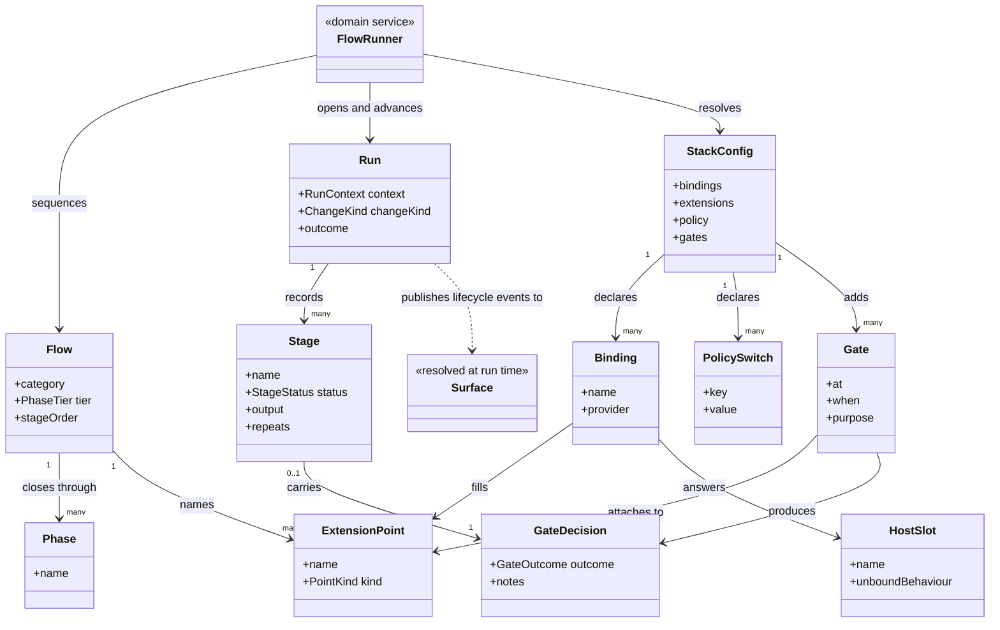
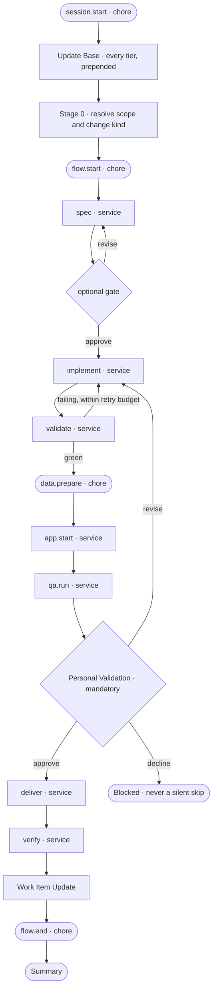
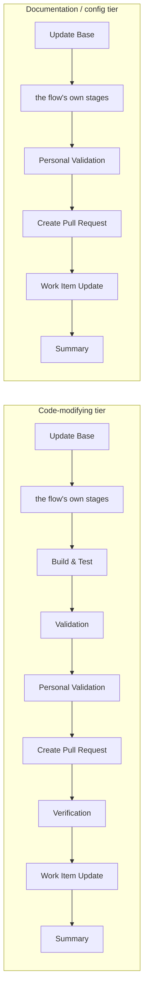
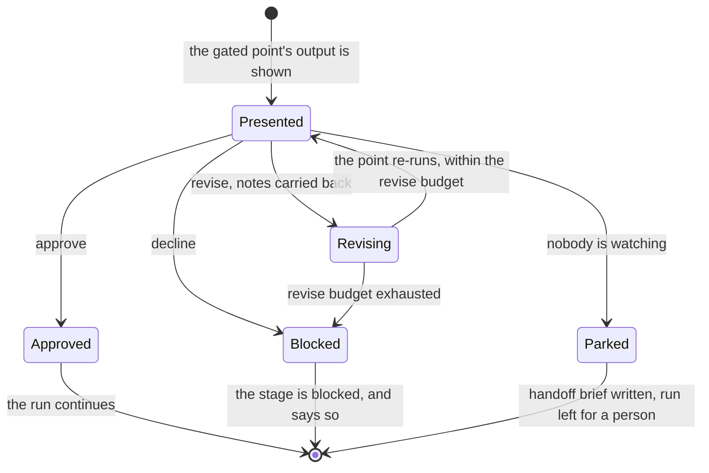
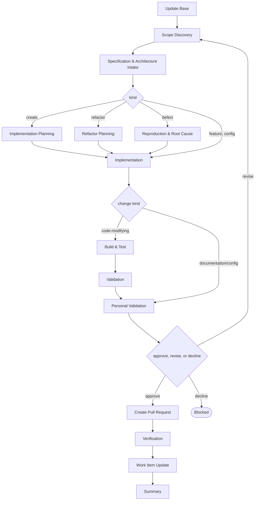
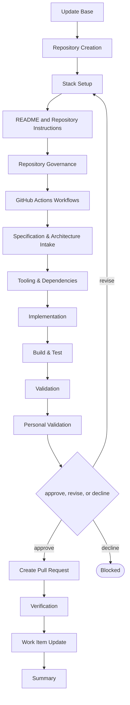
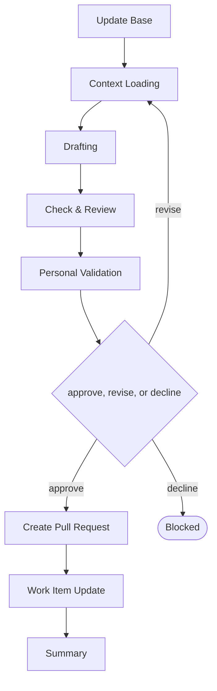
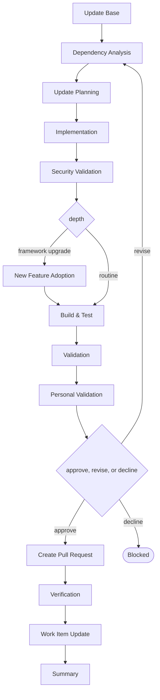

# delivery

```meta
related: [".devbook/arc42/building-blocks/README.md", ".devbook/arc42/adr/flow-engine.md", ".devbook/arc42/adr/surfaces.md", ".devbook/arc42/tdr/4-delivery-depends-on-devbook.md"]
```

The delivery engine. Responsible for three things: that one unit of work reaches a review-ready
change inside one session, that a person decided it was ready, and that a repository can shape
the run without being able to weaken it.

Inside the block: the staged procedures, the closed set of extension points a repository binds
providers to, the human gates it may add and never remove, the four engine-owned keys of the
stack config, and the pull-request lane at the end.

Outside it: deploy, which is where "delivery" stops here; expertise, which is a role a
repository binds; visibility, which is a [surface](delivery-surface-dashboard.md) resolved at
run time; and a backlog worked with nobody watching, which is
[delivery-schedule](delivery-schedule.md)'s issue sweep — one item at a time in a session no
flow shares.

## Interfaces

```meta
related: [".devbook/arc42/adr/flow-engine.md", ".devbook/arc42/08-crosscutting-concepts.md#extension-point", ".devbook/arc42/08-crosscutting-concepts.md#gate"]
```

Fourteen skills, one agent, one hook, and the contracts under `resources/` that everything a
repository plugs in answers to. No rule, no MCP server, no extension, no workflow: the engine
is reached by invoking a flow, and everything else it exposes is a contract another block or a
repository conforms to.

| Interface | Kind | Reached by |
| --- | --- | --- |
| `flow-code`, `flow-update-packages`, `flow-project`, `flow-spec` | skills, the four flows | A person routing one unit of work, `start-session-from-issue`, or a higher layer's worker or schedule entry point |
| `phase-build-test`, `phase-validation`, `phase-personal-validation` | skills, shared phases | A flow, never directly |
| `push-branch`, `update-pr-branch`, `fix-pr-checks`, `pr-merge-ready` | skills, the pull-request lane | A person, on a change a flow did or did not produce; `pr-merge-ready` uses the other three |
| `start-session-from-issue`, `sre-alerts-to-work-items` | skills, tracker entry points | A person, through the bound tracker |
| `install` | skill | A person, or `devbook-config:setup` during a fan-out |
| `flow-runner` | agent | Command-invoked once per run by a flow, holding the session for the run's length |
| `SessionStart` | hook, `hooks/hooks.json` and `hooks.json` | Either host, when a session opens |
| `surface-contract.md`, `flow-phases.md`, `capture-contract.md`, `flow-execution-model.md`, `flow-model-selection.md`, `config.schema.json` | contracts under `resources/` | A surface, a repo-native `flow-*`, a bound provider, and `devbook-config`, by path or by name |

### flow-code

```meta
related: [".devbook/arc42/building-blocks/delivery.md#flow-code-run"]
```

Carry any change to the code from a request to a review-ready change: a feature or an
incremental change, a defect, a structure or layout refactor, a new module, service, or first
runnable increment, and the tooling, CI, scripting, and housekeeping around them. One flow,
because the opening and the close are the same for all of them; the kind is derived in the
first stage and selects the one middle stage that differs — planning for a create or a
refactor, reproduction and root cause for a defect.

A thin request is the normal case rather than a reason to refuse the run. A defect's fix has a
test in front of it; a refactor holds behaviour still on purpose.

### flow-update-packages

```meta
related: [".devbook/arc42/building-blocks/delivery.md#flow-update-packages-run"]
```

Move dependencies forward and prove the result still builds and starts — NuGet, npm, SDKs, and
tools — with the security question asked before the build rather than after it. A framework
upgrade, an Aspire version move included, is the same flow at a deeper setting: a recorded
baseline before anything moves, reversible batches, and a separate decision about what the new
version makes possible.

### flow-project

```meta
related: [".devbook/arc42/building-blocks/delivery.md#flow-project-run"]
```

Take a repository from nothing to a project that builds: create it, expand the README, protect
the branch, add the templates and the governance, run the stack setup, then CI, tooling,
dependencies, and a structure that builds. Creating the repository itself stays manual, and a
repository that already exists enters at the stage it has reached.

### flow-spec

```meta
related: [".devbook/arc42/building-blocks/delivery.md#flow-spec-run"]
```

Write or correct a devbook folder — an architecture chapter, decision record, or debt record; a
bounded context or the context map; the technology graph; design principles, tokens, and
component guidance; the AI adoption record. One flow for the five folders, because the
procedure is the same and only the role differs: the folder picks who drafts, and the
repository's own instruction file for that folder says what a chapter must look like. It runs
the repository's check and never regenerates the derived indexes, and it is the escalation
target when any other flow discovers it needs a decision.

### phase-build-test

```meta
related: [".devbook/arc42/building-blocks/delivery.md#flow"]
```

Build every project and run the unit and end-to-end suites, failing fast on the first red
result. Invoked by a flow and never directly, so its definition lives in one file rather than
restated in four.

### phase-validation

```meta
related: [".devbook/arc42/building-blocks/delivery.md#flow", ".devbook/arc42/building-blocks/delivery.md#change-kind", ".devbook/arc42/adr/flow-engine.md"]
```

Validate the running application, at a depth the change kind decides: a browser pass with
captured evidence for new functionality, targeted verification for a change to existing
behaviour, startup-only for a dependency update, and skipped where there is no runnable
application.

**Record the depth honestly.** A shallower depth is reported as the depth it was, never as
validation that did not happen. This is the one guarantee that makes the other three depths
usable at all.

**Capture evidence without a QA plugin.** The evidence rules are the engine's own contract, so
they hold with no QA plugin, no `qa.run` binding, and no capture skill. Capture resolves to the
repository's `capture` skill, then the provider's, then this phase driving it directly; a
missing piece changes who captures, never whether capture happens.

### phase-personal-validation

```meta
related: [".devbook/arc42/building-blocks/delivery.md#flow", ".devbook/arc42/building-blocks/delivery.md#gate", ".devbook/arc42/12-glossary.md#personal-validation"]
```

Hand the run back to a person to look at: bring the application up, publish the review links
as clickable URLs, say what to check by hand, and present the code and QA reviews. It runs
again on every revise round, because a revised change set is a new thing to look at.

**Present, never decide.** The phase produces the review; the approve / revise / decline
decision after it belongs to the flow-runner. Nothing in the handoff can approve, skip, or
soften that [gate](#gate) — which is what lets the presentation be a shared phase skill while
the gate itself stays out of a repository's reach.

**No agent and no model.** It runs inline in the session the person is reading, because a
subagent has no user turn to hand back to and a link nobody can click is not a handback.
Starting the application is the phase's own job: a list of commands for the person to run is a
failed handback rather than a shortcut.

### push-branch

```meta
related: [".devbook/arc42/building-blocks/delivery.md#pull-request-lane"]
```

Push the current branch and set its upstream, and stop there. No pull request — this is the
step for getting commits onto the remote so CI runs.

### update-pr-branch

```meta
related: [".devbook/arc42/building-blocks/delivery.md#pull-request-lane"]
```

Bring a pull request branch level with its base, resolve the conflicts, re-validate, and push.
For a branch that is behind, or that a required up-to-date check is blocking.

### fix-pr-checks

```meta
related: [".devbook/arc42/building-blocks/delivery.md#pull-request-lane"]
```

Read a failing job's logs, reproduce locally, classify the failure, fix it, and push until the
checks go green.

### pr-merge-ready

```meta
related: [".devbook/arc42/building-blocks/delivery.md#pull-request-lane"]
```

Score one pull request against the merge-ready checklist and clear its blockers, using the
other three lane skills as its tools. One pull request per pass.

### start-session-from-issue

```meta
related: [".devbook/arc42/08-crosscutting-concepts.md#tracker"]
```

Start this session's work from one tracker item: fetch what matches a filter, select one,
claim it, route it to the flow its type calls for, and run that flow here. One item per run,
with a person present — which is what separates it from the fan-out lane.

### sre-alerts-to-work-items

```meta
related: [".devbook/arc42/08-crosscutting-concepts.md#tracker"]
```

Turn active Azure Monitor alerts into tracked work items, so an incident becomes something the
rest of this block already knows how to carry. Azure is the alert source; where the item lands
is the tracker binding's answer, not this skill's.

### install

```meta
related: [".devbook/arc42/adr/flow-engine.md"]
```

Write the two procedures the engine names but cannot author — `start`, how this repository's
application comes up, and `capture`, how evidence of the feature being built is taken — into
the repository as one editable copy with a pointer wrapper per host, and record what landed.

**Hand the procedure over.** Editing the installed copy is the intended path, not drift. Once
its hash matches no release it is the repository's: reported on every later reconcile, never
overwritten. The wrappers stay managed, so the name and description a phase matches on keep
refreshing while the procedure does not.

## Structure

```meta
related: [".devbook/arc42/adr/flow-engine.md", ".devbook/arc42/adr/surfaces.md", ".devbook/arc42/adr/configuration.md"]
```

What a run is made of, what a repository declares about it, and where the line runs between
what the engine owns and what a repository binds. Five aggregates, two domain services, three
domain events, and the two value objects and one enum more than one aggregate holds. The
kernel vocabulary — plugin, layer, role, tracker, surface, host slot, extension point, gate —
is defined once in [chapter 8](../08-crosscutting-concepts.md); the terms this block owns and
no part below names — tier, Personal Validation, PR lane, provider — are in the
[glossary](../12-glossary.md).

### Model

```meta
```



- **A flow names a point; a binding fills it.** That indirection is the entire reason this
  block declares no specialist dependency: `Flow` and `Binding` never meet except through
  `ExtensionPoint`, so a missing provider is a resolution that returned nothing rather than a
  plugin that failed to load.
- **The `Flow → ExtensionPoint` association is to a closed set the engine declares.** A
  repository adds `Binding` rows and never `ExtensionPoint` rows, which is why configuration
  cannot become a second flow language.
- **`Gate` hangs off a point, not off a stage.** It is what lets configuration add one anywhere
  without knowing a flow's stage names, and what makes Personal Validation an instance of the
  pattern rather than an exception to it.
- **`GateDecision` is a value held in two places on purpose.** The stage carries it so the run
  reads correctly, and the gate produced it; recording it twice is harmless and re-deriving it
  from a conversation is impossible.
- **`Surface` is a dashed dependency and appears nowhere else.** The run publishes to whatever
  answers the lifecycle group and knows nothing about which implementation did — see
  [the surfaces record](../adr/surfaces.md).
- **`StackConfig` here is four keys, not the file.** Every `components.<name>` stamp in the same
  file belongs to that component's install skill, which is why the class carries the four names
  and not a generic key bag.
- **Nothing associates with a host.** `HostSlot` is a name with a documented unbound
  behaviour, bound from configuration or answered by the live session — the only shape in this
  model that can absorb two hosts without branching on either.

### Run

```meta
related: [".devbook/arc42/adr/flow-engine.md"]
```

Also called: execution, session run.

One execution of one flow over one unit of work: the stages and their results, the prompts
that produced them, the gate decisions a person returned, and where the change landed. It is
the consistency boundary because a stage result, the decision that accepted it, and the change
it produced are only meaningful together — a run that recorded an approval it cannot name a
stage for has recorded nothing.

A run owns a session and never outlives one twice: it survives a session restart because a
surface keeps it on disk, and it resumes on the stage it stopped at rather than starting again.
What it never does is split — a run across two sessions is two runs, which is why fan-out
lives in another block.

| Invariant | Enforced at | Evidence |
| --- | --- | --- |
| One item per run, and never a fan-out | flow entry | untested |
| A run belongs to one session; a resumed run reattaches to the same run rather than opening a second | `start_run()` | untested |
| Every tier opens with Update Base, prepended by the runner and named by no skill | stage sequencing | untested |
| `implement` and `validate` are the only cycle, bounded by `validate.retryBudget` | `validate()` | untested |
| `verify` reports one verdict per item of the run's specification and the chapters the change set touches, repairs nothing, and commits nothing; a row becomes work outside the run | `verify()` | untested |
| Personal Validation is reached before `deliver`, exactly once, and never inside it | gate evaluation | untested |
| A chore contributes side effects and a report and never rewrites a stage's result | chore invocation | untested |
| A stage repeated after a revise decision is recorded as repeated, not as one long stage | `update_stage()` | untested |
| A run whose surface is unbound still produces its file artifacts and says so once | all stages | untested |

A run owns one entity, one value object, and one enum.

**Stage** (also called: step) — one step of a run, with identity inside it: a name, a status,
the output it produced, the links and evidence it gathered, and how many times it finished. A
stage is a prompt rather than a program — "apply TDD", "escalate instead of continuing when the
request needs a new architectural decision" — which is why configuration can choose among
stages and never define one. The repeat count is not bookkeeping: a stage that ran again after
a revise decision reads as two attempts rather than one long step, and that difference is what
a resumed session and a report both depend on.

**Run Context** (value object) — what the run is about, set once and refined rather than
accumulated: the change kind, the item being worked, the branch, and the worktree it lives in.
It is a value because nothing in it has identity — replacing it wholesale is the only sensible
update, and two runs with the same context are still two runs.

**Stage Status** (enum) — whether a stage is pending, running, finished, or blocked. Blocked is
the one that carries weight: it is what a declined gate produces, and it is never spelled as
skipped, because a skipped stage reads as a decision nobody made.

### Flow

```meta
related: [".devbook/arc42/adr/plugin-boundaries.md", ".devbook/arc42/adr/flow-engine.md"]
```

Also called: flow skill, staged procedure.

A staged procedure for one category of work, run start to finish in one session and ending at
the Personal Validation gate. Four ship here, one for the code and one for the five devbook
folders, and each owns its stage order and the tier it closes through.

A flow is the unit a request is routed to, so its category is the boundary that matters: a
repository needing a different shape writes its own `flow-*`, which takes precedence for the
categories it covers, rather than configuring this one into something else.

| Invariant | Enforced at | Evidence |
| --- | --- | --- |
| A flow never leaves its session | all stages | untested |
| A flow ends at Personal Validation and holds no other mandatory gate | tier close | untested |
| Configuration chooses among behaviour the engine already implements and never introduces new behaviour | config validation | `unit:node:plugins/delivery/tools/stack-config/check.test.mjs` |
| The devbook flow in a repository that has not adopted the target folder stops and says so | stage 1 | untested |
| A flow shipped by a higher layer declares its own tier; the engine never assigns one | tier resolution | untested |
| A flow names an extension point and never a plugin | authoring | untested |

A flow owns one entity, and the enum that follows.

**Phase** (also called: shared step, phase skill) — a shared step several flows run
identically: Update Base, Build & Test, Validation, Personal Validation, Create Pull Request,
Verification, Work Item Update, Summary. It is invoked by a flow and never directly, which is
what keeps its definition in one file instead of restated in four.

### Phase Tier

```meta
related: [".devbook/arc42/building-blocks/delivery.md#flow", ".devbook/arc42/12-glossary.md#tier"]
```

The enum [Flow](#flow) owns: which closing phases a flow runs. The code-modifying tier
builds, tests, validates, opens a pull request, and verifies the result against the
specification; the documentation tier does none of those but the pull request, because there
is no runnable change to validate and the chapter it writes is the specification. `flow-code`
has no fixed tier and resolves one from the change kind it determined.

Session Handoff belongs to no tier. It is an interrupt rather than a step, firing at whatever
stage the run has reached when the context gauge crosses its threshold.

### Extension Point

```meta
related: [".devbook/arc42/08-crosscutting-concepts.md#extension-point", ".devbook/arc42/adr/flow-engine.md"]
```

A named place in a flow where a repository plugs a provider in. The set is closed and declared
by the engine: a repository picks what runs at a point, never what the points are, which is the
asymmetry that keeps configuration from becoming a second, undocumented flow language.

Seven are services and four are chores, and the difference is authority rather than
cardinality. A service returns a result the flow acts on; a chore contributes side effects and
a report and may never change an outcome.

| Invariant | Enforced at | Evidence |
| --- | --- | --- |
| The point set is closed; an unknown point is an error, not an extension | config validation | `unit:node:plugins/delivery/tools/stack-config/check.test.mjs` |
| A service has exactly one provider | config validation | `unit:node:plugins/delivery/tools/stack-config/check.test.mjs` |
| Chores run zero or more times, in declared order | chore invocation | untested |
| A chore may declare itself required and stop the run; it may never rewrite a result or stand in for a gate | chore invocation | untested |
| A point with no provider costs capability, never the run | provider resolution | untested |
| A bound MCP server that does not answer costs a stage its grounding, never the run | provider resolution | untested |

**Point Kind** (enum) — `service` or `chore`. `spec`, `implement`, `validate`, `app.start`,
`qa.run`, `verify`, and `deliver` are services; `session.start`, `flow.start`,
`data.prepare`, and `flow.end` are chores. Nothing is both, and no point changes kind — a
chore promoted to a service would be a provider gaining the authority to change an outcome
without anybody re-reading the flow.

### Gate

```meta
related: [".devbook/arc42/08-crosscutting-concepts.md#gate", ".devbook/arc42/adr/configuration.md"]
```

A human checkpoint attached to an extension point: it presents that point's output and asks a
question. Personal Validation is the mandatory instance of this pattern rather than a second
mechanism, which is why there is one gate concept and not one for configuration and one for
the engine.

The asymmetry is the whole design. Configuration may add a gate anywhere and may never remove
one or hand one to a plugin, so a repository's overlay can only ever make a flow more
conservative.

| Invariant | Enforced at | Evidence |
| --- | --- | --- |
| Three outcomes and only three: approve, revise, decline | gate evaluation | untested |
| Revise re-runs the gated point carrying the human's notes, bounded by the revise budget | gate evaluation | untested |
| Decline blocks the stage and is never a silent skip | gate evaluation | untested |
| Configuration may add a gate and may never remove one | config validation | `unit:node:plugins/delivery/tools/stack-config/check.test.mjs` |
| No provider performs a gate on its own behalf | gate evaluation | untested |
| An unattended run parks at a blocking gate with a handoff brief; it never waits and never self-approves | gate evaluation | untested |

**Gate Outcome** (enum) — `approve`, `revise`, `decline`. There is no fourth value and no
absent one: a gate that was reached and produced nothing is a run that stopped, which is
recorded as a block rather than inferred from silence.

### Stack Config

```meta
related: [".devbook/arc42/adr/configuration.md", ".devbook/arc42/05-building-block-view.md#stack-config"]
```

Also called: `config.json`, delivery config.

`.devbook/config.json`, and specifically the four keys this block owns — `bindings`,
`extensions`, `policy`, `gates`. It is the one file a consuming repository commits for the
whole stack, and the boundary inside it is by key: every `components.<name>` stamp belongs to
that component's own install skill and is never written here.

Reading the file is not adopting devbook. The path is a path: the engine reads it with no
devbook folder present, which is the reason the file could move there at all.

| Invariant | Enforced at | Evidence |
| --- | --- | --- |
| An unknown key is rejected, never ignored — a typo is an error, not a silently absent setting | `check.mjs` | `unit:node:plugins/delivery/tools/stack-config/check.test.mjs` |
| Nobody writes another owner's key | all mutations | untested |
| The four engine keys are written by `devbook-config`'s setup and update, and by nothing else | all mutations | untested |
| `policy` is a closed set of switches | `check.mjs` | `unit:node:plugins/delivery/tools/stack-config/check.test.mjs` |
| A machine-scope overlay may add a gate and never remove one, at each of its two layers | `check.mjs` | `unit:node:plugins/delivery/tools/stack-config/check.test.mjs` |
| An overlay never carries the `id` that located it | `check.mjs` | `unit:node:plugins/delivery/tools/stack-config/check.test.mjs` |
| A flow reads its effective configuration from `check.mjs --print`, never by merging layers itself; a refused layer prints nothing | `check.mjs` | `unit:node:plugins/delivery/tools/stack-config/check.test.mjs` |
| Model choice takes no repository-level binding | `check.mjs` | untested |

The config owns two value objects: Policy Switch, and the Binding that follows.

**Policy Switch** — one member of a closed set: QA depth and its ceiling, the validate retry
budget, the gate revise budget, whether the flow commits at each handback, whether a pull
request is required. Closed because an open one would be a stage definition wearing a shorter
name.

### Binding

```meta
related: [".devbook/arc42/building-blocks/delivery.md#stack-config", ".devbook/arc42/08-crosscutting-concepts.md#role", ".devbook/arc42/08-crosscutting-concepts.md#tracker"]
```

The value object [Stack Config](#stack-config) owns: a name resolved to whatever fills it in
this repository — a role to a plugin, the tracker to a provider, an extension point to its MCP
servers, a host slot to a fact about this repository. A binding is a value: replace it and the
flow resolves the new one on its next run; there is nothing to migrate.

An explicit `null` is a binding, not an absence: it says deliberately unbound, which the
vocabulary distinguishes from a key nobody wrote.

### Flow Runner

```meta
related: [".devbook/arc42/adr/flow-engine.md"]
```

Also called: runner, sequencer.

The one agent this block ships: it sequences a flow's stages, prepends Update Base, resolves
the configuration, delegates each stage to whatever the extension points bind, tracks the run
against the surface, and enforces the gate.

Invocation semantics: command-invoked, once per run, and it holds the session for the run's
whole length. The behaviour does not belong on [Run](#run) because it coordinates a run, a
flow, the config, and providers none of them know about — and because the thing that enforces
a gate must not be a thing a provider can be.

It is also the commit point. A stage handing back is where the change set is committed when
policy says so, which keeps a run's history legible without every provider having to know it
is being recorded.

### Pull Request Lane

```meta
related: [".devbook/arc42/12-glossary.md#pr-lane"]
```

Getting a finished change reviewed and merge-ready: push the branch, bring it level with its
base, fix the checks that fail, and score it against the merge-ready checklist. Raising the
pull request itself is the host's own action rather than a skill here.

Invocation semantics: command-invoked, and separately from a run — these skills are the one
part of this block routinely used on a change no flow produced. Unbound, the `deliver` service
writes file artifacts only and opens nothing.

### Run Started

```meta
related: [".devbook/arc42/building-blocks/delivery.md#run", ".devbook/arc42/adr/surfaces.md"]
```

Published when a run begins, in the `delivery.surface.lifecycle@1` language. The publisher
does not know which surface is listening, or whether any is: the tool names are resolved by
pattern from the live tool list, and nothing answering is a normal outcome.

Payload:

- `flow` — which flow is running, and the tier it resolved
- `phases` — the stage names, in order, so a surface can draw the shape before the work happens
- `changeKind` — what kind of change this is, which decides QA depth downstream
- `worktree` — the path the run is keyed by, so a resumed session finds it again
- `handoff` — present when this call is reattaching to a parked run rather than opening one

Consumers: the three surfaces, each answering the lifecycle group or not answering at all; and
[delivery-schedule](delivery-schedule.md), which publishes the same event for work no attended
flow started.

Published language rules:

- **Reattach or open, never both.** A `start_run` naming a worktree with a parked run resumes
  it; opening a second beside it is the failure this field exists to prevent.
- **The phase list is a claim about shape, not a promise about outcome.** A flow that resolves
  its tier at run time reports the resolved names here and nowhere else.

### Stage Updated

```meta
related: [".devbook/arc42/building-blocks/delivery.md#run"]
```

Published whenever a stage changes status, produces output, gathers evidence, or records a
gate decision. It is the event the whole surface contract is really built around: everything
a report or a resumed session needs is a fold of these.

Payload:

- `stage`, `status` — which step, and where it now stands
- `output`, `links` — what it produced, and where the artifacts are
- `qaScenarios` — scenarios with their status and evidence paths, where a QA stage ran
- `decision` — the gate outcome, where a gate was attached to this point

Consumers: the three surfaces. The dashboard renders it live, the collector keeps it for the
report and for a resumed session, the canvas ignores it — it answers the render group only.

Published language rules:

- **Evidence is a path into the worktree, and anything resolving outside it is refused.** A
  report cites the screenshot; the screenshot stays where it was produced.
- **A repeat is a repeat.** A stage finishing twice is recorded twice, because a revise
  decision that reads as one long stage has erased the decision.
- **Telemetry is never written by hand.** A surface that measures reports it; one that does
  not says nothing about it, and a caller filling the gap would be reporting an estimate as a
  measurement.

### Run Finished

```meta
related: [".devbook/arc42/building-blocks/delivery.md#run", ".devbook/arc42/building-blocks/delivery.md#pull-request-lane"]
```

Published when a run reaches its Summary phase or stops — and a run that stopped is finished
too. The distinction between finished-and-delivered and finished-and-blocked lives in the
payload rather than in whether the event fired.

Payload:

- `outcome` — delivered, blocked at a gate, or parked with a handoff brief
- `summary` — what the run produced, in the run's own words
- `report` — where the exported report was written, when a surface answered the export group

Consumers: the three surfaces, for the report and for closing the run; and
[delivery-schedule](delivery-schedule.md)'s issue sweep, whose brief reports every resolution's
outcome including failure, because a brief that cannot tell a crash from a slow build reports
nothing a person can act on.

Published language rules:

- **Every outcome is published, failure included.** A run that stops silently is
  indistinguishable from one still going, which is the whole reason a parked run carries a
  marker rather than just an absence.
- **A parked run is not an abandoned one.** Both look idle; only one carries a handoff marker,
  and that difference is what a later `start_run` needs to reattach to one and refuse the
  other.

### Gate Decision

```meta
related: [".devbook/arc42/building-blocks/delivery.md#gate", ".devbook/arc42/building-blocks/delivery.md#run"]
```

A value object held by more than one aggregate. What a person answered at a gate, with the
notes they gave: an outcome, the point it was attached to, and the stage it belonged to. It is
held by both [Run](#run) and [Gate](#gate) because it is the one fact they must agree on, and
it is a value so that recording it twice is harmless and re-deriving it is impossible.

A resumed session re-runs the gate rather than trusting a decision it cannot see the
conversation behind — which only works because the decision is written down rather than
remembered.

### Host Slot

```meta
related: [".devbook/arc42/08-crosscutting-concepts.md#host-slot", ".devbook/arc42/05-building-block-view.md#host-slots"]
```

A value object held by more than one aggregate. A name a shared asset reads instead of a
host's own file: `repo-instructions`, `model-override`, `stage-delegation`, `surface`,
`pr-lane`. A slot is bound or it takes its documented unbound default, and it is never
branched on — an asset carrying an if-this-host clause has not used a slot.

Two of the five are answered by the live session rather than by configuration, which is what
keeps the hosts from re-diverging the moment one gains what the other has. Unbound is the
resting state of the whole set.

### Change Kind

```meta
```

Also called: change category.

An enum held by more than one aggregate. What kind of change this run is making: new
functionality, a change to existing behaviour, a defect, a dependency update, or a
documentation change. It is resolved once, early, and it is the input to two decisions that
would otherwise each need their own switch — which phase tier runs, and how deep QA validation
goes.

It is a claim about the change, never about the flow that carried it: `flow-code` resolves one
at run time and reports it, and a flow with a fixed tier still records it because the QA depth
downstream depends on it.

## Runtime

```meta
related: [".devbook/arc42/building-blocks/delivery.md#run", ".devbook/arc42/building-blocks/delivery.md#gate", ".devbook/arc42/adr/flow-engine.md"]
```

How a run moves: the spine of services with chores hanging off it, the two tiers a flow closes
through, the three answers a gate can give, and then the stages of each of the four flows.
Every flow diagram below runs the same spine. The roles and MCP servers each stage resolves
are in the engine's own `FLOW-DIAGRAMS.md`, which is where a binding table belongs — this
section is the model, not the wiring.

### A Run, End to End

```meta
```

Services are on the spine and chores hang off it. A chore may stop the run when it declares
itself required; it may never move the spine.



- **The gate is the only place a run stops for a person, and configuration may only add more.**
  It sits before `deliver` and never inside it, so approval is a recorded decision rather than
  a step a provider performs on its own behalf. What the person is *shown* there — the running
  app, the links, the what-to-check list — is a phase skill and repeats on every revise round;
  the decision itself is not, and cannot be configured away.
- **`implement` and `validate` are the only cycle**, bounded by the retry budget rather than
  by the providers — which is why the two commonly bind to one provider and still resolve
  their model per stage.
- **`verify` reports and never repairs.** Validation says the change runs; verification says
  it is what was agreed and that what is written down is still true — one verdict per item of
  the specification the run built on and the chapters the change set touches. It runs after
  `deliver`, where a documentation refresh used to guess at staleness, and it commits nothing:
  the table reaches the reviewer and the work item, and a row becomes work outside this run.
- **A point with no provider costs capability, not the run.** Unbound, `spec` is written
  inline and `deliver` produces file artifacts only; the run continues and says so once.
- **Update Base is prepended by the runner and named by no skill.** The closing tier differs
  per flow, so a skill names its own; the opening phase is identical everywhere, so nothing
  names it.
- **Session Handoff can interrupt any box on this diagram.** The run resumes on the same stage
  in a fresh session, which is why the stage and not the diagram is the unit of resumption.

### The Two Tiers

```meta
```

Same spine, different close. The tier is a property of the change kind, and `flow-code`
resolves it at run time and reports which it picked.



- **The documentation tier drops three phases because there is nothing runnable to validate
  and nothing to verify a chapter against** — the chapter is the specification — not because
  the change matters less. A chapter change still passes Personal Validation and still opens
  for review.
- **QA depth inside Validation is driven by change kind**: new functionality gets a browser
  pass with captured evidence, an existing-flow change gets targeted verification, a
  dependency update gets startup only, and where there is no runnable application the depth
  is recorded as skipped rather than claimed.
- **A flow shipped by a higher layer declares its own tier.** The engine never enumerates a
  skill in a layer above it, so a tier is not something it can assign from here.

### A Gate, Answered

```meta
```

Three outcomes, and the difference between them is what happens to the run rather than what
the person felt about the work.



- **Decline is never a silent skip.** The stage is recorded as blocked, which is a different
  claim from a stage nobody ran.
- **Revise carries the notes.** Re-running the point without them would be asking the same
  question and hoping for a different answer.
- **Parked is not declined and not approved.** An unattended run reaching a blocking gate
  stops with a brief naming what a person has to look at; it never waits and never
  self-approves, and that boundary is where [delivery-schedule](delivery-schedule.md) takes
  over.

### flow-code run

```meta
related: [".devbook/arc42/building-blocks/delivery.md#flow-code", ".devbook/arc42/building-blocks/delivery.md#change-kind", ".devbook/arc42/adr/flow-engine.md"]
```

The lane for every change to the code: a feature, a defect, a refactor, a new module, service,
or first increment, and the tooling and housekeeping around them. What the skill does is under
[Interfaces](#flow-code).



It closes through the tier the change kind selects, code-modifying for everything that runs.
Every tier opens with Update Base, prepended by the runner and named by no skill.

- **The kind is settled inside the flow, not before it.** Scope Discovery derives whether the
  request is a feature, a create, a refactor, a defect, or a config change, and one middle
  stage follows from it: planning for a create or a refactor, reproduction and root cause for
  a defect, nothing for the rest. A request that is "really" a service or "really" a module
  is a different kind, not a different flow.
- **A thin request is the normal case.** Scope Discovery derives what is missing rather than
  refusing the run for lacking it — the flow that only works on a well-specified request is
  the flow nobody reaches.
- **Behaviour is held still on purpose in a refactor.** Refactor Planning lists every move and
  the reference each one forces before a file is touched, so the diff stays reviewable as a
  move.
- **A defect's fix has a test in front of it.** The failing test that reproduces it comes
  first, then the minimal fix, then the regression tests that keep it fixed.
- `Implementation` and `Build & Test` are the `implement` and `validate` services, and their
  loop is the only cycle here. It is bounded by the retry budget rather than by the provider.
- Validation depth follows the change kind: full with captured evidence for new
  functionality, targeted for a fix or a refactor, skipped with the reason where there is
  nothing to run.
- `Verification` is the `verify` service, after the pull request: the change set against the
  specification Stage 1 took in and the chapters it touches, one verdict per item, reported
  where the reviewer reads and never repaired.

### flow-project run

```meta
related: [".devbook/arc42/building-blocks/delivery.md#flow-project"]
```

From nothing to a project that builds: the repository, its governance, and the scaffold. What
the skill does is under [Interfaces](#flow-project).



It closes through the code-modifying tier. Every tier opens with Update Base, prepended by the
runner and named by no skill.

- **It starts before the repository exists and enters wherever the repository has got to.**
  Creating the repository stays manual; every later stage opens by checking what is there, so
  a governed repository with no project runs the scaffold and a bare one runs everything.
- **It writes no stack config of its own.** Stack Setup runs `devbook-config:setup`, which
  owns the engine keys, the MCP files, and each component's install; the flow fills the
  `start` skill's facts afterwards, because those are the project's, not the config's.
- It is code-tier because what it scaffolds has to build. A scaffold that was never compiled
  is a guess about somebody else's toolchain.
- Governance and CI land before the scaffold, so the first build runs under the protection
  and the workflow that will run every later one.

### flow-spec run

```meta
related: [".devbook/arc42/building-blocks/delivery.md#flow-spec", ".devbook/arc42/adr/flow-engine.md"]
```

One flow for the five devbook folders: an architecture chapter, a decision or debt record, a
bounded context, the technology graph, the design guidelines, and the adoption record alike.
What the skill does is under [Interfaces](#flow-spec).



It closes through the documentation tier. Every tier opens with Update Base, prepended by the
runner and named by no skill.

- **The folder and the kind are settled inside the flow, not before it.** Context Loading
  derives which folder the change lands in and, for `arc42/`, whether it is a chapter, a
  decision, a debt record, or a proposal — which is a decision record in `proposed` status.
  There is no separate flow per folder to route to, and no ADR or TDR flow either.
- **The folder picks the role, and the role picks the model.** `architecture` drafts `arc42/`
  and `tech/`, `domain` drafts `domain/`, `ux` drafts `design/`, `docs` drafts `ai/`. A
  repository binds a different agent per folder through its roles, and a person picks a
  different model per folder through the category each role resolves to.
- **It carries none of the folder's rules.** What a chapter must look like is the repository's
  own instruction file for that folder; the flow loads it task-scoped, runs the check the
  repository's `AGENTS.md` names, and never regenerates the derived indexes.
- It is the escalation target for a new decision, a cross-cutting redesign, a boundary
  question, and accepted debt. A stage that discovers it needs a decision escalates here
  rather than taking one inline.
- It stops at Context Loading when the repository has not adopted the folder. Adopting one is
  the convention's own install and never a flow's job.

### flow-update-packages run

```meta
related: [".devbook/arc42/building-blocks/delivery.md#flow-update-packages"]
```

Dependencies moved forward, with the security question asked before the build, and a
framework upgrade as the same flow at a deeper setting. What the skill does is under
[Interfaces](#flow-update-packages).



It closes through the code-modifying tier. Every tier opens with Update Base, prepended by the
runner and named by no skill.

- **A framework upgrade is a depth, not a flow.** Dependency Analysis settles it, and it adds
  two things: a baseline gate — green before anything moves, or a red recorded as
  pre-existing and excluded by agreement — and a New Feature Adoption stage after the
  upgrade, because what the new version makes possible is a separate decision from taking it.
- **Security Validation sits between the change and the build.** A dependency update that
  compiles is not the same as one that is safe, and asking after Build & Test would mean
  asking about a change already treated as good.
- QA depth is startup-only by change kind: the application has to come up, and nothing more
  is claimed. That depth is recorded rather than presented as full validation.
- It lands as a pull request. Nothing here merges its own dependency bump.

## Dependencies

```meta
related: [".devbook/arc42/tdr/4-delivery-depends-on-devbook.md", ".devbook/arc42/adr/surfaces.md", ".devbook/arc42/08-crosscutting-concepts.md#layer"]
```

An L0 foundation. Its `dependencies` array is empty and its README devotes a section to what
it never depends on — one row below says that is not the whole truth.

### Outbound

```meta
```

| Depends on | Pattern | Mechanism | Contract | Why |
| --- | --- | --- | --- | --- |
| [The plugin kernel](../08-crosscutting-concepts.md) | Shared Kernel | Plugin folder, two manifests, marketplace entry, `resources/` contracts | [Chapter 8](../08-crosscutting-concepts.md) | It is packaged like everything else here, and the kernel is what "packaged" means. |
| [devbook](devbook.md#dependencies) | **Undeclared** | `flow-spec` is named for the folders and expects every chapter to carry devbook's `meta` block | None, on either side | Three of four flows work with devbook absent, so it is not an L1 extension; declaring it would demote all fourteen skills. Logged as [debt record 4](../tdr/4-delivery-depends-on-devbook.md). |
| A bound role provider | Binding, never a dependency | Named in `bindings["delivery.roles"]`, consulted by name | The role key and the fallback each reference states | One missing advisor must not demote every skill that names it. No provider for any role ships in this marketplace. |
| A bound tracker | Binding, never a dependency | Named in `bindings["delivery.tracker"]` — GitHub, Jira, or Markdown chapters | One set of operations behind one name | No repository should end up with Jira installed because it enabled the flows. Unbound, a flow runs to its file artifacts and opens nothing. |
| A bound MCP server | Binding, per point | Named in `bindings["delivery.mcp"]`, resolved from the live tool list | The tool-name pattern, never one spelling | A server that does not answer costs a stage its grounding, never the run. |
| A surface | Resolved at run time, never declared | Tool names matched by pattern from the live tool list | `resources/surface-contract.md`, three capability groups | No surface bound is a normal outcome. It costs a view, never a capability. |
| Claude Code and Copilot Plugin APIs | Conformist | Manifests, skills, the `flow-runner` agent, `hooks/hooks.json` and `hooks.json` | Each host's own schemas | The host decides what loads. Host divergence is absorbed through a slot rather than a branch. |
| A consuming repository | Customer-Supplier, this block supplying | `.devbook/config.json`, four engine-owned keys; the `start` and `capture` skills it names by name and reads at `.agents/skills/<name>.md`, whoever seeded them | `resources/config.schema.json`, validated by `check.mjs` | Configuration is how a repository shapes a run without being able to weaken it. |

### Inbound

```meta
```

| Consumer | Pattern | Mechanism | Contract | What it relies on |
| --- | --- | --- | --- | --- |
| [delivery-schedule](delivery-schedule.md#dependencies) | Customer-Supplier, declared `delivery >=1.0.0 <2.0.0` | Its entry points call these flows and phases | Flow names, the phase contract, the parking rule at a gate | That an unattended run parks where Personal Validation would be, and that no schedule may target a flow. |
| [delivery-surface-dashboard](delivery-surface-dashboard.md#dependencies) | Conformist to a Published Language | Implements `delivery.surface.lifecycle@1`, `.render@1`, `.export@1` | `resources/surface-contract.md` | The tool names and their shapes. It names no engine, and the engine names no surface. |
| [delivery-surface-canvas](delivery-surface-canvas.md#dependencies) | Conformist to a Published Language | Implements `.render@1` only | Same contract, one group | That a caller resolves each group separately, so an unanswered group renders nowhere rather than finding a stub. |
| [delivery-surface-collector](delivery-surface-collector.md#dependencies) | Conformist to a Published Language | Implements `.lifecycle@1` and `.export@1` | Same contract, two groups | The same. Its absent render group is a declaration, not an omission. |
| [devbook-config](devbook-config.md#dependencies) | Conformist, read-only | Reads the four engine keys, every binding, every gate, and the `skills/` folder on disk | The config schema and the skill naming convention | That the four keys keep their shape and the `flow-*` / `phase-*` prefixes keep their meaning. It writes the four keys and nothing else. |
| A repo-native `flow-*` skill | Open Host Service | Declares its own tier and reads the phase contracts by name | `resources/flow-phases.md`, `resources/surface-contract.md` | That the phase and point vocabulary is stable, and that a repo-native skill takes precedence for the categories it covers. |

- **Every binding row is a dependency this block refused to declare, and each refusal has the
  same reason:** a missing provider must cost capability rather than a load. Twenty-four
  skills demoted because one specialist is absent is the failure mode the whole indirection
  exists to prevent.
- **The undeclared devbook row is the exception, and it is exceptional in the wrong
  direction.** The coupling is real in one flow; what is missing is the declaration. The
  debt record's first remediation was taken by the 2026-09-15 fold — `flow-spec` runs the
  repository's own check, restates no schema rule, and the README says it stops where the
  folder is not adopted — and the folder names and the `meta` block it expects are what
  remain, still undeclared.
- **Nothing here names a host.** Five slots absorb what would otherwise be host branches, and
  two of the five are answered by the live session rather than by configuration, so the hosts
  cannot re-diverge the moment one gains what the other has.
- **Fan-out is not a dependency in either direction.** A flow owns a run, a gate, and a user
  turn, none of which survives a session boundary — so the mechanism that spawns a session
  per item lives where no flow can reach it.
