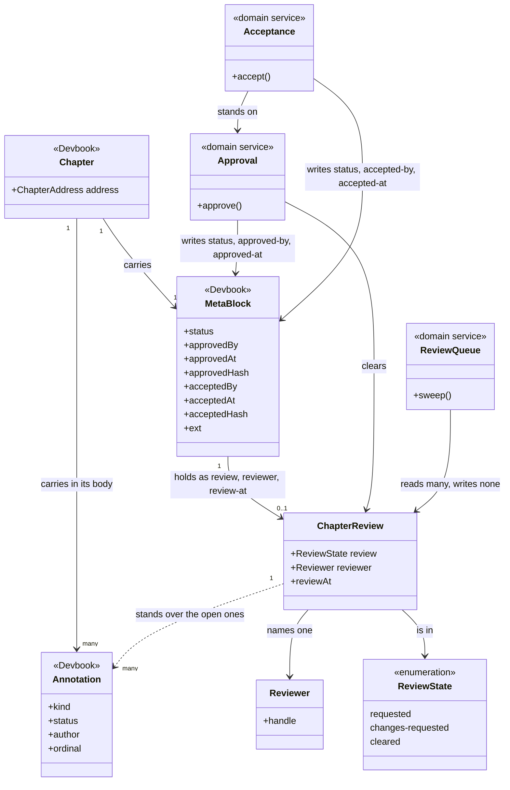
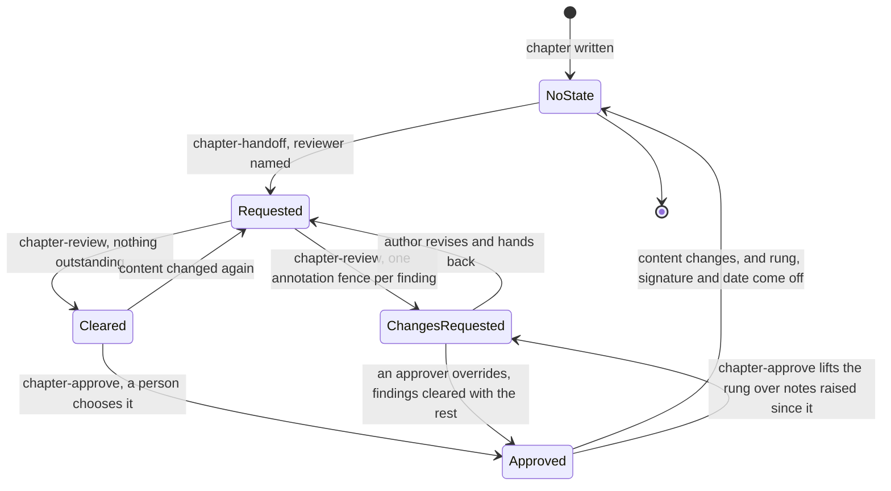
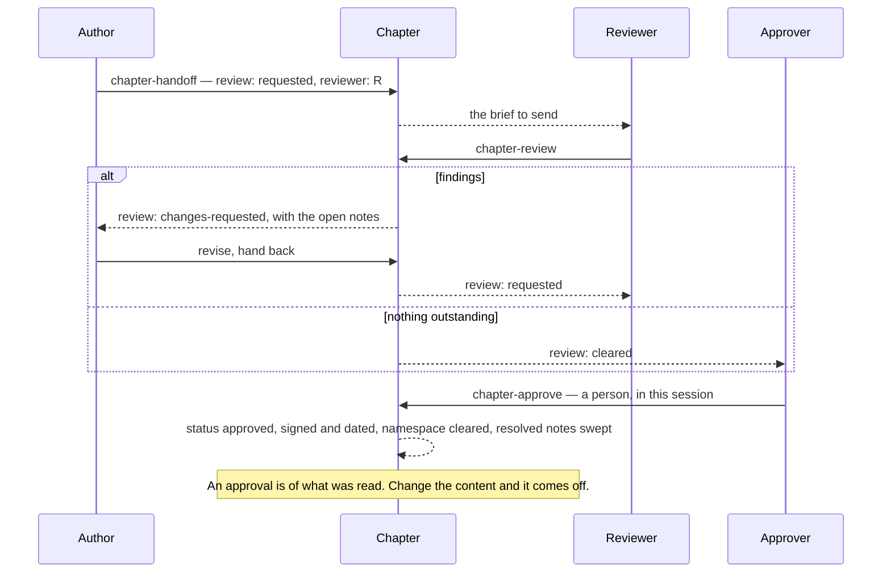

# devbook-collaboration

```meta
related: [".devbook/arc42/building-blocks/README.md", ".devbook/arc42/building-blocks/devbook.md#dependencies", ".devbook/arc42/adr/annotations.md", ".devbook/arc42/adr/chapter-schema.md", ".devbook/arc42/12-glossary.md#review-pass", ".devbook/arc42/12-glossary.md#stale-approval"]
```

Who owes the next move on a chapter. Responsible for two things: that a chapter always says
who owes the next move, and that an approval on it was chosen by a person in the session that
wrote it.

Inside the block: the review request, the reviewer, the verdict, the approval decision, and
the sweep that reports what is waiting on whom.

Outside it: what a chapter says, what its folder's rules are, the schema the state is stored
in, and the [annotation](devbook.md#annotation) a finding is written as — all
[devbook](devbook.md)'s. This block owns no schema and no state of its own: the three review
fields it writes are devbook's, defined beside the approval triad and held to their meaning by
devbook's check, and a finding lives in devbook's own device
([the annotations record](../adr/annotations.md)).

## Interfaces

```meta
related: [".devbook/arc42/building-blocks/devbook.md#interfaces"]
```

Five skills, and nothing else in the plugin. They move one chapter through a review to the
two decisions past it, and one of the five writes nothing at all. There is no install: the state they write is devbook's
schema, so enabling the plugin is the whole adoption. Deleting the answered notes is
`devbook:annotation-sweep`, in the plugin that owns the fence.

| Interface | Kind | Reached by |
| --- | --- | --- |
| `chapter-handoff` | skill | A person, on one chapter |
| `chapter-review` | skill | The named reviewer, on one chapter |
| `chapter-approve` | skill | A person who chose it in that session — never a schedule, never a cleared review |
| `chapter-accept` | skill | A person who chose it in that session, over evidence — never a green suite, never a merged pull request |
| `chapter-review-queue` | skill | A person, or a schedule: it writes nothing |

### chapter-handoff

```meta
related: [".devbook/arc42/building-blocks/devbook-collaboration.md#review-position", ".devbook/arc42/building-blocks/devbook-collaboration.md#the-review-pass"]
```

Name the reviewer, set the chapter to `requested`, and produce the brief to send them. The
request survives the conversation it was made in, which is the whole point of writing it into
the chapter.

### chapter-review

```meta
related: [".devbook/arc42/building-blocks/devbook-collaboration.md#finding", ".devbook/arc42/building-blocks/devbook.md#annotation"]
```

Read a chapter against its folder's rules and its own evidence, and record the verdict:
`changes-requested` over one annotation fence per objection, or `cleared` over none open.

A verdict and its findings are written in the same change — a verdict with nothing behind it
is not a review. The fences are the evidence, so the two cannot drift without one of them
being wrong.

`cleared` is not approval: it says nothing is outstanding. It obliges nobody and grants
nothing, which is what lets a chapter wait for an approver rather than for a reviewer.

### chapter-approve

```meta
related: [".devbook/arc42/building-blocks/devbook-collaboration.md#approval", ".devbook/arc42/building-blocks/devbook-collaboration.md#chapter-approved"]
```

Record that a person read this chapter and approved it, in devbook's own rung with a
signature and a date, and clear this block's namespace and the chapter's resolved notes in the
same change.

An open `kind: question` note blocks it outright: devbook's check reports an approval standing
over one as an error, so this is the one condition the skill refuses on rather than states.
Every other open note is shown and weighed, flags first; on a chapter already approved, a note
dated after `approved-at` is named as raised since the approval, and revise means lifting the
rung.

It runs only where a person chose it in that session — never from a schedule, never as a
consequence of a cleared review, and never on the strength of a conversation a later session
cannot read.

### chapter-accept

```meta
related: [".devbook/arc42/building-blocks/devbook-collaboration.md#acceptance", ".devbook/arc42/building-blocks/devbook-collaboration.md#chapter-accepted"]
```

Record that a person saw the implemented work against this chapter and accepted it, in the
rung above `approved`, with a signature, a date, and the content fingerprint the acceptance
was of. The approval record stays: the two statements are different, and both are wanted.

What it shows is the built work, never a summary of it — the repository's own `show` procedure
where `devbook-procedures` is installed, otherwise the chapter's linked `tests` run. It refuses
on an open `kind: question`, on a chapter that was never approved, and on an approval whose
fingerprint no longer matches the chapter: an acceptance stands on a current approval, and
there is nothing to accept against without one.

Like the approval under it, it runs only where a person chose it in that session — never from
a green suite, a merged pull request, or a schedule.

### chapter-review-queue

```meta
related: [".devbook/arc42/building-blocks/devbook-collaboration.md#review-queue"]
```

Sweep the adopted folders and report what is awaiting whom, and which approvals have gone
stale. It writes nothing, which makes it the one skill here that is safe to schedule.

## Structure

```meta
related: [".devbook/arc42/building-blocks/devbook.md#structure", ".devbook/arc42/adr/annotations.md", ".devbook/arc42/adr/chapter-schema.md"]
```

One aggregate that has no storage of its own, two domain services, and one domain event
stated in devbook's language.

### Model

```meta
```

Where this block's state physically lives, and where the line runs between it and the chapter
it is written inside.



- **The aggregate has no storage of its own.** `ChapterReview` is a projection of three fields
  in a block another block owns, and the fields are that block's too: devbook defines
  `review`, `reviewer`, and `review-at` beside its approval triad and validates them, so this
  block contributes the procedure and none of the vocabulary
  ([the annotations record](../adr/annotations.md)).
- **The decision rungs are `domain/`'s, the review triad is every folder's.** So the pass runs
  wherever a chapter lives, and the two gates run on model chapters only — a repository that
  adopts no `domain/` gets the review and neither decision.
- **The line between the two is who writes, not who defines.** Every field is devbook's; this
  block writes the review triad through the pass, `status`, `approved-by`, and
  `approved-at` only through [Approval](#approval), and the acceptance three only through
  `Acceptance`, which is a service for the same reason and stands on the record Approval
  left.
- **`Approval` writes across the line and is therefore a service.** It is the one operation
  whose result is not a state of the aggregate — it deletes the aggregate and sets a field
  belonging to someone else, which is coordination rather than a transition.
- **A [Finding](#finding) is an `Annotation`, and the association is a dependency rather than
  a composition.** The fence hangs off the chapter, not off the review: it outlives the pass
  that raised it, a person can write one with no review running, and this block neither owns
  its shape nor sweeps it. What the review contributes is the reading — an open
  `kind: question` is the one that blocks the approval decision.
- **The seam that used to be open is closed.** Findings were flat `ext` keys until 2026-09-09;
  see [the annotations record](../adr/annotations.md) for why, and for why the sweep stayed
  with devbook.

### Review Position

```meta
related: [".devbook/arc42/12-glossary.md#review-pass", ".devbook/arc42/building-blocks/devbook.md#meta-block"]
```

The `ChapterReview` aggregate of the model above: one chapter's position in a review, held in
devbook's `review`, `reviewer`, and `review-at` fields inside that chapter's own block, over
the notes in the chapter body. It is the consistency boundary because the fields are only ever
consistent together and against those notes: a state without a reviewer says nobody owes
anything, and `changes-requested` over no open note says the review was never written down.
Devbook's check enforces both.

Its lifecycle is deliberately short. The state exists to be cleared — an approved chapter
carries the decision and not the road to it — so the resting shape of a chapter in this block
is no review fields at all.

| Invariant | Enforced at | Evidence |
| --- | --- | --- |
| Every remembered fact is one of `review`, `reviewer`, `review-at`, and this block writes no other field except devbook's two decision rungs and their six record fields | all mutations | untested |
| A chapter in any review state names exactly one reviewer and one day — the three are written together or not at all | devbook's check | `unit:node:plugins/devbook/tools/devbook-meta/review-state.test.mjs` |
| A `changes-requested` verdict stands over at least one open annotation fence, and `cleared` over none | devbook's check | `unit:node:plugins/devbook/tools/devbook-meta/review-state.test.mjs` |
| A finding is written through devbook's `annotations.mjs` and never as a field here | `chapter-review()`, `chapter-approve()` | untested |
| Approval clears all three review fields, and sweeps the chapter's resolved notes, in the same change that writes the rung | `chapter-approve()`, devbook's check | `unit:node:plugins/devbook/tools/devbook-meta/review-state.test.mjs` |
| No chapter is approved over an open `kind: question` note | `chapter-approve()` | `unit:node:plugins/devbook/tools/devbook-meta/field-scope.test.mjs` |
| The gate shows every open note on the chapter, from the chapter itself, before the decision is asked | `chapter-approve()` | untested |
| No skill here writes `approved` without a person choosing it in that session | `chapter-approve()` | untested |
| Review state is never read as chapter content | convention | open — devbook's rules state it beside the annotation rule; nothing checks a reader obeyed it |

The aggregate owns one value object and one enum. **Reviewer** — also called assignee, owner
— is one handle, name, or role, never a list. Two reviewers is two review passes, because a
state that says "awaiting someone" cannot tell you which of them the chapter is actually
waiting for. **Review State** is `requested`, `changes-requested`, `cleared`: three values,
each naming who owes the next move — the reviewer, the author, and nobody. There is no
`in-progress` — a review nobody has recorded a verdict on is still `requested`, and inventing
a fourth value would let a chapter sit in a state that obliges no one.

### Finding

```meta
related: [".devbook/arc42/building-blocks/devbook.md#annotation", ".devbook/arc42/adr/annotations.md"]
```

Also called: note, comment, objection.

One unresolved objection, as one [annotation](devbook.md#annotation) fence in the chapter
body — devbook's device, not this block's. It has identity within the review because it is
answered individually, and it is addressed the way devbook addresses a note: the chapter, plus
its ordinal under that heading.

This block reads a finding and writes one; it owns neither the shape nor the lifecycle. What
it adds is the reading: an open `kind: question` is a hole in the chapter and blocks the
approval decision, while a `comment`, `suggestion`, or `flag` is a remark about a chapter that
stands. Among the remarks a `flag` is read first, and a note dated after the chapter's
`approved-at` is read as raised since the approval — an objection the approval never saw, and
a reason to lift it. Neither reading blocks; see [the decision](../adr/annotations.md).

It was one flat `ext` key until 2026-09-09, which recorded no author, could not be replied to
in place, and never said which passage it was about. See
[the decision](../adr/annotations.md).

### Approval

```meta
related: [".devbook/arc42/adr/chapter-schema.md", ".devbook/arc42/adr/annotations.md"]
```

Also called: sign-off, agreed.

The decision that writes devbook's own `approved` rung, with `approved-by` and `approved-at`,
and clears this block's namespace in the same change.

Invocation semantics: command-invoked, and never anything else. It is the one operation here
that writes a field this block does not own, so it runs only where a person chose it in that
session — not from a schedule, not as a consequence of a cleared review, and not on the
strength of a conversation a later session cannot read.

The behaviour does not live on the [Review Position](#review-position) aggregate because its
output leaves that aggregate entirely: the review state is deleted and a devbook field is set,
which is a coordination across two owners rather than a transition of one.

It lives in this block and not in the flow engine because it writes the rung it decides, and
the engine reads that rung and never writes it. It reads the chapter, not the derived index:
every fact the decision needs is in the one file it is already showing, and the index is
refreshed on a schedule, so the note written on this branch an hour ago is the one it lacks.
See [the decision](../adr/annotations.md).

### Review Queue

```meta
related: [".devbook/arc42/12-glossary.md#review-pass", ".devbook/arc42/12-glossary.md#stale-approval"]
```

Sweeps the adopted folders and reports what is awaiting whom, and which approvals have gone
stale — an approval that no longer stands because the content moved under it.

Invocation semantics: query-oriented, and it writes nothing at all. It is a read across every
chapter in the repository rather than an operation on one, which is why it is a service and
not a method: no single [Review Position](#review-position) can answer *who is blocked right
now*.

### Acceptance

```meta
related: [".devbook/arc42/adr/chapter-schema.md", ".devbook/arc42/building-blocks/devbook-collaboration.md#approval"]
```

Also called: validated, signed off on the build.

The decision that writes devbook's `accepted` rung, with `accepted-by`, `accepted-at`, and
`accepted-hash`, on top of the approval record it stands on and never in place of it.

A service for the same reason [Approval](#approval) is: its result is not a state of the
aggregate but a field belonging to another block, and it reads evidence — a running
application, a test run — that lives outside this one entirely.

### Chapter Approved

```meta
related: [".devbook/arc42/building-blocks/devbook.md#chapter", ".devbook/arc42/building-blocks/devbook-collaboration.md#approval"]
```

Published when a person approves a chapter. It is the one fact this block states in somebody
else's language: it is written into devbook's `status`, `approved-by`, and `approved-at`
fields, lands in git like any other change, and travels with the content rather than sitting
in flow configuration or in somebody's memory.

Payload:

- `status` — the `approved` rung, on top of `domain/`'s ladder and no other folder's
- `approved-by` — one person, handle, or team; never a list
- `approved-at` — the day they approved it, `YYYY-MM-DD`
- `approved-hash` — optional; the fingerprint of the content approved, which is what makes a
  later lapse a check result rather than something a reader has to establish from git

Consumers:

- **[devbook](devbook.md)** — the rung is its field, and its check reports an approval that is
  unsigned or undated, or a record left behind on a chapter no longer claiming the rung.
- **[delivery](delivery.md)** — a flow's approval gate reads whether a chapter it is about to
  build from was agreed, and never writes the rung itself.
- **Any reader of the chapter** — which is the point of recording it in the chapter rather
  than anywhere else.

Published language rules:

- **The rung is never a resting value and is never omitted to mean itself.** A chapter states
  it while the approval stands and drops back to its ordinary rung the moment the content
  changes.
- **`approved-by` and `approved-at` are written and deleted in the same change as the rung.**
  Either the approval is current and the status says so, or it has lapsed and the record
  comes out with it.
- **An approval is of what was read, not of the heading.** Nothing may re-assert it from a
  previous approval, a cleared review, or a version comparison.

### Chapter Accepted

```meta
related: [".devbook/arc42/building-blocks/devbook.md#chapter", ".devbook/arc42/building-blocks/devbook-collaboration.md#acceptance"]
```

Published when a person accepts the built work against a chapter. The rung above
[Chapter Approved](#chapter-approved), and the one statement the loop between a specification
and its implementation otherwise loses: `approved` says the chapter is right, `accepted` says
the product satisfies it.

Payload:

- `status` — the `accepted` rung, on `domain/`'s ladder and no other folder's
- `accepted-by` — one person, handle, or team; never a list
- `accepted-at` — the day they accepted it, `YYYY-MM-DD`, on or after `approved-at`
- `accepted-hash` — optional; the fingerprint of the content accepted

Consumers:

- **[devbook](devbook.md)** — the rung is its field, and its check reports an acceptance that
  is unsigned, undated, dated before its approval, or standing over no approval at all.
- **[delivery](delivery.md)** — a flow may record the decision at its personal-validation
  gate, and never writes the rung itself.
- **Any reader of the chapter** — including a team accepting in a different tool, for whom
  the chapter is the only place both sides read.

Published language rules:

- **It stands on an approval and never replaces one.** An accepted chapter carries both
  records, because the two statements are different and are usually made by different people
  on different days.
- **Both records come off together.** A content change drops the acceptance with the
  approval: a build was accepted against the text that was approved.
- **What is accepted is the chapter's content, never a commit.** Which pull request delivered
  it belongs to the tracker, not to a field here.

## Runtime

```meta
related: [".devbook/arc42/building-blocks/devbook-collaboration.md#review-position", ".devbook/arc42/building-blocks/devbook-collaboration.md#approval", ".devbook/arc42/building-blocks/devbook.md#a-chapters-standing"]
```

How a chapter moves through a review, and how it leaves.

### The Review Pass

```meta
related: [".devbook/arc42/12-glossary.md#review-pass"]
```

Five skills and three states, and every state names who owes the next move. The resting shape
is no keys and no open notes — this block's state exists in order to be cleared.



- **`cleared` is not approval.** It says nothing is outstanding, obliges nobody, and grants
  nothing. Collapsing the two would make a reviewer's sign-off into an approval decision they
  never made.
- **There is no `in-progress`.** A review nobody has recorded a verdict on is still
  `requested`; a fourth value would let a chapter sit in a state that obliges no one.
- **Approval clears everything in one change.** The rung, `approved-by`, and `approved-at` go
  in; `review`, `reviewer`, and `review-at` come out, and the chapter's resolved notes are
  swept with them. A chapter that carries both is a half-finished write, not a state.
- **An open question is the one thing that blocks the decision.** Devbook's check reports an
  approval standing over one as an error, so `chapter-approve` refuses rather than warns.
  Every other kind of note is weighed, not enforced — a `flag` first, and a note dated after
  `approved-at` named as raised since the approval. Choosing revise over one is the
  `Approved --> ChangesRequested` edge: the rung comes off by a person's decision rather than
  by a content change, and the notes already on the chapter are the findings.
- **The exit is content change, not time.** An approval lapses because the chapter moved
  under it, which is why [Review Queue](#review-queue) reports staleness rather than the
  chapter claiming to be current.

### Who Owes the Next Move

```meta
```

The same pass read as a hand-off, which is the question the state is actually there to
answer.



- **Nothing here is inferred from a conversation.** A later session cannot read this one, so
  every hand-off is a written state and the approval is taken in the session that writes it.
- **The queue sweep runs beside this diagram, never inside it.** It reads every chapter and
  changes none, which is what makes it the one operation here safe to schedule.

## Dependencies

```meta
related: [".devbook/arc42/building-blocks/devbook.md#dependencies", ".devbook/arc42/08-crosscutting-concepts.md#layer", ".devbook/arc42/adr/annotations.md"]
```

An L1 extension: exactly one declared dependency, on the foundation whose schema it writes
into.

### Outbound

```meta
```

| Depends on | Pattern | Mechanism | Contract | Why |
| --- | --- | --- | --- | --- |
| [devbook](devbook.md#dependencies) | Customer-Supplier, declared `devbook >=1.0.0 <2.0.0` | `review`, `reviewer`, `review-at` in a chapter's own `meta` block | The review triad in `devbook-chapter-metadata.md`: three optional fields, validated together and against the chapter's open notes | It has no store and no vocabulary of its own. The state it remembers about a chapter is three of devbook's fields in that chapter — [the annotations record](../adr/annotations.md). |
| [devbook](devbook.md#annotation) | Conformist, for the whole device | Writes findings through `.devbook/_tools/devbook-meta/annotations.mjs` | The [annotation](devbook.md#annotation) fence: its schema, its placement rule, and its open/resolved/gone lifecycle | A finding is devbook's device, not this block's. It reads the fences as the evidence a verdict stands on, and sweeping them is devbook's too — see [the annotations record](../adr/annotations.md). |
| [devbook](devbook.md#chapter) | Conformist, for one field | Writes `status: approved` or `accepted` and the six record fields directly, on `domain/` chapters only | The two decision rungs, on `domain/`'s ladder alone, and their six record fields | Both rungs are devbook's fields and keep devbook's meaning. This block runs the decisions; it does not own the vocabulary, and a repository with no `domain/` folder gets the review pass and neither decision. |
| [The plugin kernel](../08-crosscutting-concepts.md) | Shared Kernel | Plugin folder and two manifests | [Chapter 8](../08-crosscutting-concepts.md) | It is packaged like every other plugin here, and — alone among them — materializes nothing and stamps nothing. |
| Claude Code and Copilot Plugin APIs | Conformist | Manifests and skills | Each host's own schemas | Enabling the plugin is the whole adoption; the rules its skills follow are devbook's, and reach a host through devbook's install. |

### Inbound

```meta
```

| Consumer | Pattern | Mechanism | Contract | What it relies on |
| --- | --- | --- | --- | --- |
| [devbook](devbook.md#dependencies), as a reader | Conformist, reversed | Its check reads `status: approved` and the review triad, and reports an unsigned, undated, or orphaned approval, a half-written review, a verdict without its findings, or review state left on an approved chapter | The three approval fields and the three review fields | That this block writes the triads whole, and clears the review triad in the change that writes the rung. |
| [delivery](delivery.md#dependencies) | Separate Ways | A flow's approval gate reads whether a chapter was agreed before building from it | The `approved` rung, read from the chapter | Nothing from this plugin. It reads devbook's field, which is why the two never name each other. |
| [devbook-config](devbook-config.md#dependencies) | Conformist, read-only | Reports whether the plugin is installed and enabled | The marketplace entry and manifests | Nothing: there is no stamp to read and no install to invoke. |

**The review triad is the entire dependency, and it is devbook's.** Disable this plugin and
the fields stay defined, validated, and meaningful — a person can write them by hand and be
held to the same rules. What goes is the procedure, not the vocabulary.

**This block reads no `ext` key.** The namespace it once stored its state in is reserved and
unused; the first extension's state became schema instead.

**Nothing declares this block.** It is above devbook in the layer order and below nothing, so
no manifest anywhere names it — a repository that has not enabled it simply has no skill that
writes review state, and every chapter still reads correctly.

**Promotion to a work item is not here, and the Separate Ways row above is why.** A note that
has become tracked work should be promoted through `bindings["delivery.tracker"]`, but the
operations, their resolution order, and the key naming them are declared in `delivery`'s own
surface contract — a file this block may not point at. Restating it here is what the Separate
Ways relationship exists to prevent, so promotion belongs in `delivery` or in a bridge allowed
to name both. See [the annotations record](../adr/annotations.md).
