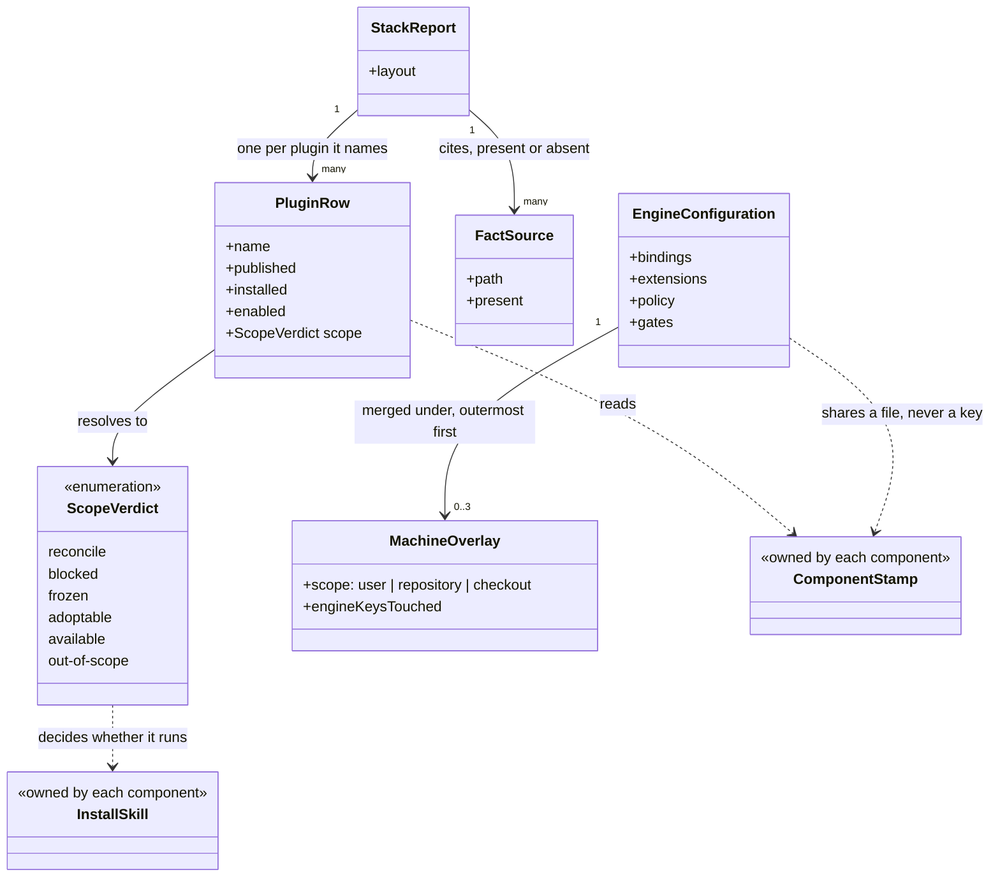
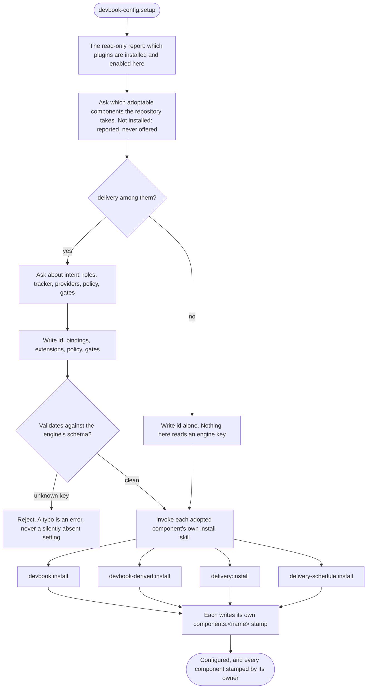
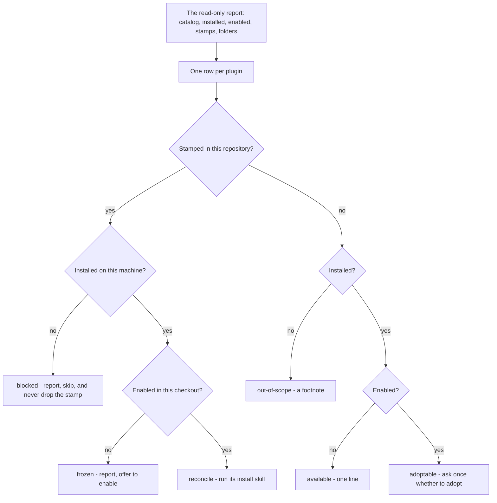

# devbook-config

```meta
related: [".devbook/arc42/building-blocks/README.md", ".devbook/arc42/building-blocks/delivery.md#dependencies", ".devbook/arc42/adr/plugin-boundaries.md", ".devbook/arc42/adr/configuration.md", ".devbook/arc42/05-building-block-view.md#config-plugin"]
```

What this stack is, what this machine has, and how this repository is wired. Responsible for
three things: that a repository's stack configuration exists before anything installs itself,
that it can be moved forward in one run, and that every answer it gives about the stack names
the file it came from.

Inside the block: the four engine-owned keys of the stack config, the read-only report behind
every fact, the scope verdict that decides what an update touches, and the drift report against
the adoption record.

Outside it: every `components.<name>` stamp, which belongs to that component's own install
skill; the schema of the four keys, which is [delivery](delivery.md)'s; and writing a chapter,
which is a flow's. This block names every plugin in the marketplace and declares none.

## Interfaces

```meta
```

Four skills, two of which write nothing, and the one script all four read through. None of them
writes a key another component owns.

| Interface | Kind | Reached by |
| --- | --- | --- |
| `setup` | skill | A person adopting the stack in a repository, before any component installs itself |
| `update` | skill | A person moving the configured stack forward |
| `ask` | skill | A person with a question about this marketplace |
| `adoption` | skill | A person checking the `ai/` adoption record against what is installed |
| `scripts/report.mjs` | script, the read-only report | The four skills, run in place from the plugin root; reads only, takes no network, and names the file behind every fact |
| The engine keys of `.devbook/config.json` | what it writes | `setup` and `update`, and nothing else in that file |

### setup

```meta
```

Write a repository's four engine-owned keys for the first time — which provider fills each
point, which plugin fills each role, which tracker, which policy switches, which gates — then
invoke every component's own install skill rather than reimplementing any of them. The service
is [Setup Service](#setup-service); the run is drawn under
[Setup, Then Every Component](#setup-then-every-component).

It is a conversation about intent, which is why it is not the same skill as the one that moves
the stack forward.

Stop at the engine keys: four keys and no more. Every `components.<name>` stamp stays with the
component that knows what it materialized, which is why the install skills are invoked and not
absorbed — the boundary [Engine Configuration](#engine-configuration) holds.

### update

```meta
```

Move the whole configured stack forward in one run: version drift, outstanding migrations, a
fan-out to every adopted component's install skill, and a re-validated config. It changes
nothing about intent, which is what makes it safe to run when nothing has changed. The service
is [Update Service](#update-service); the verdicts are under [Update, By Scope](#update-by-scope).

Never drop a stamp: a component this machine has not installed is reported, skipped, and **left
stamped**. A stamp is committed and shared while installed-ness is personal, so dropping the
entry would un-adopt the component for everyone on the next commit.

### ask

```meta
```

Answer one question about this marketplace from what is on disk: what each part is and how they
fit, which version of each plugin is installed against the newest published, and which are
enabled. Reads only. The service is [Ask Service](#ask-service).

It is the one asset allowed to name every plugin, because it is the only one whose subject is
the marketplace rather than a unit of work.

### adoption

```meta
related: [".devbook/arc42/building-blocks/delivery.md#flow-spec"]
```

Report where the adoption record no longer matches what is installed, enabled, and wired, and
hand every edit to the folder's own flow. It writes nothing, deliberately: the report can only
see what is on disk, and whether people actually work a certain way is not on disk. The service
is [Adoption Drift](#adoption-drift).

## Structure

```meta
related: [".devbook/arc42/05-building-block-view.md#config-plugin", ".devbook/arc42/adr/configuration.md", ".devbook/arc42/adr/plugin-boundaries.md"]
```

Two aggregates and four services: what the report reads, what the four keys are, and where the
line runs between what this block writes and what it only looks at.

### Model

```meta
related: [".devbook/arc42/building-blocks/delivery.md"]
```



- **The two dashed edges into `ComponentStamp` are the whole boundary.** This block reads every
  stamp and writes none. `EngineConfiguration` and `ComponentStamp` share one file and never a
  key, which is what [one config file, two kinds of key](../adr/configuration.md) means in a
  diagram.
- **`ScopeVerdict` decides whether an install skill runs and never runs one itself.** The fan-out
  is a delegation, so a component's install skill remains the only thing that knows what that
  component materialized.
- **`FactSource` is associated with the report rather than with a row, and it carries `present`.**
  A file that was absent still produces a source, which is what makes an empty table say "this was
  not there" rather than "there is nothing".
- **`PluginRow` names every plugin and depends on none.** A plugin it cannot find becomes a row
  reading `not installed` — the same degrade-rather-than-fail shape the engine uses for an
  unbound role, applied to a report.
- **`EngineConfiguration` conforms to a schema this block does not own.** The four field names
  and their meanings are [delivery](delivery.md)'s; what this block owns is being the only
  writer of them.
- **Nothing in this model reads a devbook chapter.** It reads which folders exist and in which
  layout, and stops — writing a chapter is a flow's, which is why the adoption service reports
  and hands over.

### Stack Report

```meta
related: [".devbook/arc42/12-glossary.md#report"]
```

What is on disk, read and nothing else: the catalog in the working tree and in the host's clone,
the host's installed-plugin state, three settings layers merged nearest-last, the stack config
and every machine overlay layer, the devbook folders under `.devbook/`, and the `skills/`
folders of the engine and the schedule plugin. It is the [report](../12-glossary.md#report)
behind every answer this block gives.

It is the aggregate because a fact here is only usable with its source attached. "Already
latest" is usually wrong because a clone is older than the catalog it is being compared to — so
the report prints both, and the commit behind each.

| Invariant | Enforced at | Evidence |
| --- | --- | --- |
| Every fact names the file it came from, and every file that was absent is named too | report | untested |
| It reads and takes no network | report | untested |
| A plugin it names but cannot find is reported as not installed, never as an error | report | untested |
| An empty table is legible as "this file was absent", never as "there is nothing" | report | untested |
| The three scope inputs stay orthogonal — installed is per machine, enabled is per checkout, stamped is per repository | scope resolution | untested |

The parts it owns:

- **Plugin Row** — an entity. One plugin as the report sees it: the newest published version,
  the version on disk, whether this checkout enables it, its stamp if the repository has one, and
  the scope that follows. Identity is the plugin name, which is also why a name is never reused
  after release.
- **Fact Source** — a value object. The path a fact was read from, carried with the fact. It is
  what makes an answer checkable rather than authoritative, and it is why an absent file produces
  an empty row with a named source instead of silence.
- **Scope Verdict** — an enum, also called reconcile, blocked, frozen, adoptable, available,
  out-of-scope. What an update does with one component: `reconcile`, `blocked`, `frozen`,
  `adoptable`, `available`, `out-of-scope`. It is derived from three orthogonal inputs —
  installed, enabled, stamped — and never from a version comparison. `blocked` is the one worth
  stating twice. A stamp is committed and shared while installed-ness is personal and
  per-machine, so a component this machine lacks is skipped and **left stamped**: dropping the
  entry would un-adopt it for everyone on the next commit.

### Engine Configuration

```meta
related: [".devbook/arc42/building-blocks/delivery.md#stack-config", ".devbook/arc42/adr/configuration.md", ".devbook/arc42/12-glossary.md#engine-key"]
```

The four keys this block writes into `.devbook/config.json` — `bindings`, `extensions`,
`policy`, `gates`, each an [engine key](../12-glossary.md#engine-key) — and nothing else in that
file. The schema is [delivery](delivery.md#stack-config)'s and this block conforms to it; what
this block owns is the writing.

The boundary is by key and it is absolute. A `components.<name>` stamp is written by that
component's own install skill, which is the only thing that knows what it materialized — which
is also why `devbook:install` did not move here.

| Invariant | Enforced at | Evidence |
| --- | --- | --- |
| Only the four engine keys are written here | `setup()`, `update()` | untested |
| No component's stamp is ever written or dropped by this block | `setup()`, `update()` | untested |
| The result validates against the engine's schema, which rejects an unknown key | validation | `unit:node:plugins/delivery/tools/stack-config/check.test.mjs` |
| Setup runs before any component installs itself, and hands each component its own install skill | `setup()` | untested |
| Model choice is never written: it is personal, so there is no repository-level override | `setup()` | untested |

The value it holds:

- **Machine Overlay** — a value object. An overlay merged over the committed file, holding what
  is true of this machine only. Three layers, outermost first: the user's for every repository,
  the user's for the repository whose committed `id` names it, and the checkout's own gitignored
  file. The first two live under the user's devbook config directory and survive a fresh
  worktree; the last does not. Each may add a gate and may never remove one — the same asymmetry
  the engine holds for configuration, applied one layer down, at every layer — and none may
  carry the `id` that found it. Every layer is absent by default, and none is private: nothing
  secret goes in any of them. The reasoning is [the configuration record](../adr/configuration.md).

### Setup Service

```meta
related: [".devbook/arc42/12-glossary.md#engine-key"]
```

Writes a repository's four engine keys for the first time, then invokes each component's own
install skill rather than reimplementing any of them. The `setup` skill is its entry.

Invocation semantics: command-invoked, and it is a conversation about intent — which roles,
which tracker, which providers, which gates. That is why it stays separate from
[Update Service](#update-service): the two answer *what should this repository use?* and *is
what it uses current?*, and merging them would put an interview in front of an operation people
run to change nothing.

### Update Service

```meta
```

Moves the whole configured stack forward in one run: version drift, outstanding migrations, a
fan-out to every adopted component's own install skill, and a re-validated config. The `update`
skill is its entry.

Invocation semantics: command-invoked, and it changes nothing about intent. It fans out over the
[scope verdict](#stack-report) — running what it can, reporting what this machine has not
installed or this checkout has not enabled, and never dropping a stamp for either reason.

### Ask Service

```meta
related: [".devbook/arc42/12-glossary.md#report"]
```

Answers one question about this marketplace from what is on disk: what devbook, the engine, the
extensions, the surfaces, and the fan-out lane are and how they fit; which version of each
plugin is installed against the newest published; which are enabled. The `ask` skill is its
entry.

Invocation semantics: query-oriented, and it writes nothing. Its state half comes from the
[report](#stack-report) and its concept half from walking the canon — the plugin READMEs, the
domain chapters, the arc42 chapters, and the engine's surface contract.

It is the only asset allowed to name every plugin, because it is the only one whose subject is
the marketplace rather than a unit of work.

### Adoption Drift

```meta
```

Also called: ai/ drift.

Reports where the `ai/` adoption record no longer matches what is installed, enabled, and wired,
and hands every edit to the folder's own flow. The `adoption` skill is its entry.

Invocation semantics: query-oriented, and it writes nothing at all — deliberately. The derivable
half of that folder goes stale on every upgrade and is exactly what the report already prints;
the other half rates whether people actually work that way, which no file on disk records. So a
status, an adoption line, or a piece of evidence is never derived from an install.

Reporting drift is inside this block's subject. Writing the chapter is not.

## Runtime

```meta
```

Two flows: a repository being set up once, and the whole stack being moved forward afterwards.

### Setup, Then Every Component

```meta
```

Setup asks which installed components the repository adopts, writes `id` and — only when the
engine is among them — the four engine keys, and then gets out of the way. Everything that
materializes anything is invoked, never reimplemented.



- **Setup is a conversation and update is not.** They answer *what should this repository use?*
  and *is what it uses current?*; merging them would put an interview in front of an operation
  people run to change nothing.
- **Nothing is set up that this machine has not installed.** Installing a plugin is the user's
  act; a stamp written for one the machine lacks is `blocked` on the very next update.
- **The engine keys exist only for the engine.** They are `delivery.*` settings, so a repository
  adopting devbook without `delivery` is asked nothing about roles, points, policy, or gates.
- **The fan-out is a delegation, always.** A component's install skill is the only thing that
  knows what that component materialized, which is why nothing here writes a stamp.
- **An unknown key is rejected rather than ignored.** That single property is most of what the
  schema is for.

### Update, By Scope

```meta
```

Three orthogonal inputs, six verdicts, and one of them exists purely to stop a well-meant cleanup.



- **`blocked` never drops the stamp.** A stamp is committed and shared; installed-ness is personal
  and per-machine. Dropping the entry because this machine lacks the plugin would un-adopt the
  component for everyone on the next commit.
- **The three inputs stay orthogonal on purpose.** Collapsing them into one "is it set up" flag is
  exactly what produces the wrong answer for a colleague who has not installed what you have.
- **Version comparison decides nothing here.** What runs is decided by scope, and what a migration
  does is decided by the ledger — neither by comparing numbers.
- **The clone is compared against the source.** A host's marketplace clone older than the catalog
  in the working tree is the usual reason "already latest" is wrong, so both are printed with the
  commit behind each.

## Dependencies

```meta
related: [".devbook/arc42/building-blocks/delivery.md#dependencies", ".devbook/arc42/building-blocks/devbook.md#dependencies", ".devbook/arc42/08-crosscutting-concepts.md#layer"]
```

It names every plugin in the marketplace and its `dependencies` array is empty — devbook
included. That is the whole shape of it.

### Outbound

```meta
```

| Depends on | Pattern | Mechanism | Contract | Why |
| --- | --- | --- | --- | --- |
| [delivery](delivery.md#dependencies) | Conformist, and the only writer | Writes `bindings`, `extensions`, `policy`, `gates`; validates with the engine's own checker | `resources/config.schema.json` | The four keys are the engine's schema and this block's to write. It conforms to a shape it does not own. |
| [devbook](devbook.md#dependencies) | Conformist, read-only | Reads which folders are adopted under `.devbook/`, and invokes `devbook:install` during setup and update | The folder layout, and the install skill's name | It is named for the folder it writes into, not for a plugin it needs. One it names but cannot find is reported as not installed. |
| [devbook-derived](devbook-derived.md#dependencies), [delivery-schedule](delivery-schedule.md#dependencies) | Conformist, read-only | Reads their stamps and invokes their install skills during a fan-out | The stamp shape and each install skill's name | Every component's stamp stays with the component. This block decides *whether* an install runs and never what it does. |
| [devbook-collaboration](devbook-collaboration.md#dependencies) | Conformist, read-only | Reports whether it is installed and enabled | The marketplace entry and manifests | It has no stamp and no install; enabling it is the whole adoption. |
| [fleet](fleet.md#dependencies), the three surfaces | Conformist, read-only | Reports whether each is installed, enabled, and at what version | The marketplace entries and manifests | Naming a plugin is not depending on one. Every row degrades to `not installed`. |
| The host's own plugin state | Conformist, **and a known divergence** | Reads the host's config directory, its installed-plugin file, its marketplace clones, and three settings layers merged nearest-last | The host's own file layout | Where a plugin is installed and whether it is enabled is a fact about a host and nothing else, so an asset answering it either names those files or answers nothing. |
| [The plugin kernel](../08-crosscutting-concepts.md) | Shared Kernel | Plugin folder, two manifests, marketplace entry, `scripts/` run in place from the plugin root | [Chapter 8](../08-crosscutting-concepts.md) | It is packaged like everything else here. |

### Inbound

```meta
```

| Consumer | Pattern | Mechanism | Contract | What it relies on |
| --- | --- | --- | --- | --- |
| A repository being set up | Customer-Supplier, this block supplying | `.devbook/config.json`, written before any component installs itself | The engine's schema | That setup runs first and hands each component its own install skill. |
| [devbook](devbook.md#dependencies) and every other component, during a fan-out | Customer-Supplier, reversed — this block calling | Their own install skills, invoked with a scope verdict already resolved | Each install skill's name and its idempotence | That an install run twice is harmless, which is what makes a whole-stack update safe. |
| Nothing declares it | — | — | — | No manifest anywhere names this plugin, in either direction. |

**Naming every plugin and depending on none is the position, and it is deliberate.** A plugin it
cannot find is reported as `not installed` — the same degrade-rather-than-fail shape the engine
uses for an unbound role — which is what keeps this block outside the layer order rather than
under it.

**The host-path row is the one divergence, and it is recorded rather than hidden.** This is the
only asset in the marketplace that still names a host's own files, after the two profile plugins
were deleted for doing exactly that. A slot would be the clean fix, and the engine's closed set
has no member for *where this host keeps its plugins*.

**The other host's plugin state has never been written down here**, so its rows come back empty
while the catalog half still answers. The report says which files it read and which were absent,
which is what keeps an empty table legible rather than misleading.

**It writes four keys and calls other people's install skills.** Everything else it does, it
reads.
