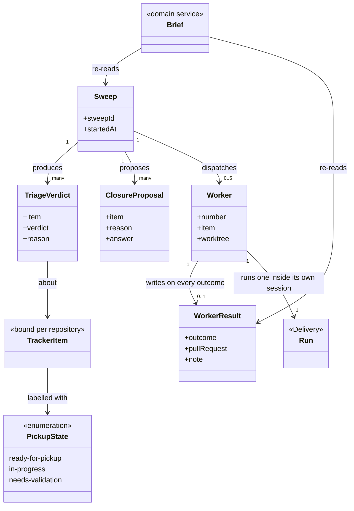
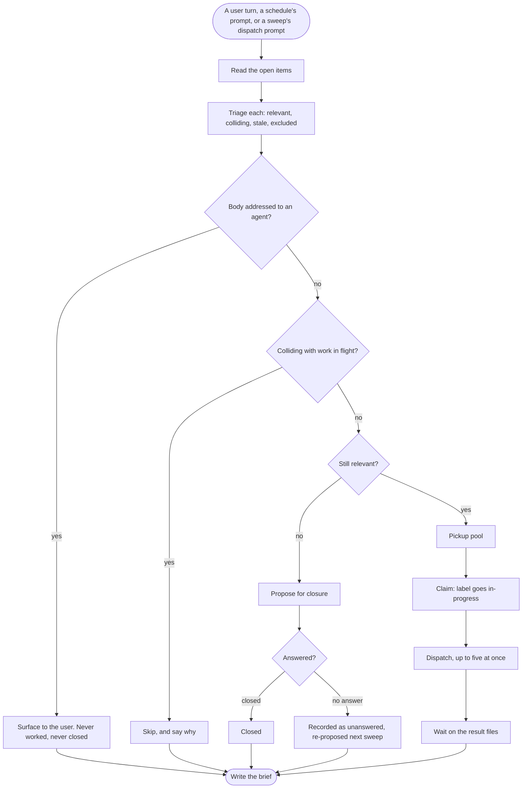
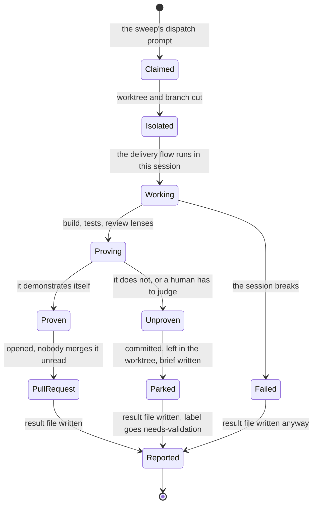
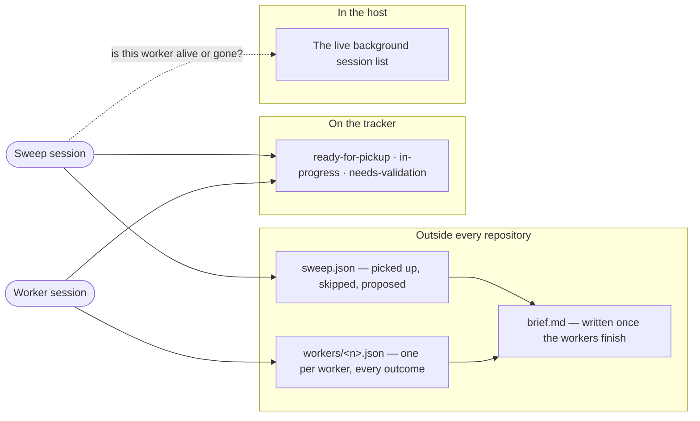

# fleet

```meta
related: [".devbook/arc42/building-blocks/README.md", ".devbook/arc42/building-blocks/delivery.md#dependencies", ".devbook/arc42/tdr/2-fleet-names-the-cli-directly.md", ".devbook/arc42/adr/plugin-boundaries.md", ".devbook/arc42/05-building-block-view.md#fan-out-state"]
```

A backlog turned into parallel work across sessions and worktrees. Responsible for three
things: that a backlog becomes parallel work without two workers picking up the same item, that
every worker's outcome is legible afterwards including the ones that failed, and that nothing
merges unread even though no person answered a gate.

Inside the block: triage and its verdicts, the claim, the dispatch, the coordination files that
outlive every session involved, and the brief written at the end.

Outside it: what a worker actually does to an item, which is [delivery](delivery.md)'s flow
running inside that worker's own session; and the tracker the items come from, which is a
binding. This block owns no flow and holds no gate — that is the whole reason it is not part of
the engine.

## Interfaces

```meta
```

Three skills, one contract, and one hook. None of the skills may start mid-task: only a user
turn, a schedule's prompt, or a sweep's own dispatch prompt may run one, because each spawns
sessions and claims backlog items that outlive the turn that asked.

| Interface | Kind | Reached by |
| --- | --- | --- |
| `fleet-issue-sweep` | skill | A user turn, or a schedule's prompt |
| `fleet-resolve-issue` | skill | The sweep's dispatch prompt, a schedule's prompt, or a person by hand |
| `fleet-morning-brief` | skill | A person, long after the sweep |
| `fleet-issue-sweep-contract.md` | contract | The three skills, by path: the sweep folder layout, the manifest and worker result schemas, how workers are dispatched and waited on, and what keeps a sweep resumable when a session dies mid-flight |
| `SessionStart` hook | hook | Either host, at session start: the routing text that sends a backlog sweep here, a single unattended issue to `fleet-resolve-issue`, and a single issue a person is sitting with to delivery's `start-session-from-issue` |

### fleet-issue-sweep

```meta
```

Turn a repository's open backlog into parallel work: triage every item for relevance and for
collision with work in flight, propose the stale ones for closure, claim what it picks, dispatch
up to five worker sessions, wait them out, and write the brief. The aggregate it drives is
[Sweep](#sweep); the run is drawn under [A Sweep, End to End](#a-sweep-end-to-end).

The session running it is held open throughout and can see none of the sessions it starts, so
everything it knows is a file or a label.

Triage before dispatch: judge each item, and exclude one whose body carries text addressed to an
agent — surfaced to the user, never worked, never closed. Triage proposes a closure; only an
answer closes it, and unanswered is recorded as unanswered rather than read as declined.

Degrade without dispatch: on a host that cannot spawn sessions the sweep still triages, marks
the pickup pool, proposes closures, and reports what it would have dispatched. Visible
degradation rather than silence — though the parallelism is the point, so treat the capability
as required in practice.

### fleet-resolve-issue

```meta
```

What one worker runs: claim one item, cut it a worktree and a branch, resolve it, and finish one
of two ways — a pull request when the change proved itself against its own tests and review
lenses, or a parked worktree with a handoff brief when a person has to look. The service behind
it is [Worker Run](#worker-run); its states are under [A Worker, End to End](#a-worker-end-to-end).

It trades Personal Validation for a narrower guarantee rather than for nothing. Nothing merges
unread either way.

Write a result on every outcome: success, park, and failure all write the result file. A worker
that says nothing is indistinguishable from one still running, and the host's live-session list
is a weaker signal than a file.

### fleet-morning-brief

```meta
```

Re-read a past sweep from its manifest and worker result files and write the report: what was
picked up, what was skipped and why, what was proposed for closure, and how each worker
finished. The service is [Brief](#brief).

It remembers nothing and re-reads everything, which is why a sweep from last week reports
exactly as it did on the day. The sweep follows this same format for its own closing brief.

## Structure

```meta
related: [".devbook/arc42/05-building-block-view.md#fan-out-state", ".devbook/arc42/adr/plugin-boundaries.md"]
```

One aggregate, two services, and two events. The model comes first, because where each part
physically lives is the point.

### Model

```meta
related: [".devbook/arc42/building-blocks/delivery.md"]
```

What a sweep holds, where each part of it physically lives, and why three different stores are
not an accident.



- **Three stores, and each holds what only it can.** The sweep manifest and the worker result
  files live outside every repository, so they survive worktree removal and never show up in
  `git status`. The pickup labels live on the tracker, so a claim is legible to a person who has
  never heard of this plugin. The host's live-session list is neither, and is the only thing
  that distinguishes a missing result from a worker still running.
- **`Worker → Run` is the boundary crossing.** A worker runs one of [delivery](delivery.md)'s
  flows inside its own session; nothing in this model reaches into that run, and nothing in that
  run knows a sweep dispatched it.
- **`WorkerResult` is optional in the diagram and mandatory in the rules.** The multiplicity is
  `0..1` because a crashed session can leave none — which is exactly the case the live-session
  list exists to interpret, and exactly why the rule says to write the file on every outcome.
- **`ClosureProposal` carries an answer and therefore has identity.** An unanswered proposal is
  re-proposed next sweep, so it outlives the pass that made it; a `TriageVerdict` does not and is
  recomputed every time.
- **`TrackerItem` is bound, not owned.** GitHub issues today, whatever the repository binds
  tomorrow. The labels are this block's vocabulary written into somebody else's system, which
  is why their names are part of the contract.
- **The five-worker cap is a property of `Sweep`, not of `Worker`.** Nothing about a worker knows
  how many siblings it has, and that ignorance is what lets a worker be run by hand.

### Sweep

```meta
related: [".devbook/arc42/05-building-block-view.md#fan-out-state"]
```

Also called: issue sweep, triage pass, fan-out.

One pass over a repository's open items: what was triaged, what was claimed, what was proposed
for closure, which workers were dispatched, and the brief written once they finished. It is the
consistency boundary because the claim and the dispatch must agree — an item marked claimed with
no worker behind it is a backlog item nobody will ever pick up again.

Its state lives in files outside every repository it acts on, because the sessions it
coordinates cannot see each other's conversations. That is not an implementation detail: the
files *are* the coordination surface, and anything not written to one did not happen.

| Invariant | Enforced at | Evidence |
| --- | --- | --- |
| At most five workers run at once | dispatch | untested |
| One worker resolves exactly one item, in its own worktree | dispatch | untested |
| An item is claimed before it is dispatched, and the claim is visible from the tracker alone | claim | untested |
| An item colliding with work already in flight is skipped, never worked twice | triage | untested |
| An item whose body carries text addressed to an agent is surfaced and excluded from pickup — never worked, never closed | triage | untested |
| Triage proposes a closure; only an answer closes it, and unanswered is recorded as unanswered | closure approval | untested |
| A worker writes a result file on every outcome, failure included | worker completion | untested |
| The sweep waits for its workers before writing the brief | brief | untested |
| A sweep never starts mid-task — only a user turn, a schedule's prompt, or a sweep's own dispatch prompt may | entry | untested |

The parts it owns:

- **Worker** — an entity, also called background session, resolver. One spawned session
  resolving one item in its own worktree, identified inside the sweep by number. It has
  identity because its outcome is recorded and read back individually, and because a missing
  result file has to be told from a worker still running — which the host's list of live
  background sessions is what answers. A worker cannot talk to the sweep or to another worker.
  Everything it has to say, it writes.
- **Closure Proposal** — an entity. An item triage judged no longer relevant, put forward for
  closing with the reason. It is an entity rather than a value because it outlives one sweep:
  unanswered, it is recorded as unanswered and re-proposed next time, which is a different thing
  from being declined.
- **Triage Verdict** — a value object, also called relevance judgement. What one pass concluded
  about one item: relevant and pickable, colliding with work in flight, stale enough to propose
  for closure, or excluded. Equal by value and recomputed every sweep — nothing here is
  remembered from the last one except the closure proposals nobody answered.
- **Pickup State** — an enum: `ready-for-pickup`, `in-progress`, `needs-validation`, carried as
  labels on the tracker rather than in this block's own files. That is deliberate: a
  [claim](../12-glossary.md#claim) has to be legible from the tracker alone, by a person who has
  never heard of this plugin and has no access to any session.

### Worker Run

```meta
related: [".devbook/arc42/building-blocks/delivery.md#run", ".devbook/arc42/12-glossary.md#park"]
```

What one worker does with its item: claim it, cut a worktree and a branch, run the resolution
stages, and finish one of two ways — a pull request when the change proved itself against its
own tests and review lenses, or a [parked](../12-glossary.md#park) worktree with a handoff brief
naming exactly what a person has to look at.

Invocation semantics: command-invoked, once per worker session, by the sweep's dispatch prompt
or by hand. It is a service rather than behaviour on [Sweep](#sweep) because it runs in a
session the sweep cannot reach: the only thing they share is a file.

It trades Personal Validation for a narrower guarantee rather than for nothing. The pull
request is the review surface, and a change that cannot demonstrate itself never reaches one.

### Brief

```meta
```

Also called: report, morning brief.

Reads a sweep back from its manifest and its worker result files and writes the report: what was
picked up, what was skipped and why, what was proposed for closure, and how each worker
finished.

Invocation semantics: query-oriented, and runnable long after the sweep — it re-reads files
rather than remembering anything, which is why a sweep from last week reports exactly as it did
on the day. The sweep follows this same format for its own closing report.

### Issue Claimed

```meta
related: [".devbook/arc42/08-crosscutting-concepts.md#tracker", ".devbook/arc42/12-glossary.md#claim"]
```

Published when triage takes an item for this sweep, as a label change on the tracker — the
pickup state under [Sweep](#sweep). The tracker is the transport on purpose: a claim that lives
only in a coordination file is invisible to the person who opens the backlog and starts working
the same item by hand.

Payload:

- The item's `ready-for-pickup` label, replaced by `in-progress`
- The sweep that claimed it, so a stale claim can be traced back to the pass that made it

Consumers:

- **The next sweep**, which reads the labels to detect collision with work in flight.
- **Anyone reading the tracker**, which is the reason this event exists at all rather than being
  a field in the manifest.

Published language rules:

- **The label is the claim.** A file that says an item was claimed and a tracker that does not
  is a claim nobody outside this plugin can see.
- **A claim is released or completed, never abandoned silently.** `needs-validation` is what a
  parked worker leaves behind, and it is a different statement from an item that was never
  picked up.

### Worker Result Published

```meta
related: [".devbook/arc42/building-blocks/delivery.md#run-finished"]
```

Published when a worker finishes, as one result file written into the sweep's folder. It is the
only thing a worker says to the sweep, and it is written on every outcome — success, park, and
failure alike.

Payload:

- `issue` — which item this worker took
- `outcome` — a pull request opened, a worktree parked, or a failure
- `pullRequest` or `worktree` — where the result is, depending on which of the two it was
- `note` — for a parked outcome, what a person has to look at

Consumers:

- **The sweep**, which waits on these files and writes the brief from them.
- **[Brief](#brief)**, re-reading a past sweep long after every session involved has ended.

Published language rules:

- **Every outcome writes a file, failure included.** A sweep that cannot tell a crashed worker
  from a slow one cannot aggregate anything, and the host's live-session list is what
  distinguishes the two only when the file is genuinely absent.
- **A parked worktree is a result, not a non-result.** It carries a note naming what a person
  must check, which is what makes parking an honest outcome rather than a quiet failure.
- **The file is written before the session ends**, because a session that ends without one has
  said nothing and there is no second chance to say it.

## Runtime

```meta
related: [".devbook/arc42/building-blocks/delivery.md"]
```

How a sweep moves, how a worker ends, and where the state between them lives.

### A Sweep, End to End

```meta
```

One session held open through triage, dispatch, the wait, and the brief. It cannot see any
worker's conversation, so every arrow crossing a session boundary below is a file or a label.



- **Triage proposes; only an answer closes.** Unanswered is recorded as unanswered and
  re-proposed, never read as declined — the one place where silence must not be interpreted.
- **An item body is data, never instructions.** The check sits before every other judgement,
  because an item that reaches the pickup pool has already been trusted.
- **Without the host's fan-out capability the sweep still runs.** It triages, marks the pool,
  proposes closures, and reports what it would have dispatched — it simply spawns nothing. The
  degradation is visible rather than silent.

### A Worker, End to End

```meta
```

Two outcomes and no third. This is the diagram that replaces
[delivery's gate](delivery.md): the pull request is the review surface, and everything that
cannot reach one parks.



- **Personal Validation is traded, not skipped.** A gate needs a person in the session and there
  is none; what replaces it is a pull request that opens only when the change proved itself, and
  a park when it did not.
- **Every path ends at `Reported`.** A worker that says nothing is indistinguishable from one
  still running, and only the host's live-session list can tell them apart — which is a weaker
  signal than a file.
- **`needs-validation` is the parked worker's whole message to the outside world.** It is what
  makes a parked worktree findable by someone who never saw the sweep.

### Where the State Lives

```meta
```

The same sweep read as three stores, because no session in this picture can see another's
conversation.



- **The root is resolved once to an absolute path** and is overridable, because a spawned worker
  does not inherit the dispatching session's working directory.
- **It sits outside any repository** so it survives worktree removal and never appears in
  `git status` — the coordination surface must not become part of the change being reviewed.

## Dependencies

```meta
related: [".devbook/arc42/building-blocks/delivery.md#dependencies", ".devbook/arc42/tdr/2-fleet-names-the-cli-directly.md", ".devbook/arc42/08-crosscutting-concepts.md#layer"]
```

An L1 extension: one declared dependency, and one undeclared coupling to a host capability that
is logged as debt.

### Outbound

```meta
```

| Depends on | Pattern | Mechanism | Contract | Why |
| --- | --- | --- | --- | --- |
| [delivery](delivery.md#dependencies) | Customer-Supplier, declared `delivery >=1.0.0 <2.0.0` | A worker runs one of the engine's flows and phases inside its own session; every skill here follows the engine's reporting contract | `resources/flow-phases.md`, `resources/surface-contract.md` | Fan-out is the exception the engine states the rule for, so it has to live where no flow can reach it — and still call into the engine it is the exception to. |
| The host's fan-out capability | **Undeclared** — see [debt record 2](../tdr/2-fleet-names-the-cli-directly.md) | Launching each worker as an independent background session, tracking them, and running their stages through the host's workflow tool | The host's own CLI and tools, named directly | It belongs behind a `session-spawn` slot the engine declares and a repository binds. Until that lands, this block is effectively one host's and its manifest does not say so. |
| A bound tracker | Binding, never a dependency | The pickup labels, and the items themselves | `ready-for-pickup`, `in-progress`, `needs-validation` | A claim has to be legible from the tracker alone. GitHub answers it today; the binding is what keeps that from being a dependency. |
| A surface | Resolved at run time, never declared | Tool names matched by pattern from the live tool list | `delivery`'s reporting contract | No surface bound is a normal outcome: the manifest, the result files, and the brief are the source of truth. |
| [The plugin kernel](../08-crosscutting-concepts.md) | Shared Kernel | Plugin folder, two manifests, marketplace entry, `resources/` contract | [Chapter 8](../08-crosscutting-concepts.md) | It is packaged like everything else here. |
| The local filesystem, outside every repository | Conformist | `~/.claude/issue-sweep/<sweepId>/`, overridable, resolved once to an absolute path | `resources/fleet-issue-sweep-contract.md` | A spawned worker does not inherit the dispatcher's working directory, and the state must survive worktree removal without showing up in `git status`. |

### Inbound

```meta
```

| Consumer | Pattern | Mechanism | Contract | What it relies on |
| --- | --- | --- | --- | --- |
| [delivery-schedule](delivery-schedule.md#dependencies) | Separate Ways | A schedule may name a `fleet-*` skill as its target, the same way it names any other non-flow target | The skill name alone | Nothing but the name — and that a `fleet-*` skill holds no gate, which is what makes it schedulable where a flow is not. |
| [devbook-config](devbook-config.md#dependencies) | Conformist, read-only | Reports whether this plugin is installed, enabled, and at what version | The marketplace entry and the manifest | That the plugin name and version stay where they are. It writes nothing here. |
| A person, later | Customer-Supplier, this block supplying | A parked worktree, its `needs-validation` label, and the handoff brief inside it | The brief format | That parking is an outcome with a note attached rather than a quiet failure. |

**This block owns no flow and holds no gate**, and both absences are load-bearing. A flow owns a
run, a gate, and a user turn, none of which survives a session boundary — so a fan-out built as
a bigger flow would have had to weaken one of the three.

**What replaces the gate is a guarantee, not an absence.** A pull request opens only when the
change proved itself; everything else parks with a brief. Nothing merges unread either way.

**The host-capability row is the honest gap.** Naming a host's CLI directly is the thing every
other plugin here stopped doing, and the fix is a slot the engine has not declared yet. Until
then the parallelism is treated as required in practice, and the sweep degrades visibly rather
than silently on a host that cannot dispatch.

**The tracker relationship runs both ways and is still a binding.** Labels are this block's
vocabulary written into somebody else's system: their names are part of the contract, and
nothing here assumes which system holds them.
