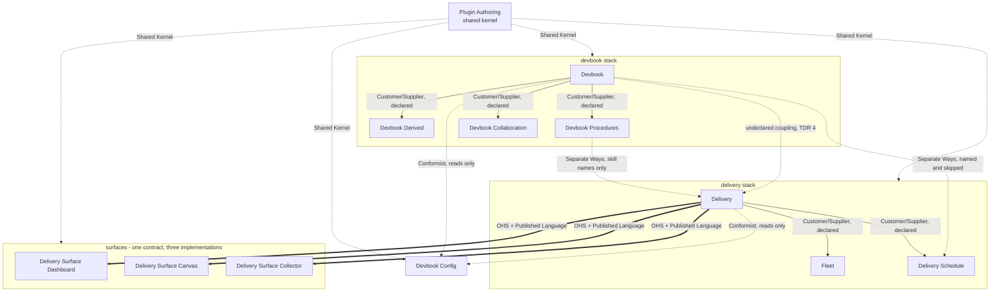

# Context Map

```meta
index: root
type: context-map
related: [".devbook/domain/context-map.md", ".devbook/arc42/05-building-block-view.md#plugin-folder"]
```

**One plugin, one bounded context.** A plugin is the unit a host installs, versions, and can
refuse to load, so it is already the line a model cannot cross without somebody declaring it —
which is what a bounded context has to be before it earns a folder here. Ten folders follow
the ten plugin folders under `plugins/`, name for name, plus
[Plugin Authoring](#plugin-authoring), the only one that is not a plugin: it is the language
the other ten are written in. A plugin is the unit a host installs, versions, and refuses to
load, so it is where a model can change without somebody having to agree — which is the line a
context map draws; one context for all had them sharing one `domain.md` while meaning
different things by *run*, *record*, and *view*. The kernel holds only what is true of every
plugin, so a new plugin costs a domain folder as well as a marketplace entry, and the two land
together.

This repository ships authoring assets rather than a running product, so a *user* here is a
host that loads an asset and a repository that installs one. Both sit outside every boundary,
and every context conforms to them rather than the other way round.

## Subdomain landscape

| Subdomain | Classification | Bounded context |
|---|---|---|
| How an asset is written, packaged, and installed | Supporting | [Plugin Authoring](#plugin-authoring) |
| Durable, addressed documentation | Core | [Devbook](#devbook) |
| Keeping the derived index committed and current | Supporting | [Devbook Derived](#devbook-derived) |
| How a repository's application is started, shown, evidenced, and debugged | Supporting | [Devbook Procedures](#devbook-procedures) |
| Review and approval of a chapter | Supporting | [Devbook Collaboration](#devbook-collaboration) |
| Which stack a repository runs, and what it has | Supporting | [Devbook Config](#devbook-config) |
| Carrying one unit of work to a review-ready change | Core | [Delivery](#delivery) |
| Turning a backlog into parallel work | Supporting | [Fleet](#fleet) |
| Work that runs with nobody watching | Supporting | [Delivery Schedule](#delivery-schedule) |
| Making a run visible or recorded | Generic | [Dashboard](#delivery-surface-dashboard), [Canvas](#delivery-surface-canvas), [Collector](#delivery-surface-collector) |

Two subdomains are core because everything else exists to serve them: the delivery engine
carries work, and devbook is what the work is grounded in and what it writes back to. The three
surfaces are generic on purpose — they answer one published contract and are interchangeable,
which is the whole reason there are three.

## Context map



Arrows point downstream, from the context that owns a model to the context that has to live
with it. A solid arrow is a dependency a host enforces, a thick arrow is a published language
its consumers conform to without either side declaring the other, and a dashed arrow is a
relationship that exists in the assets and in no manifest.

| Upstream | Downstream | Pattern | Declared |
|---|---|---|---|
| Plugin Authoring | every context | Shared Kernel | No — it is the vocabulary, not a plugin |
| Devbook | Devbook Derived | Customer/Supplier | Yes, `devbook >=1.1.0 <2.0.0` |
| Devbook | Devbook Collaboration | Customer/Supplier | Yes, `devbook >=1.0.0 <2.0.0` |
| Devbook | Devbook Procedures | Customer/Supplier | Yes, `devbook >=1.0.0 <2.0.0` |
| Devbook Procedures | Delivery | Separate Ways | No — the engine names the skills `start` and `capture` and their path, never the plugin; absent, a flow does without |
| Delivery | Fleet | Customer/Supplier | Yes, `delivery >=1.0.0 <2.0.0` |
| Delivery | Delivery Schedule | Customer/Supplier | Yes, `delivery >=1.0.0 <2.0.0` |
| Delivery | the three surfaces | OHS + Published Language | No, deliberately — a surface is resolved from the live tool list |
| Devbook | Delivery Schedule | Separate Ways | No — `prose-check` is named as a target and skipped when absent |
| Devbook Derived | Delivery Schedule | Separate Ways | No — `schedule-devbook-check` refreshes where the script exists and skips where it does not |
| Fleet | Delivery Schedule | Separate Ways | No — `fleet-issue-sweep` is named as the `issue-triage` target, at zero workers, and skipped when absent |
| Devbook | Delivery | **Undeclared** | No, and it should be — see [debt record 4](../arc42/tdr/4-delivery-depends-on-devbook.md) |
| every context | Devbook Config | Conformist, read-only | No, deliberately — it names every plugin and depends on none |
| the two hosts | every context | Conformist | Not declarable; the host decides what loads |

The undeclared row is the one to read twice. `delivery`'s five folder flows name devbook's
folders, restate three of its schema rules, and run its generator at the path devbook's install
writes it to, while both manifests say nothing. It is recorded as debt rather than drawn as a
dependency, because declaring it would demote all twenty-four of the engine's skills wherever
devbook is absent.

## Published languages

| Published language | Owned by | Consumed by | Carried as |
|---|---|---|---|
| The `meta` block schema and chapter addressing | Devbook | Every context that writes a chapter | `rules/devbook-chapter-metadata.md`, materialized into a repository |
| The checker's CLI — `--check`, `--print`, `--write`, `--scope` | Devbook | Devbook Derived's refresh paths, CI, and every skill that runs the check | `tools/devbook-meta/build.mjs` |
| The procedure goal — one sentence per `start`, `show`, `capture`, `debug` that holds whatever the body says | Devbook Procedures | Delivery's `app.start` point and Validation, and any session invoking the skill by name | The `goal` field of each seed, rendered into the managed wrapper per host |
| The derived-artifacts envelope — `_meta/graph.json`, `index.json`, `annotations.json` and their `schemaVersion` | Devbook Derived | Devbook Collaboration's queue and the Backlog app off disk | `rules/devbook-derived-artifacts.md`, materialized into a repository |
| The review triad — `review`, `reviewer`, `review-at` | Devbook | Devbook Collaboration, and anyone writing review state by hand | Three optional fields in `rules/devbook-chapter-metadata.md`, validated together and against the chapter's open notes |
| The `ext.<plugin>.<key>` extension namespace | Devbook | No current consumer; reserved for a later L1 extension | Reserved keys devbook carries through untouched and unvalidated |
| `delivery.surface.lifecycle@1`, `.render@1`, `.export@1` | Delivery | The three surfaces | `resources/surface-contract.md`; tool names matched by pattern |
| The extension-point set and the gate contract | Delivery | Fleet, Delivery Schedule, and every provider a repository binds | `resources/surface-contract.md`, `resources/flow-phases.md` |
| `.devbook/config.json` — four engine keys plus one stamp per component | Delivery owns the four keys; each component owns its own stamp | Devbook Config reads all of it; every install skill writes one key | `resources/config.schema.json` |
| The schedule catalog entry | Delivery Schedule | Whatever scheduler the live session exposes | `resources/schedule-catalog-contract.md` |
| The sweep manifest and the worker result files | Fleet | Its own workers, across sessions that cannot see each other | `resources/fleet-issue-sweep-contract.md` |
| The plugin folder shape and the two manifests | Plugin Authoring | Every plugin; checked by `tools/check-assets.mjs` | [domain.md](plugin-authoring/domain.md) and the hosts' own schemas |

## Strategic rules

- **A lower layer never names a higher one.** The `dependencies` array is the whole statement
  of the [layer](plugin-authoring/domain.md#layer) order, and a context that would have to name
  something above it has found a published language it should be conforming to instead.
- **A role, a tracker, and a surface are bound per repository, never declared.** They are how a
  context reaches capability it does not own without acquiring a dependency on it, and a
  missing one costs capability rather than a load.
- **A missing upstream degrades; it never fails a load.** Every dashed and thick edge above has
  a documented absent behaviour, and stating that behaviour is a condition of drawing the edge
  at all.
- **Nobody writes another context's state.** One component's stamp, another context's `ext`
  namespace, and the engine's four config keys each have exactly one writer.
- **Two contexts never share a term with two meanings.** Where a host's word differs from this
  repository's, the host's word is recorded as an alias in the owning context's `domain.md` and
  never adopted — *Routines* and *Automations* both resolve to
  [Schedule](delivery-schedule/domain.md#schedule).

## Plugin Authoring

```meta
type: bounded-context
related: [".devbook/domain/plugin-authoring/domain.md", ".devbook/arc42/05-building-block-view.md#plugin-folder", ".devbook/tech/hosts.md#claude-code-plugin-api"]
```

The shared kernel: the folder shape of a plugin, the two manifests, the marketplace listing,
the layer order, and what a plugin leaves behind in a repository that installs it. It is the
one context that is not a plugin, because it is the language the other ten are written in.
Everything it defines is co-owned — a change to the plugin folder shape is a change to every
context at once, which is what a shared kernel means and why it stays small.

## Devbook

```meta
type: bounded-context
related: [".devbook/domain/devbook/domain.md", ".devbook/arc42/adr/chapter-schema.md", ".devbook/arc42/adr/plugin-boundaries.md"]
```

Addressed Markdown chapters and the schema underneath them: the `meta` block, the status
ladders, the reference graph derived from them, annotation fences, the reconcile that
materializes the convention into a repository, and the converters between a chapter and the
code that implements it. It ships the shape and the check, and never a flow.

## Devbook Derived

```meta
type: bounded-context
related: [".devbook/domain/devbook-derived/domain.md", ".devbook/arc42/adr/checks-and-indexes.md"]
```

The committed index and the canvas that draws it: for a repository that keeps the derived
`_meta/` files in its tree, the `refresh` skill, the refresh script, the nightly refresh, the
drift warning, the rule that places them, the `devbook-graph` canvas, and the install that
puts those in. It computes nothing — every byte under `_meta/` and every node the canvas
draws is devbook's checker's output, reached by `--write` or by loading its modules from
their materialized path.

## Devbook Procedures

```meta
type: bounded-context
related: [".devbook/domain/devbook-procedures/context.md", ".devbook/arc42/adr/plugin-boundaries.md", ".devbook/arc42/adr/install.md"]
```

The four procedures every repository has and no plugin can write — `start`, `show`,
`capture`, `debug` — each with a goal the plugin fixes and a body the repository owns. It
seeds the body once under `.agents/skills/`, keeps the wrapper per host that carries the goal,
and records which of the four a repository adopted. It names no engine: whoever needs a
running application or evidence names the skill and finds it or does without.

## Devbook Collaboration

```meta
type: bounded-context
related: [".devbook/domain/devbook-collaboration/domain.md", ".devbook/arc42/adr/chapter-schema.md", ".devbook/arc42/adr/annotations.md"]
```

Who owes the next move on a chapter: request a review, record findings and a verdict, and run
the approval decision that writes devbook's own `approved` rung. Every fact it remembers is
one of devbook's own review fields, so it owns procedure and no vocabulary — four skills,
nothing installed, nothing stamped.

## Devbook Config

```meta
type: bounded-context
related: [".devbook/domain/devbook-config/domain.md", ".devbook/arc42/05-building-block-view.md#config-plugin", ".devbook/arc42/adr/plugin-boundaries.md"]
```

What this stack is, what this machine has, and how this repository is wired — the only context
allowed to name every plugin, and the only one that answers those three questions together. It
writes the four engine-owned keys of the stack config and never a component's stamp.

## Delivery

```meta
type: bounded-context
related: [".devbook/domain/delivery/domain.md", ".devbook/arc42/adr/flow-engine.md", ".devbook/arc42/05-building-block-view.md#stack-config"]
```

One unit of work, carried from a request to a review-ready change inside one session: the
staged flows, the closed set of extension points a repository binds providers to, the human
gates it may add and never remove, and the pull-request lane at the end. Deploy is outside the
boundary, and so is fan-out.

## Fleet

```meta
type: bounded-context
related: [".devbook/domain/fleet/domain.md", ".devbook/arc42/05-building-block-view.md#fan-out-state", ".devbook/arc42/adr/plugin-boundaries.md"]
```

A backlog turned into parallel work across sessions and worktrees — the one thing a flow may
never do. A sweep triages and dispatches, a worker resolves one item, and a change that cannot
prove itself parks instead of passing a gate nobody is there to answer.

## Delivery Schedule

```meta
type: bounded-context
related: [".devbook/domain/delivery-schedule/domain.md", ".devbook/arc42/05-building-block-view.md#schedule-plugin", ".devbook/arc42/adr/plugin-boundaries.md"]
```

Work that runs with nobody watching: entry points that pick their own input, and the catalog of
triggers that fires them in a cloud session starting with nothing but the repository. A trigger
is what asks; the entry point is what runs.

## Delivery Surface Dashboard

```meta
type: bounded-context
related: [".devbook/domain/delivery-surface-dashboard/domain.md", ".devbook/arc42/05-building-block-view.md#surface-plugins", ".devbook/arc42/adr/surfaces.md"]
```

The live view of a run, and the only implementation that measures rather than accepts what it
is told: stages and their output, QA evidence inline, and tool and token telemetry folded in by
hooks. It answers all three capability groups.

## Delivery Surface Canvas

```meta
type: bounded-context
related: [".devbook/domain/delivery-surface-canvas/domain.md", ".devbook/arc42/adr/surfaces.md", ".devbook/tech/hosts.md#copilot-extension-sdk"]
```

Two viewers and nothing else: Mermaid rendered live and Markdown rendered live, beside the
files they were written from. It answers the render group alone, persists nothing, and is the
one plugin here that ships a single host's manifest.

## Delivery Surface Collector

```meta
type: bounded-context
related: [".devbook/domain/delivery-surface-collector/domain.md", ".devbook/arc42/adr/surfaces.md"]
```

A run recorded rather than watched: stage status, gate decisions, QA evidence paths, and the
handoff marker on disk, plus the Markdown report at the end. No page and no port, which is what
makes it the right surface for a scheduled or unattended run.
