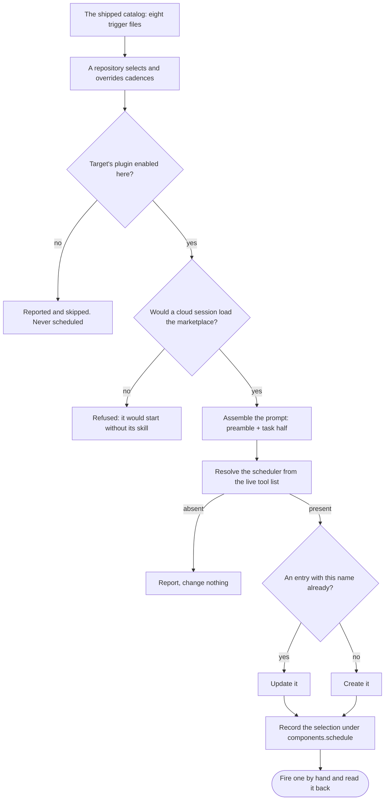
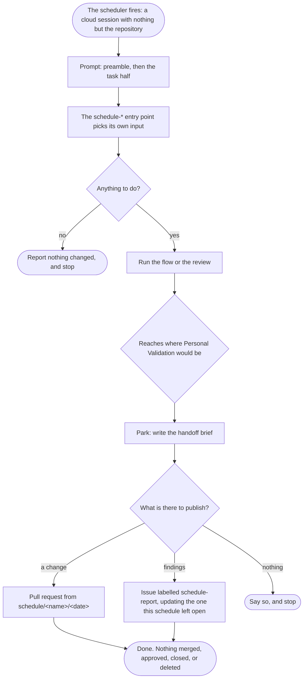

# Delivery Schedule

```meta
type: flow
related: [".devbook/domain/delivery-schedule/domain.md#schedule", ".devbook/domain/delivery-schedule/domain.md#entry-point", ".devbook/domain/delivery/flow.md"]
```

> How a trigger becomes a run, and where that run stops. Structure is in [model.md](model.md).

## From Catalog to Scheduler

Three skills read the catalog, and all three resolve the scheduler rather than naming one. No
scheduler is a normal outcome at every step below.



- **Matching by name is what makes a second sync an update.** The name is
  `<owner>/<repo> · <title>`, which is also why no scheduler id has to be written down — and an
  id would be personal, so it could not be committed anyway.
- **Refusing beats creating something that cannot run.** A cloud session loads this marketplace
  only if the repository's committed host settings enable it and the plugins the target needs.
- **The first run is the proof, not the creation.** A cadence that has never fired is a guess
  about somebody else's environment.

## An Unattended Run

The same spine [Delivery](../delivery/flow.md) draws, cut short at exactly one place. Everything
below the gate is what changes when nobody is in the session.



- **The gate is never passed and never waited at.** It is parked at, with a brief — which is the
  whole reason a schedule may not target a flow, and why the catalog checker enforces it.
- **A run that publishes nothing has, from outside, not happened.** That is acceptable and
  common: most weeks the security review finds nothing new. What is not acceptable is a run that
  changed something and published nothing.
- **The next run updates what this one left open.** A weekly report opening a new issue every
  week becomes its own backlog within two months.
- **Nothing personal crosses into the repository.** The environment, the model, and the
  scheduler ids stay in the scheduler; the stamp records only the selection and the overrides.
