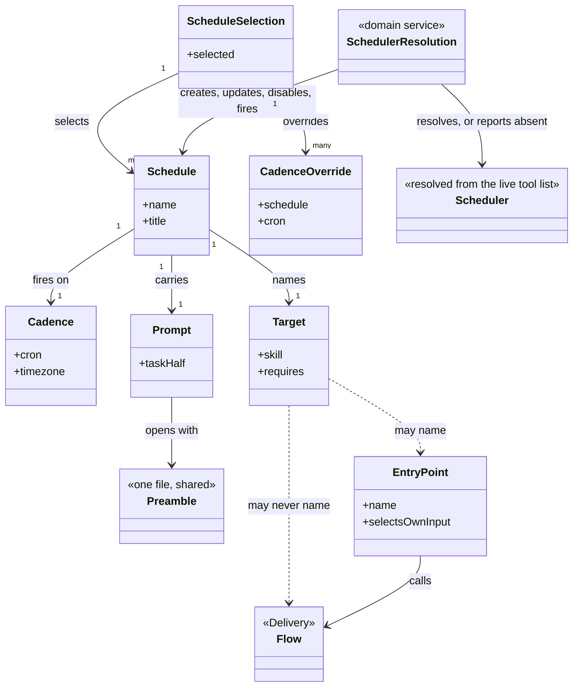

# Delivery Schedule

```meta
type: model
related: [".devbook/domain/delivery-schedule/domain.md", ".devbook/arc42/05-building-block-view.md#schedule-plugin"]
```

> Structural view: the two halves of this context — the triggers and the things they fire — and
> the line between what a repository commits and what stays in the scheduler.
> [flow.md](flow.md) has the run.

## Model diagram



## Relationship notes

- **`Target ..> Flow` is the one forbidden association, and it is drawn on purpose.** A flow ends
  at a gate and an unattended run parks where a gate would be, so scheduling a flow schedules a
  park. The catalog checker is what turns that sentence into a failing build.
- **`EntryPoint → Flow` is allowed and is the whole design.** The entry point is the adapter: it
  picks the input a flow would otherwise need a person for, then calls the flow.
- **`Preamble` is one file associated by every prompt.** Restating the unattended rules per
  schedule would put six copies of the most safety-critical prose in the plugin, drifting
  independently.
- **`ScheduleSelection` sits in the consuming repository, `Scheduler` sits in the host, and
  nothing joins them but a name.** Matching by `<owner>/<repo> · <title>` is what removes the
  need to write a scheduler id anywhere — an id would be personal, and personal facts do not go
  in a committed file.
- **`Scheduler` is dashed and terminal.** It is resolved at run time and no scheduler is a normal
  outcome, which is the same shape a [surface](../delivery-surface-dashboard/model.md) has and
  for the same reason.
- **The two halves share only `Target`.** The catalog is host-neutral data and the entry points
  are procedures; the plugin holds both because they are one subject — work that runs with nobody
  watching — not because either needs the other's internals.
