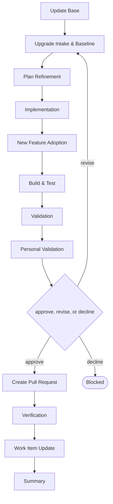

# Delivery

```meta
type: flow
related: [".devbook/domain/delivery/skills.md#flow-aspire-update", ".devbook/domain/delivery/flow.md"]
```

> `flow-aspire-update` — a plan-first upgrade, where the plan is refined before anything changes.
> What the skill does is in [skills.md](skills.md#flow-aspire-update); the shared spine every flow
> runs is in [flow.md](flow.md).

## flow-aspire-update



It closes through the code-modifying tier. Every tier opens with Update Base, prepended by the
runner and named by no skill.

- **Baseline first.** The intake stage records what works before the upgrade, because after it there
  is no way to tell a pre-existing failure from one the upgrade caused.
- Plan Refinement is a separate stage from Implementation so the staging of a multi-step upgrade is
  agreed while backing out is still cheap.
- New Feature Adoption is its own stage so an upgrade does not quietly become a feature change. What
  the new version makes possible is a decision, taken visibly, after the version moved.

The roles and MCP servers each stage resolves are in the engine's own `FLOW-DIAGRAMS.md`, which
is where a binding table belongs — this chapter is the model, not the wiring.
