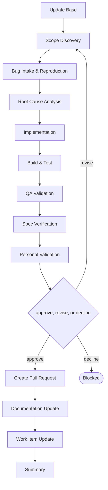

# Delivery

```meta
type: flow
related: [".devbook/domain/delivery/skills.md#flow-bug", ".devbook/domain/delivery/flow.md"]
```

> `flow-bug` — reproduce, then find the cause, then fix — in that order and not another. What the
> skill does is in [skills.md](skills.md#flow-bug); the shared spine every flow runs is in
> [flow.md](flow.md).

## flow-bug



It closes through the code-modifying tier. Every tier opens with Update Base, prepended by the
runner and named by no skill.

- **Reproduction is a stage, not a precondition.** A report that arrives as “this is broken” is
  worked the same way as a triaged issue; what is missing gets derived here rather than sending
  the request away.
- Root Cause Analysis sits between reproduction and the fix so the change is aimed at a cause. A
  fix written before this stage is a guess with a test attached.
- The fix is test-first: the failing test is the reproduction, promoted. QA Validation is targeted
  rather than full capture, because the flow is changing behaviour that already exists.

The roles and MCP servers each stage resolves are in the engine's own `FLOW-DIAGRAMS.md`, which
is where a binding table belongs — this chapter is the model, not the wiring.
