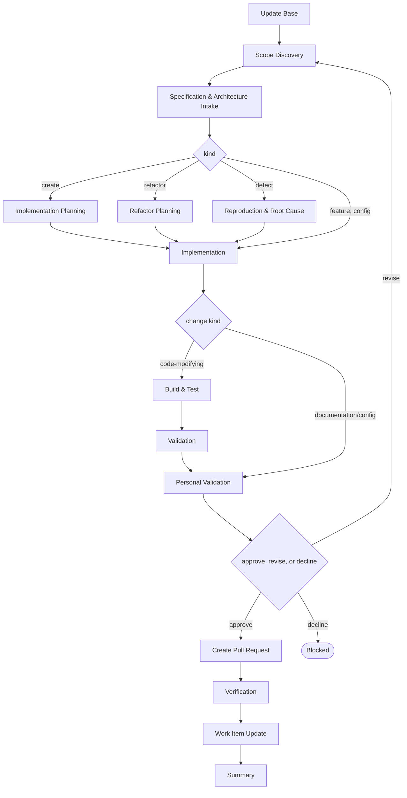

# Delivery

```meta
type: flow
related: [".devbook/domain/delivery/skills.md#flow-code", ".devbook/domain/delivery/flow.md", ".devbook/domain/delivery/domain.md#change-kind", ".devbook/arc42/adr/flow-engine.md"]
```

> `flow-code` — the lane for every change to the code: a feature, a defect, a refactor, a new
> module, service, or first increment, and the tooling and housekeeping around them. What the
> skill does is in [skills.md](skills.md#flow-code); the shared spine every flow runs is in
> [flow.md](flow.md).

## flow-code



It closes through the tier the change kind selects, code-modifying for everything that runs.
Every tier opens with Update Base, prepended by the runner and named by no skill.

- **The kind is settled inside the flow, not before it.** Scope Discovery derives whether the
  request is a feature, a create, a refactor, a defect, or a config change, and one middle stage
  follows from it: planning for a create or a refactor, reproduction and root cause for a defect,
  nothing for the rest. A request that is "really" a service or "really" a module is a different
  kind, not a different flow.
- **A thin request is the normal case.** Scope Discovery derives what is missing rather than
  refusing the run for lacking it — the flow that only works on a well-specified request is the
  flow nobody reaches.
- **Behaviour is held still on purpose in a refactor.** Refactor Planning lists every move and the
  reference each one forces before a file is touched, so the diff stays reviewable as a move.
- **A defect's fix has a test in front of it.** The failing test that reproduces it comes first,
  then the minimal fix, then the regression tests that keep it fixed.
- `Implementation` and `Build & Test` are the `implement` and `validate` services, and their loop
  is the only cycle here. It is bounded by the retry budget rather than by the provider.
- Validation depth follows the change kind: full with captured evidence for new functionality,
  targeted for a fix or a refactor, skipped with the reason where there is nothing to run.
- `Verification` is the `verify` service, after the pull request: the change set against the
  specification Stage 1 took in and the chapters it touches, one verdict per item, reported
  where the reviewer reads and never repaired.

The roles and MCP servers each stage resolves are in the engine's own `FLOW-DIAGRAMS.md`, which
is where a binding table belongs — this chapter is the model, not the wiring.
