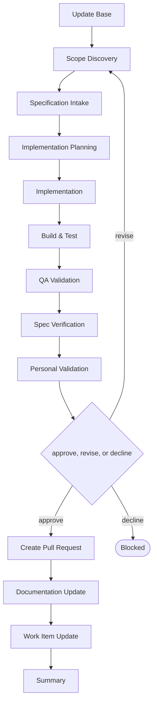

# Delivery

```meta
type: flow
related: [".devbook/domain/delivery/skills.md#flow-create-module", ".devbook/domain/delivery/flow.md"]
```

> `flow-create-module` — a new module in an existing project, or an existing area carved into one.
> What the skill does is in [skills.md](skills.md#flow-create-module); the shared spine every flow
> runs is in [flow.md](flow.md).

## flow-create-module



It closes through the code-modifying tier. Every tier opens with Update Base, prepended by the
runner and named by no skill.

- **Carving an existing area out is the same flow as creating a new one.** Both end with a module
  that has a boundary somebody agreed, and the interesting work in each is deciding where the line
  runs.
- Implementation Planning is its own stage so the boundary is settled before code moves. A module
  whose boundary is decided while implementing it is a folder.
- Missing specification or boundary context is derived in Scope Discovery rather than being a
  reason to refuse the run.

The roles and MCP servers each stage resolves are in the engine's own `FLOW-DIAGRAMS.md`, which
is where a binding table belongs — this chapter is the model, not the wiring.
