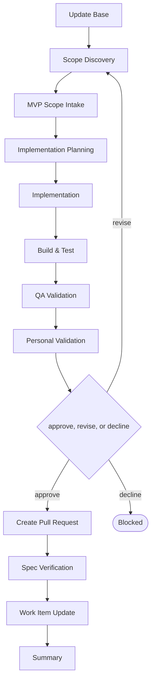

# Delivery

```meta
type: flow
related: [".devbook/domain/delivery/skills.md#flow-create-mvp", ".devbook/domain/delivery/flow.md"]
```

> `flow-create-mvp` — the first runnable increment of a product, at whatever size that is. What
> the skill does is in [skills.md](skills.md#flow-create-mvp); the shared spine every flow runs is
> in [flow.md](flow.md).

## flow-create-mvp



It closes through the code-modifying tier. Every tier opens with Update Base, prepended by the
runner and named by no skill.

- **Scope is what the gate is really about here.** For every other code flow the gate reviews a
  change; for this one it reviews a decision about what not to build yet.
- MVP Scope Intake and Implementation Planning are two stages because prioritising features and
  sequencing the build are different arguments, and collapsing them buries the first.
- “Minimum” is not a size claim. The flow runs the same way for a weekend prototype and for a
  first release, because what makes it an MVP is that it runs, not that it is small.

The roles and MCP servers each stage resolves are in the engine's own `FLOW-DIAGRAMS.md`, which
is where a binding table belongs — this chapter is the model, not the wiring.
