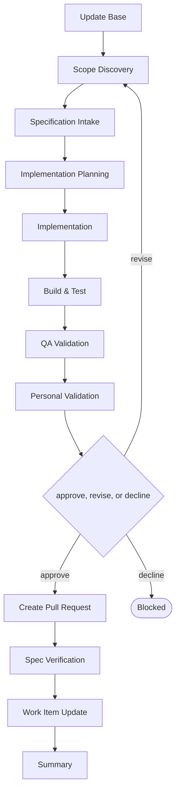

# Delivery

```meta
type: flow
related: [".devbook/domain/delivery/skills.md#flow-create-service", ".devbook/domain/delivery/flow.md"]
```

> `flow-create-service` — a new service in an existing project, or an existing area extracted into
> one. What the skill does is in [skills.md](skills.md#flow-create-service); the shared spine
> every flow runs is in [flow.md](flow.md).

## flow-create-service



It closes through the code-modifying tier. Every tier opens with Update Base, prepended by the
runner and named by no skill.

- Same shape as [flow-create-module](flow.flow-create-module.md), different unit. What differs is
  what Implementation Planning has to settle: a service adds a process boundary, so wiring,
  configuration, and how it is started are part of the plan rather than of the implementation.
- Extracting an existing area into its own service runs here too, for the same reason a carve runs
  through the module flow.
- The service has to start before Personal Validation, which is why QA Validation is not optional
  for this one even when the change looks like configuration.

The roles and MCP servers each stage resolves are in the engine's own `FLOW-DIAGRAMS.md`, which
is where a binding table belongs — this chapter is the model, not the wiring.
