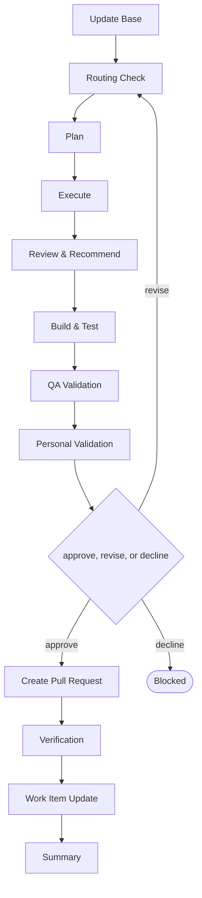

# Delivery

```meta
type: flow
related: [".devbook/domain/delivery/skills.md#flow-fallback", ".devbook/domain/delivery/flow.md"]
```

> `flow-fallback` — the lane for a category no other flow covers — and the one that will send you
> away. What the skill does is in [skills.md](skills.md#flow-fallback); the shared spine every
> flow runs is in [flow.md](flow.md).

## flow-fallback



It closes through whichever tier Routing Check resolves. Every tier opens with Update Base,
prepended by the runner and named by no skill.

- **Routing Check can end the run.** Where a dedicated flow covers the category, this one stops and
  names it rather than doing the work badly. It is a last resort, never an escape hatch from a
  matching flow whose preconditions are inconvenient.
- **It has no fixed tier.** Routing Check resolves the change kind, and the run closes through the
  code-modifying tier or the documentation tier accordingly — reporting which it picked, since a
  reader cannot infer it from the flow's name.
- Review & Recommend is a stage rather than a phase because an uncategorised change is exactly the
  one where what to do next is worth writing down.

The roles and MCP servers each stage resolves are in the engine's own `FLOW-DIAGRAMS.md`, which
is where a binding table belongs — this chapter is the model, not the wiring.
