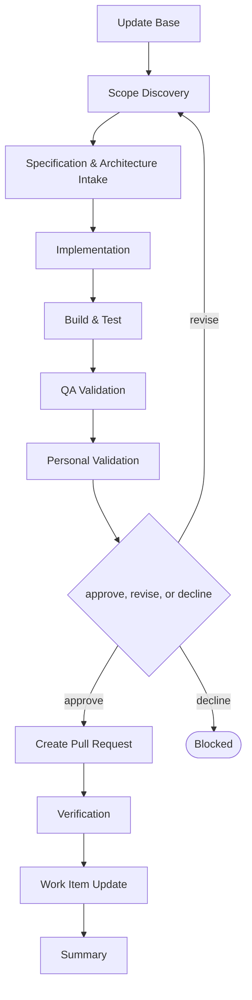

# Delivery

```meta
type: flow
related: [".devbook/domain/delivery/skills.md#flow-feature", ".devbook/domain/delivery/flow.md"]
```

> `flow-feature` — the default lane, and the one every other code flow is a variation of. What the
> skill does is in [skills.md](skills.md#flow-feature); the shared spine every flow runs is in
> [flow.md](flow.md).

## flow-feature



It closes through the code-modifying tier. Every tier opens with Update Base, prepended by the
runner and named by no skill.

- **A thin request is the normal case.** Scope Discovery derives what is missing rather than
  refusing the run for lacking it — the flow that only works on a well-specified request is the
  flow nobody reaches.
- `Implementation` and `Build & Test` are the `implement` and `validate` services, and their loop is
  the only cycle here. It is bounded by the retry budget rather than by the provider.
- QA Validation runs at full depth with captured evidence, because new functionality is the change
  kind that earns it.
- `Verification` is the `verify` service, after the pull request: the change set against
  the specification Stage 1 took in and the chapters it touches, one verdict per item, reported
  where the reviewer reads and never repaired.

The roles and MCP servers each stage resolves are in the engine's own `FLOW-DIAGRAMS.md`, which
is where a binding table belongs — this chapter is the model, not the wiring.
