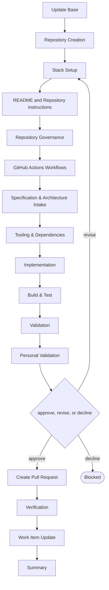

# Delivery

```meta
type: flow
related: [".devbook/domain/delivery/skills.md#flow-project", ".devbook/domain/delivery/flow.md"]
```

> `flow-project` — from nothing to a project that builds: the repository, its governance, and the
> scaffold. What the skill does is in [skills.md](skills.md#flow-project); the shared spine every
> flow runs is in [flow.md](flow.md).

## flow-project



It closes through the code-modifying tier. Every tier opens with Update Base, prepended by the
runner and named by no skill.

- **It starts before the repository exists and enters wherever the repository has got to.** Creating
  the repository stays manual; every later stage opens by checking what is there, so a governed
  repository with no project runs the scaffold and a bare one runs everything.
- **It writes no stack config of its own.** Stack Setup runs `devbook-config:setup`, which owns the
  engine keys, the MCP files, and each component's install; the flow fills the `start` skill's facts
  afterwards, because those are the project's, not the config's.
- It is code-tier because what it scaffolds has to build. A scaffold that was never compiled is a
  guess about somebody else's toolchain.
- Governance and CI land before the scaffold, so the first build runs under the protection and the
  workflow that will run every later one.

The roles and MCP servers each stage resolves are in the engine's own `FLOW-DIAGRAMS.md`, which
is where a binding table belongs — this chapter is the model, not the wiring.
