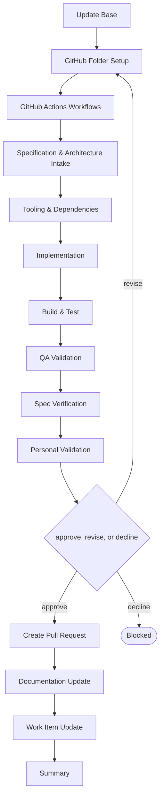

# Delivery

```meta
type: flow
related: [".devbook/domain/delivery/skills.md#flow-project", ".devbook/domain/delivery/flow.md"]
```

> `flow-project` — scaffolding a development project into a repository that already exists. What
> the skill does is in [skills.md](skills.md#flow-project); the shared spine every flow runs is in
> [flow.md](flow.md).

## flow-project



It closes through the code-modifying tier. Every tier opens with Update Base, prepended by the
runner and named by no skill.

- **It assumes the repository exists and is configured** — [flow-repo](flow.flow-repo.md) is what
  makes that true, and running this one first produces a project in a repository nobody governs.
- It is code-tier because what it scaffolds has to build. A scaffold that was never compiled is a
  guess about somebody else's toolchain.
- The two opening stages write the repository's own configuration before anything depends on it, so
  the first build runs under the CI that will run every later one.

The roles and MCP servers each stage resolves are in the engine's own `FLOW-DIAGRAMS.md`, which
is where a binding table belongs — this chapter is the model, not the wiring.
