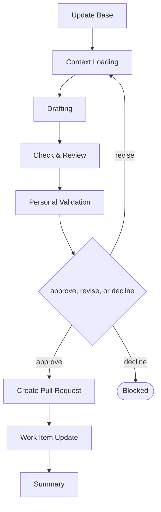

# Delivery

```meta
type: flow
related: [".devbook/domain/delivery/skills.md#flow-spec", ".devbook/domain/delivery/flow.md", ".devbook/arc42/adr/flow-engine.md"]
```

> `flow-spec` — one flow for the five devbook folders: an architecture chapter, a decision or debt
> record, a bounded context, the technology graph, the design guidelines, and the adoption record
> alike. What the skill does is in [skills.md](skills.md#flow-spec); the shared spine every flow
> runs is in [flow.md](flow.md).

## flow-spec



It closes through the documentation tier. Every tier opens with Update Base, prepended by the
runner and named by no skill.

- **The folder and the kind are settled inside the flow, not before it.** Context Loading derives
  which folder the change lands in and, for `arc42/`, whether it is a chapter, a decision, a debt
  record, or a proposal — which is a decision record in `proposed` status. There is no separate
  flow per folder to route to, and no ADR or TDR flow either.
- **The folder picks the role, and the role picks the model.** `architecture` drafts `arc42/` and
  `tech/`, `domain` drafts `domain/`, `ux` drafts `design/`, `docs` drafts `ai/`. A repository
  binds a different agent per folder through its roles, and a person picks a different model per
  folder through the category each role resolves to.
- **It carries none of the folder's rules.** What a chapter must look like is the repository's own
  instruction file for that folder; the flow loads it task-scoped, runs the check the repository's
  `AGENTS.md` names, and never regenerates the derived indexes.
- It is the escalation target for a new decision, a cross-cutting redesign, a boundary question, and
  accepted debt. A stage that discovers it needs a decision escalates here rather than taking one
  inline.
- It stops at Context Loading when the repository has not adopted the folder. Adopting one is the
  convention's own install and never a flow's job.

The roles and MCP servers each stage resolves are in the engine's own `FLOW-DIAGRAMS.md`, which
is where a binding table belongs — this chapter is the model, not the wiring.
