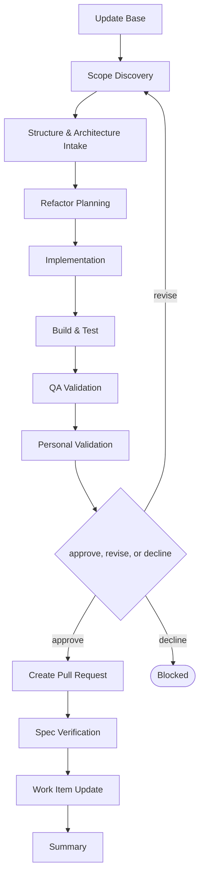

# Delivery

```meta
type: flow
related: [".devbook/domain/delivery/skills.md#flow-structure", ".devbook/domain/delivery/flow.md"]
```

> `flow-structure` — moving what already works, without changing what it does. What the skill does
> is in [skills.md](skills.md#flow-structure); the shared spine every flow runs is in
> [flow.md](flow.md).

## flow-structure



It closes through the code-modifying tier. Every tier opens with Update Base, prepended by the
runner and named by no skill.

- **Spec Verification matters more here than anywhere.** A move invalidates every path a chapter
  wrote down, so the verdict that names which chapters now point at nothing is part of the flow
  rather than something a reader discovers later.
- Refactor Planning is separate from Implementation because the value is in agreeing the target
  layout before anything moves — a half-finished move is worse than either layout.
- Behaviour is held still on purpose. Anything that changes what the code does belongs in
  [flow-feature](flow.flow-feature.md) or [flow-bug](flow.flow-bug.md), so the diff stays
  reviewable as a move.

The roles and MCP servers each stage resolves are in the engine's own `FLOW-DIAGRAMS.md`, which
is where a binding table belongs — this chapter is the model, not the wiring.
