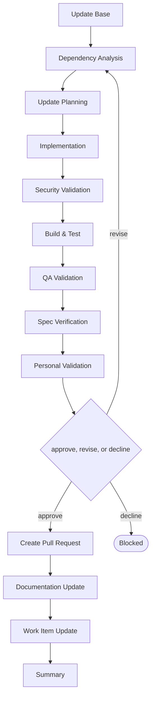

# Delivery

```meta
type: flow
related: [".devbook/domain/delivery/skills.md#flow-update-packages", ".devbook/domain/delivery/flow.md"]
```

> `flow-update-packages` — dependencies moved forward, with the security question asked before the
> build. What the skill does is in [skills.md](skills.md#flow-update-packages); the shared spine
> every flow runs is in [flow.md](flow.md).

## flow-update-packages



It closes through the code-modifying tier. Every tier opens with Update Base, prepended by the
runner and named by no skill.

- **Security Validation sits between the change and the build.** A dependency update that compiles
  is not the same as one that is safe, and asking after Build & Test would mean asking about a
  change already treated as good.
- QA depth is startup-only by change kind: the application has to come up, and nothing more is
  claimed. That depth is recorded rather than presented as full validation.
- It lands as a pull request. Nothing here merges its own dependency bump.

The roles and MCP servers each stage resolves are in the engine's own `FLOW-DIAGRAMS.md`, which
is where a binding table belongs — this chapter is the model, not the wiring.
