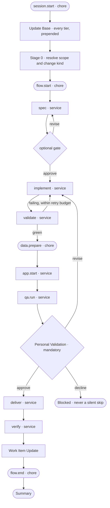
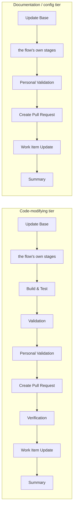
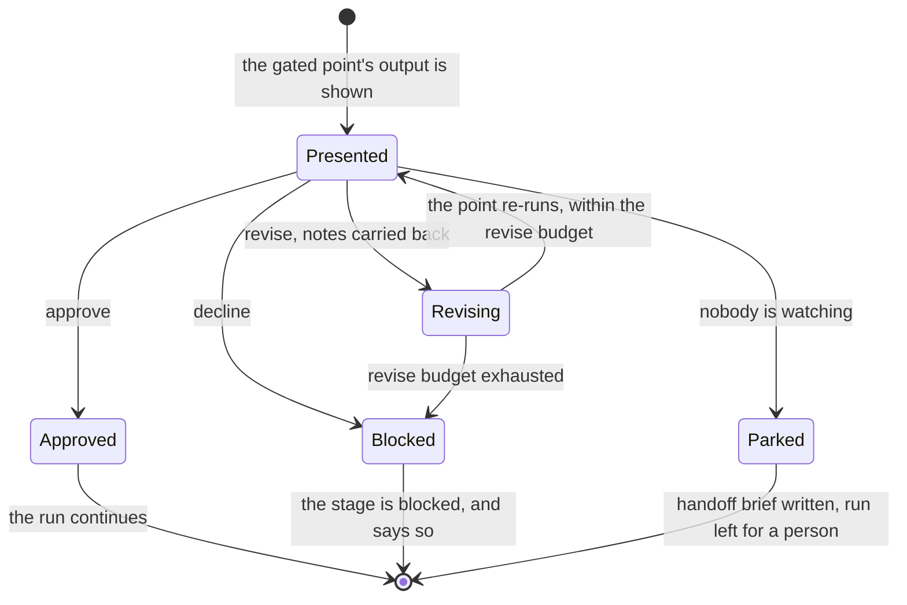

# Delivery

```meta
type: flow
related: [".devbook/domain/delivery/domain.md#run", ".devbook/domain/delivery/domain.md#gate", ".devbook/arc42/adr/flow-engine.md"]
```

> How a run moves: the spine of services with chores hanging off it, the two tiers a flow closes
> through, and the three answers a gate can give. Structure is in [model.md](model.md).

## A Run, End to End

Services are on the spine and chores hang off it. A chore may stop the run when it declares
itself required; it may never move the spine.



- **The gate is the only place a run stops for a person, and configuration may only add more.**
  It sits before `deliver` and never inside it, so approval is a recorded decision rather than a
  step a provider performs on its own behalf. What the person is *shown* there — the running
  app, the links, the what-to-check list — is a phase skill and repeats on every revise round;
  the decision itself is not, and cannot be configured away.
- **`implement` and `validate` are the only cycle**, bounded by the retry budget rather than by
  the providers — which is why the two commonly bind to one provider and still resolve their
  model per stage.
- **`verify` reports and never repairs.** Validation says the change runs; verification says it
  is what was agreed and that what is written down is still true — one verdict per item of the
  specification the run built on and the chapters the change set touches. It runs after
  `deliver`, where a documentation refresh used to guess at staleness, and it commits nothing:
  the table reaches the reviewer and the work item, and a row becomes work outside this run.
- **A point with no provider costs capability, not the run.** Unbound, `spec` is written inline
  and `deliver` produces file artifacts only; the run continues and says so once.
- **Update Base is prepended by the runner and named by no skill.** The closing tier differs per
  flow, so a skill names its own; the opening phase is identical everywhere, so nothing names
  it.
- **Session Handoff can interrupt any box on this diagram.** The run resumes on the same stage
  in a fresh session, which is why the stage and not the diagram is the unit of resumption.

## The Two Tiers

Same spine, different close. The tier is a property of the change kind, and `flow-code` resolves
it at run time and reports which it picked.



- **The documentation tier drops three phases because there is nothing runnable to validate
  and nothing to verify a chapter against** — the chapter is the specification — not because
  the change matters less. A chapter change still passes Personal Validation and still opens
  for review.
- **QA depth inside Validation is driven by change kind**: new functionality gets a browser
  pass with captured evidence, an existing-flow change gets targeted verification, a dependency
  update gets startup only, and where there is no runnable application the depth is recorded as
  skipped rather than claimed.
- **A flow shipped by a higher layer declares its own tier.** The engine never enumerates a skill
  in a layer above it, so a tier is not something it can assign from here.

## A Gate, Answered

Three outcomes, and the difference between them is what happens to the run rather than what the
person felt about the work.



- **Decline is never a silent skip.** The stage is recorded as blocked, which is a different
  claim from a stage nobody ran.
- **Revise carries the notes.** Re-running the point without them would be asking the same
  question and hoping for a different answer.
- **Parked is not declined and not approved.** An unattended run reaching a blocking gate stops
  with a brief naming what a person has to look at; it never waits and never self-approves, and
  that boundary is where [Fleet](../fleet/flow.md) and
  [Delivery Schedule](../delivery-schedule/flow.md) take over.
