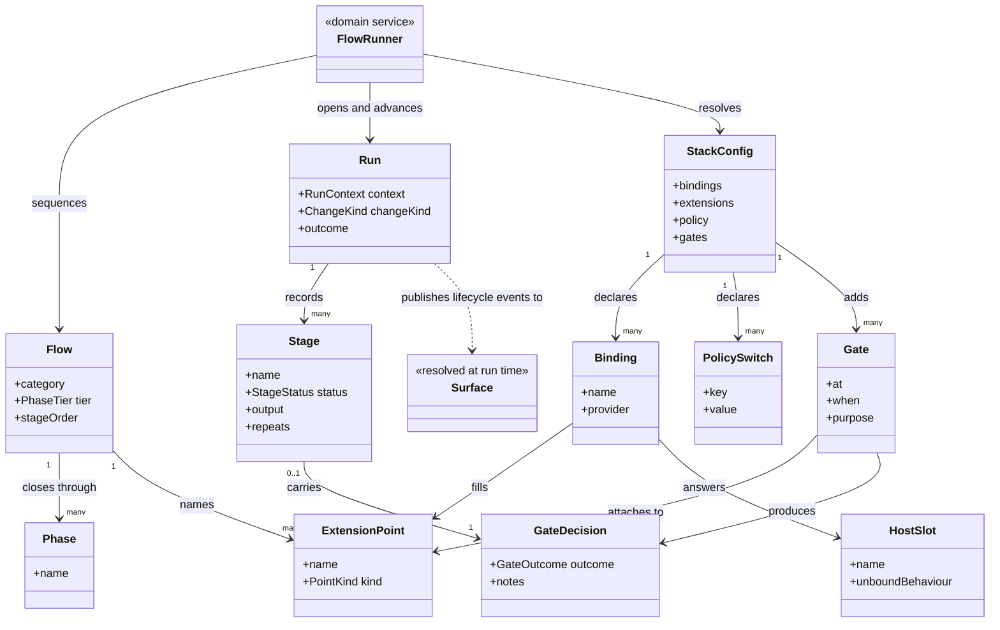

# Delivery

```meta
type: model
related: [".devbook/domain/delivery/domain.md", ".devbook/domain/context-map.md#delivery"]
```

> Structural view: what a run is made of, what a repository declares about it, and where the
> line runs between what the engine owns and what a repository binds.
> [flow.md](flow.md) has the run itself.

## Model diagram



## Relationship notes

- **A flow names a point; a binding fills it.** That indirection is the entire reason this
  context declares no specialist dependency: `Flow` and `Binding` never meet except through
  `ExtensionPoint`, so a missing provider is a resolution that returned nothing rather than a
  plugin that failed to load.
- **The `Flow → ExtensionPoint` association is to a closed set the engine declares.** A
  repository adds `Binding` rows and never `ExtensionPoint` rows, which is why configuration
  cannot become a second flow language.
- **`Gate` hangs off a point, not off a stage.** It is what lets configuration add one anywhere
  without knowing a flow's stage names, and what makes Personal Validation an instance of the
  pattern rather than an exception to it.
- **`GateDecision` is a value held in two places on purpose.** The stage carries it so the run
  reads correctly, and the gate produced it; recording it twice is harmless and re-deriving it
  from a conversation is impossible.
- **`Surface` is a dashed dependency and appears nowhere else.** The run publishes to whatever
  answers the lifecycle group and knows nothing about which implementation did — see
  [the decision](../../arc42/adr/surfaces.md).
- **`StackConfig` here is four keys, not the file.** Every `components.<name>` stamp in the same
  file belongs to that component's install skill, which is why the class carries the four names
  and not a generic key bag.
- **Nothing associates with a host.** `HostSlot` is a name with a documented unbound
  behaviour, bound from configuration or answered by the live session — the only shape in this
  model that can absorb two hosts without branching on either.
