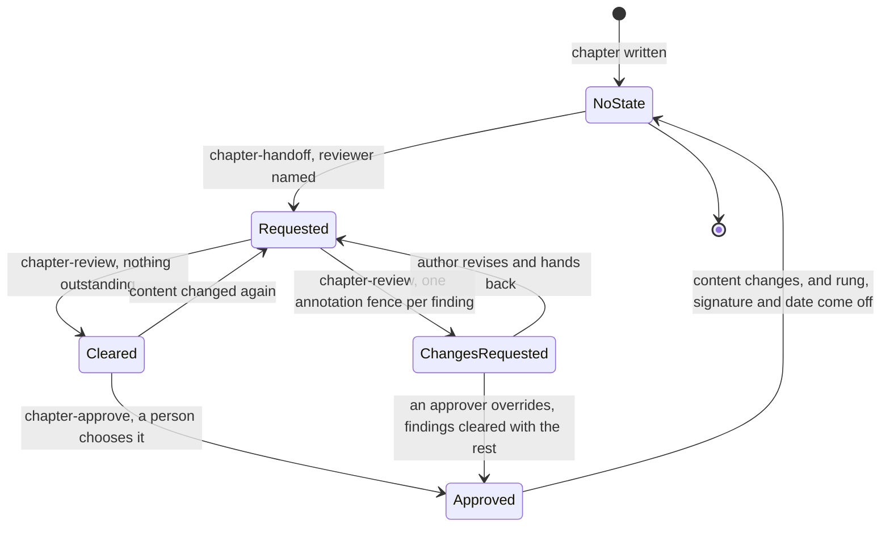
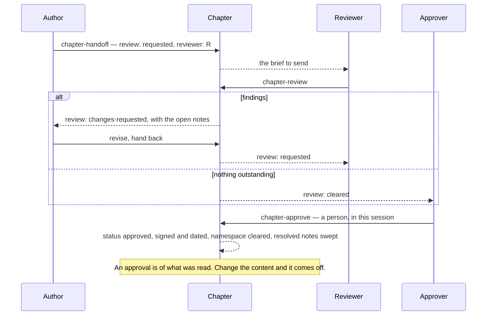

# Devbook Collaboration

```meta
type: flow
related: [".devbook/domain/devbook-collaboration/domain.md#chapter-review", ".devbook/domain/devbook-collaboration/domain.md#approval"]
```

> How a chapter moves through a review, and how it leaves. Structure is in
> [model.md](model.md); what each part is responsible for is in [domain.md](domain.md).

## The Review Pass

Four skills and three states, and every state names who owes the next move. The resting shape
is no keys and no open notes — this context's state exists in order to be cleared.



- **`cleared` is not approval.** It says nothing is outstanding, obliges nobody, and grants
  nothing. Collapsing the two would make a reviewer's sign-off into an approval decision they
  never made.
- **There is no `in-progress`.** A review nobody has recorded a verdict on is still
  `requested`; a fourth value would let a chapter sit in a state that obliges no one.
- **Approval clears everything in one change.** The rung, `approved-by`, and `approved-at` go
  in; every `ext.devbook-collaboration.` key comes out, and the chapter's resolved notes are
  swept with them. A chapter that carries both is a half-finished write, not a state.
- **An open question is the one thing that blocks the decision.** Devbook's check reports an
  approval standing over one as an error, so `chapter-approve` refuses rather than warns. Every
  other kind of note is weighed, not enforced.
- **The exit is content change, not time.** An approval lapses because the chapter moved under
  it, which is why [Review Queue](domain.md#review-queue) reports staleness rather than the
  chapter claiming to be current.

## Who Owes the Next Move

The same pass read as a hand-off, which is the question the state is actually there to answer.



- **Nothing here is inferred from a conversation.** A later session cannot read this one, so
  every hand-off is a written state and the approval is taken in the session that writes it.
- **The queue sweep runs beside this diagram, never inside it.** It reads every chapter and
  changes none, which is what makes it the one operation here safe to schedule.
