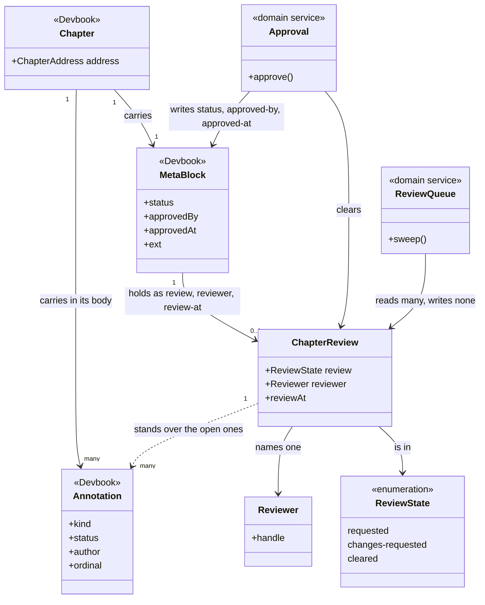

# Devbook Collaboration

```meta
type: model
related: [".devbook/domain/devbook-collaboration/domain.md", ".devbook/domain/devbook/model.md"]
```

> Structural view: where this context's state physically lives, and where the line runs between
> it and the chapter it is written inside. [flow.md](flow.md) has the pass itself.

## Model diagram



## Relationship notes

- **The aggregate has no storage of its own.** `ChapterReview` is a projection of three fields
  in a block another context owns, and the fields are that context's too: devbook defines
  `review`, `reviewer`, and `review-at` beside its approval triad and validates them, so this
  context contributes the procedure and none of the vocabulary
  ([the annotations record](../../arc42/adr/annotations.md)).
- **The line between the two is who writes, not who defines.** Every field is devbook's;
  this context writes the review triad through the pass and `status`, `approved-by`, and
  `approved-at` only through [Approval](domain.md#approval).
- **`Approval` writes across the line and is therefore a service.** It is the one operation
  whose result is not a state of the aggregate — it deletes the aggregate and sets a field
  belonging to someone else, which is coordination rather than a transition.
- **A [Finding](domain.md#finding) is an `Annotation`, and the association is a dependency
  rather than a composition.** The fence hangs off the chapter, not off the review: it outlives
  the pass that raised it, a person can write one with no review running, and this context
  neither owns its shape nor sweeps it. What the review contributes is the reading — an open
  `kind: question` is the one that blocks the approval decision.
- **The seam that used to be open is closed.** Findings were flat `ext` keys until
  2026-09-09; see [the decision](../../arc42/adr/annotations.md)
  and [the annotations record](../../arc42/adr/annotations.md) for why the
  sweep stayed with devbook.
