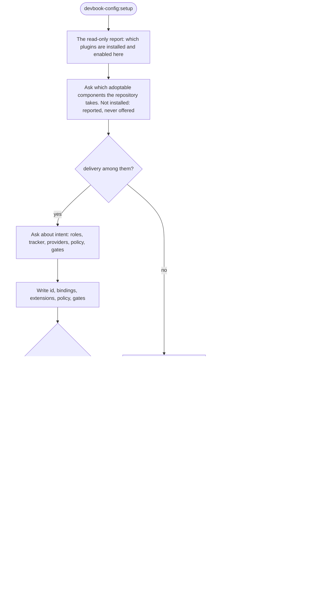
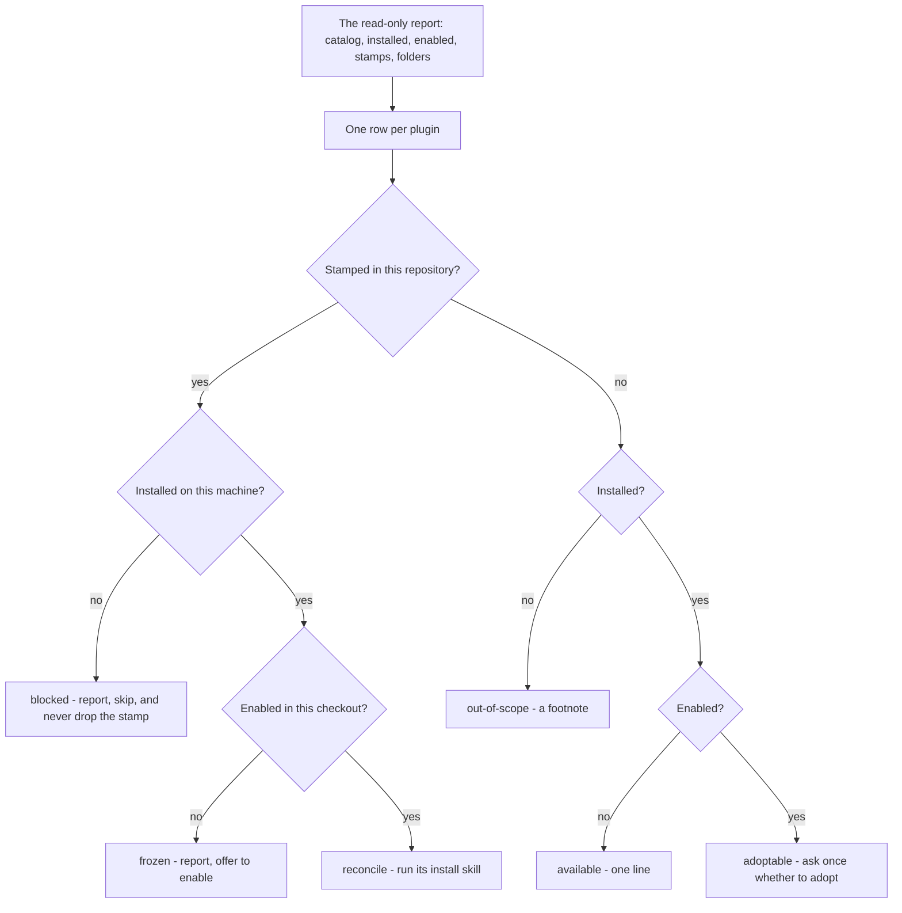

# Devbook Config

```meta
type: flow
related: [".devbook/domain/devbook-config/domain.md#update", ".devbook/domain/devbook-config/domain.md#scope-verdict"]
```

> Two flows: a repository being set up once, and the whole stack being moved forward afterwards.
> Structure is in [model.md](model.md).

## Setup, Then Every Component

Setup asks which installed components the repository adopts, writes `id` and — only when the
engine is among them — the four engine keys, and then gets out of the way. Everything that
materializes anything is invoked, never reimplemented.



- **Setup is a conversation and update is not.** They answer *what should this repository use?*
  and *is what it uses current?*; merging them would put an interview in front of an operation
  people run to change nothing.
- **Nothing is set up that this machine has not installed.** Installing a plugin is the user's
  act; a stamp written for one the machine lacks is `blocked` on the very next update.
- **The engine keys exist only for the engine.** They are `delivery.*` settings, so a repository
  adopting devbook without `delivery` is asked nothing about roles, points, policy, or gates.
- **The fan-out is a delegation, always.** A component's install skill is the only thing that
  knows what that component materialized, which is why nothing here writes a stamp.
- **An unknown key is rejected rather than ignored.** That single property is most of what the
  schema is for.

## Update, By Scope

Three orthogonal inputs, six verdicts, and one of them exists purely to stop a well-meant cleanup.



- **`blocked` never drops the stamp.** A stamp is committed and shared; installed-ness is personal
  and per-machine. Dropping the entry because this machine lacks the plugin would un-adopt the
  component for everyone on the next commit.
- **The three inputs stay orthogonal on purpose.** Collapsing them into one "is it set up" flag is
  exactly what produces the wrong answer for a colleague who has not installed what you have.
- **Version comparison decides nothing here.** What runs is decided by scope, and what a migration
  does is decided by the ledger — neither by comparing numbers.
- **The clone is compared against the source.** A host's marketplace clone older than the catalog
  in the working tree is the usual reason "already latest" is wrong, so both are printed with the
  commit behind each.
