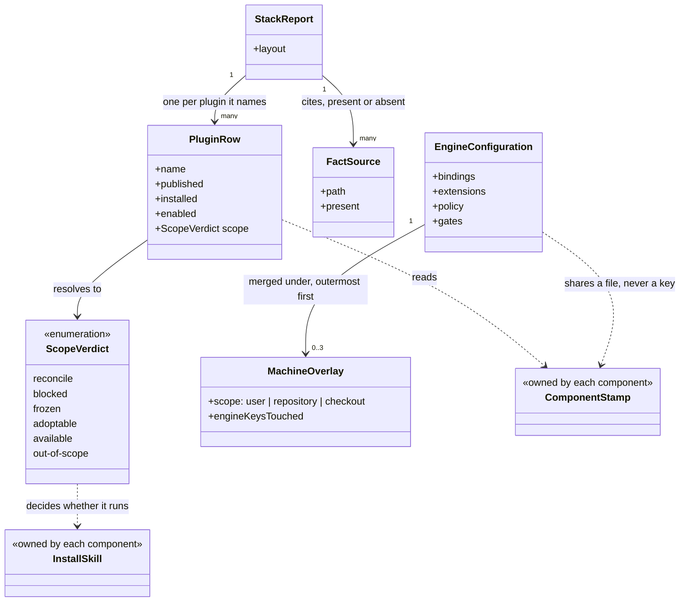

# Devbook Config

```meta
type: model
related: [".devbook/domain/devbook-config/domain.md", ".devbook/arc42/05-building-block-view.md#config-plugin"]
```

> Structural view: what the report reads, what the four keys are, and where the line runs between
> what this context writes and what it only looks at. [flow.md](flow.md) has the update run.

## Model diagram



## Relationship notes

- **The two dashed edges into `ComponentStamp` are the whole boundary.** This context reads every
  stamp and writes none. `EngineConfiguration` and `ComponentStamp` share one file and never a
  key, which is what
  [one config file, two kinds of key](../../arc42/adr/10-one-config-file-two-kinds-of-key.md)
  means in a diagram.
- **`ScopeVerdict` decides whether an install skill runs and never runs one itself.** The fan-out
  is a delegation, so a component's install skill remains the only thing that knows what that
  component materialized.
- **`FactSource` is associated with the report rather than with a row, and it carries `present`.**
  A file that was absent still produces a source, which is what makes an empty table say "this was
  not there" rather than "there is nothing".
- **`PluginRow` names every plugin and depends on none.** A plugin it cannot find becomes a row
  reading `not installed` — the same degrade-rather-than-fail shape the engine uses for an
  unbound role, applied to a report.
- **`EngineConfiguration` conforms to a schema this context does not own.** The four field names
  and their meanings are [Delivery](../delivery/model.md)'s; what this context owns is being the
  only writer of them.
- **Nothing in this model reads a devbook chapter.** It reads which folders exist and in which
  layout, and stops — writing a chapter is a flow's, which is why the adoption service reports
  and hands over.
