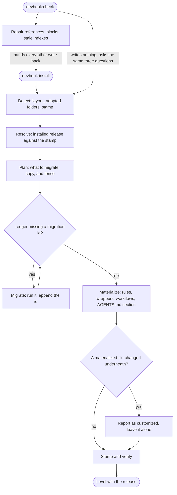
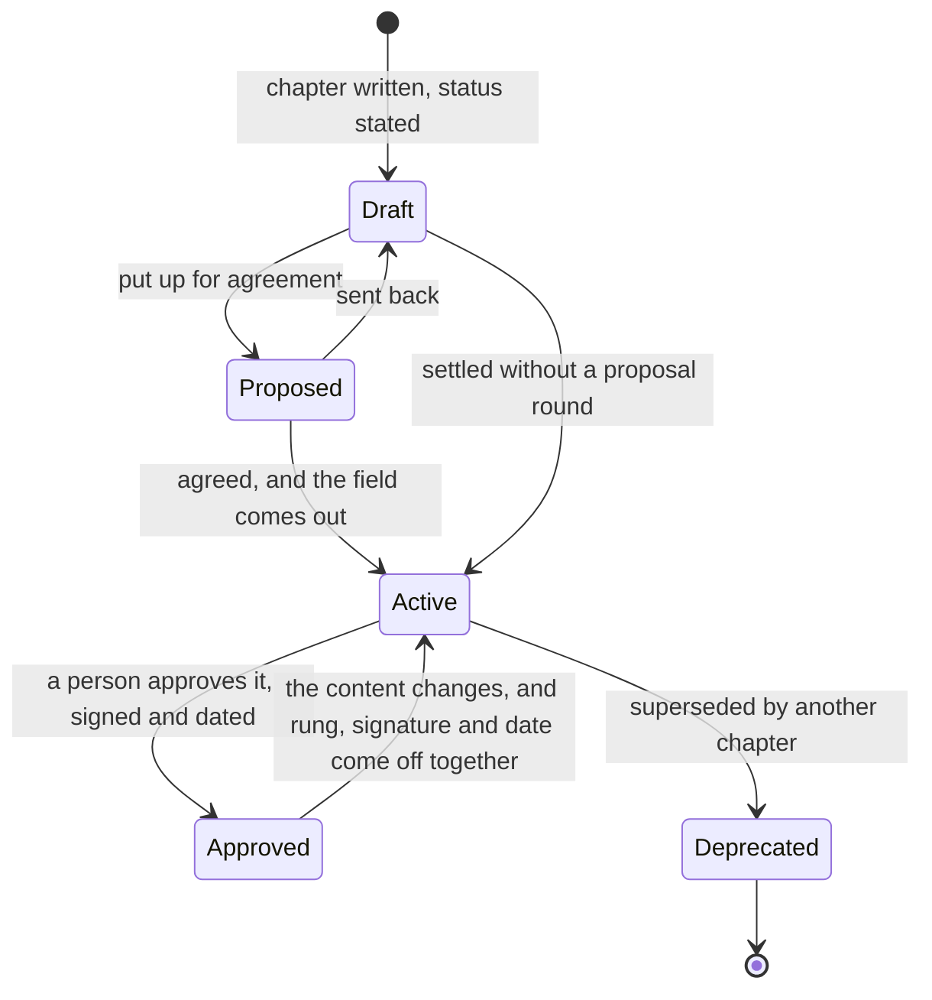
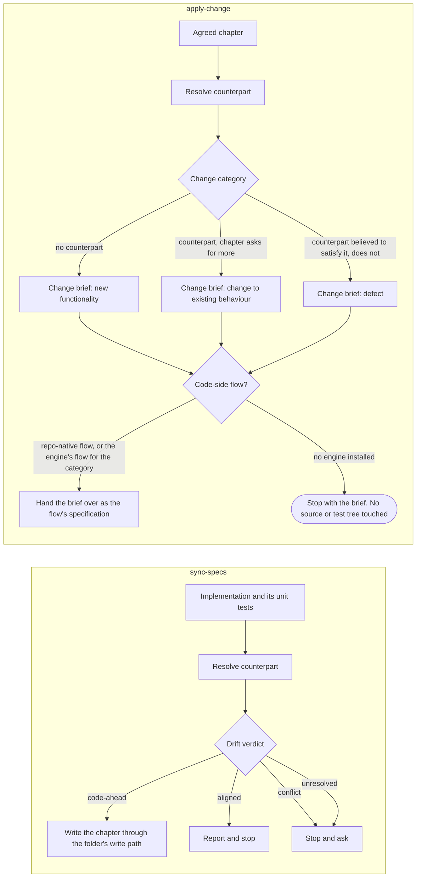

# Devbook

```meta
type: flow
related: [".devbook/domain/devbook/domain.md#reconciler", ".devbook/domain/devbook/domain.md#spec-converter", ".devbook/arc42/adr/38-an-install-is-not-a-sync.md"]
```

> How the terms in [model.md](model.md) move: a repository taking the convention on and
> carrying it forward, a chapter changing its standing, and a chapter and its implementation
> catching up with each other.

## Reconciling a Repository

Six phases, one idempotent operation. The stamp is what tells first install from upgrade from a
change of adopted folders from an outstanding migration — never a version comparison, which is
what makes running it twice harmless.



- **The check half never writes what the install owns.** It repairs what it can prove — a
  broken reference, a malformed block, a field the schema no longer defines — and hands the
  rest back, because two writers for one file is how a reconcile stops being idempotent.
- **A customized file is reported, never overwritten.** An edit inside a marker-fenced section
  makes the next reconcile leave the section alone, which is the whole reason the markers are
  there.
- **A renamed payload path is a new key, not a moved one.** Reconcile resolves it as absent,
  creates it, and leaves the old file on disk unmanaged — recorded as
  [debt record 3](../../arc42/tdr/3-devbook-rename-has-no-migration.md).

## A Chapter's Standing

The `domain/` ladder, with the shared `approved` rung on top of it. `active` is the resting
value and is written by omitting the field, which is why the diagram's busiest state is the one
that says nothing.



- **Absence is the statement, not a gap.** Writing `status: active` explicitly is reported, so
  one state never ends up with two spellings.
- **`approved` is of what was read, not of the heading.** It drops the moment the content
  changes, and `approved-by` and `approved-at` are written and deleted in the same change as
  the rung.
- **An open question is orthogonal to all of this.** A chapter carrying an open `kind: question`
  fence is not agreed whatever its status says, which is why a reader in review mode reads the
  fences and a reader loading task context skips them. The other kinds are remarks about a
  chapter that stands. `--check` reports only the contradiction — an `approved` chapter carrying
  an open question — because an open question is legal for the length of a branch.

## Catching Up With the Code

Two directions, and the direction is decided by which side already exists. Neither one guesses:
an unresolved counterpart is reported as unresolved, and a conflict stops and asks. Both open
with the same resolve-and-verdict step, and `verify-change` is that step on its own — the
report table, no write in either direction.



- **`apply-change` reads code without changing it.** Establishing what is already there is what
  lets the brief ask only for the delta, and it is why the update case can name where the
  current behaviour lives.
- **The brief goes where the chapter goes.** The code-side write resolves like the spec-side one:
  a repo-native `flow-*` skill first, then the engine's flow for the code —
  `flow-code`, which derives its kind from the category — and nowhere when no engine is installed, where the
  run stops with the brief and which flow picks it up is the user's decision. No flow knows these
  skills exist; a brief reaches one as ordinary input, so the dependency still runs one way.
- **A term chapter has no pair of its own.** Each capture pass that resolves a counterpart by
  inference proposes the discovered code name as an alias, which turns a one-off inference into
  a pairing the next pass can use.
- **An open invariant row does not stop a chapter being `active`**, and it does stop that one
  rule being built: the brief names it as needing a decision rather than briefing a rule nobody
  agreed.
- **Each converter carries the annotation prohibition itself.** `sync-specs` never writes a
  fence, `apply-change` never carries one into a brief, and both say so in their own `Do not`
  section. The session-start prompt states the reading rule; a writing rule has to be at the point
  of use to survive the session that reaches it.
