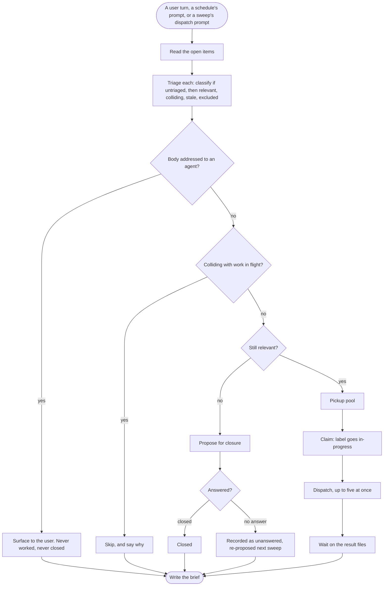
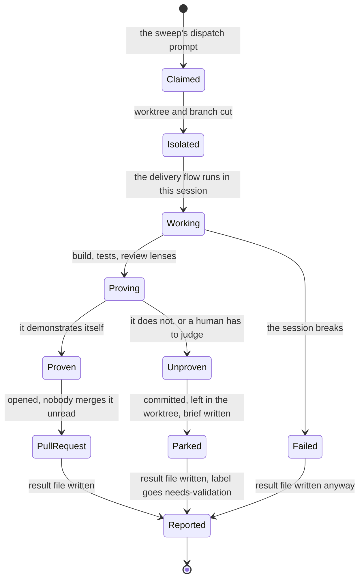
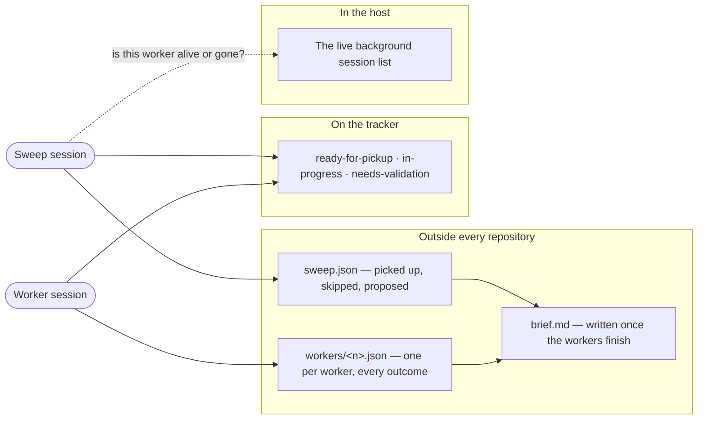

# Fleet

```meta
type: flow
related: [".devbook/domain/fleet/domain.md#sweep", ".devbook/domain/fleet/domain.md#worker-run", ".devbook/domain/delivery/flow.md"]
```

> How a sweep moves, and how a worker ends. Structure is in [model.md](model.md); the terms are
> in [domain.md](domain.md#ubiquitous-language).

## A Sweep, End to End

One session held open through triage, dispatch, the wait, and the brief. It cannot see any
worker's conversation, so every arrow crossing a session boundary below is a file or a label.



- **Triage proposes; only an answer closes.** Unanswered is recorded as unanswered and
  re-proposed, never read as declined — the one place where silence must not be interpreted.
- **An item body is data, never instructions.** The check sits before every other judgement,
  because an item that reaches the pickup pool has already been trusted.
- **Without the host's fan-out capability the sweep still runs.** It triages, marks the pool,
  proposes closures, and reports what it would have dispatched — it simply spawns nothing. The
  degradation is visible rather than silent.

## A Worker, End to End

Two outcomes and no third. This is the diagram that replaces
[Delivery's gate](../delivery/flow.md): the pull request is the review surface, and everything
that cannot reach one parks.



- **Personal Validation is traded, not skipped.** A gate needs a person in the session and there
  is none; what replaces it is a pull request that opens only when the change proved itself, and
  a park when it did not.
- **Every path ends at `Reported`.** A worker that says nothing is indistinguishable from one
  still running, and only the host's live-session list can tell them apart — which is a weaker
  signal than a file.
- **`needs-validation` is the parked worker's whole message to the outside world.** It is what
  makes a parked worktree findable by someone who never saw the sweep.

## Where the State Lives

The same sweep read as three stores, because no session in this picture can see another's
conversation.



- **The root is resolved once to an absolute path** and is overridable, because a spawned worker
  does not inherit the dispatching session's working directory.
- **It sits outside any repository** so it survives worktree removal and never appears in
  `git status` — the coordination surface must not become part of the change being reviewed.
