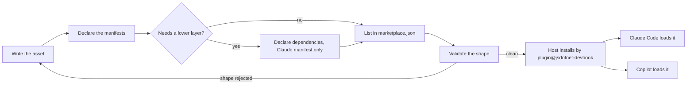
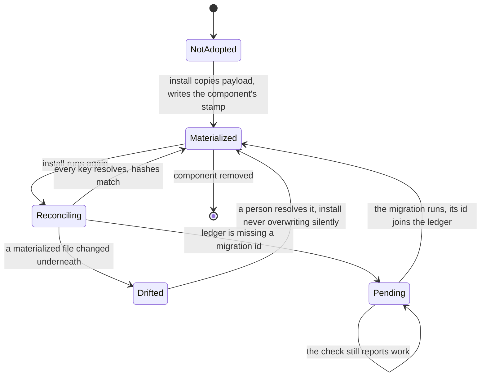
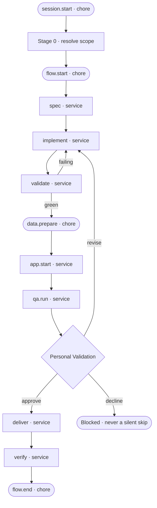

# Plugin Authoring

```meta
type: flow
related: [".devbook/domain/plugin-authoring/domain.md#stamp", ".devbook/domain/plugin-authoring/domain.md#migration", ".devbook/domain/plugin-authoring/domain.md#extension-point", ".devbook/domain/plugin-authoring/domain.md#gate", ".devbook/arc42/05-building-block-view.md#plugin-folder"]
```

> How the terms in [model.md](model.md) move over time: a file becoming something a host
> loads, payload becoming state in somebody else's repository, and the run a flow skill
> describes. Structure lives in `model.md`; responsibilities and boundary live in
> [domain.md](domain.md).

## Authoring an Asset

A file is written once and read by two hosts, so the lifecycle has one authoring step and two
independent load paths. Nothing is assembled in between — there is no build — which is why the
only place a mistake can be caught before a consumer's install is the authoring host itself.



- A plugin folder that never reaches `marketplace.json` does not exist to a host, so the list
  step is the one that cannot be skipped for a plugin meant to be installed. `delivery-surface-canvas`
  skips it deliberately: it is a Copilot canvas extension and reaches its host another way.
- The two load paths never rejoin. A shape one host rejects is fatal there and invisible on the
  other, which is what makes authoring in a host the practice recorded in
  [.devbook/ai/01-author.md](../../ai/01-author.md#claude-code-as-authoring-host).
- The loop through `check` is the whole verification story today. Whether a skill *triggers* is
  not on this path — see [.devbook/ai/03-validate.md](../../ai/03-validate.md#plugin-evaluation).

## Materializing a Component

The one flow whose state persists outside this repository. A [stamp](domain.md#stamp) is the
consuming repository's record of what a plugin put there, and it is read by presence — a
missing key means *absent*, never *older*.



- **The ledger decides whether a migration runs, never a version comparison.** A repository
  that skipped three releases replays the ids it lacks, in order, and a repository that already
  ran one never runs it twice — which is what `--check` is for.
- **A renamed payload path is a new key, not a moved one.** Reconcile resolves it as absent and
  creates it while the old file stays on disk unmanaged; that is exactly
  [debt record 3](../../arc42/tdr/3-devbook-rename-has-no-migration.md), and this transition is
  where it bites.
- Nobody writes another owner's key. The engine keys and each `components.<name>` stamp move
  through this flow independently, so two components are never mid-migration as one thing.

## A Flow Run

What a [flow skill](domain.md#flow-skill) does with the closed set of
[extension points](domain.md#extension-point), in one session. Services are on the spine;
chores hang off it and may never move it.



- **The gate is the only place a run stops for a human, and configuration may only add more.**
  It sits before `deliver` and never inside it, so approval is a recorded decision rather than
  a step a provider can perform on its own behalf.
- `implement` and `validate` are the only cycle. It is bounded by the flow, not by the providers,
  which is why the two commonly bind to one provider and resolve their model per stage.
- `verify` is the last service, after `deliver`, and repairs nothing: the change set against the
  specification the run built on and the chapters it touches, one verdict per item, reported
  where the reviewer reads.
- **A point with no provider costs capability, not the run.** Unbound, `spec` is written inline
  and `deliver` produces file artifacts only; the run continues and says so once.
- Whether the surface renders any of this is resolved from the live tool list, and none
  answering is normal — the file artifacts are written either way.
- The documentation tier of flows runs the same picture without `implement`, `validate`,
  `data.prepare`, `app.start`, `qa.run`, and `verify`: gate, then `deliver`. The tier a bridge plugin's
  flow declares is its own, because the engine may not name a skill in a layer above it.
- An unattended run does not have this shape at the gate. It **parks** with a handoff brief and
  never self-approves, which is the boundary between a flow and a [fleet skill](domain.md#fleet-skill).
