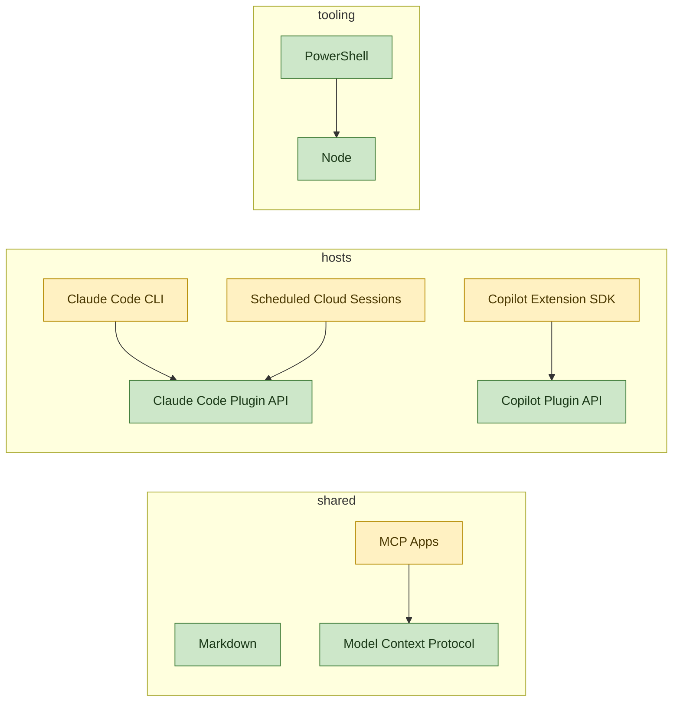

# Technology Graph

```meta
status: adopted
index: root
```

Everything this repository builds with. There is no runtime and no dependency manifest here:
the assets are Markdown and JSON, and the platforms below are what reads them. The
technologies themselves live one chapter each in the layer files; this file is the map.

## Layers

| File | Covers |
| --- | --- |
| [shared.md](shared.md) | Cross-layer formats and protocols: Markdown, the Model Context Protocol, MCP Apps. |
| [hosts.md](hosts.md) | The platforms that read or run an asset: the two plugin APIs, the Claude Code CLI, the scheduler `delivery-schedule` drives, and the Copilot extension SDK the canvases import. |
| [tooling.md](tooling.md) | What the executable parts run on: Node, PowerShell. |

Three layers is the whole stack. A fourth appears only when a technology genuinely belongs to
none of these, and it is registered in this table in the same change that adds its file.

## Graph

Nodes are technologies, edges are `depends-on`, shading is `status`. Five edges is the honest
count: almost everything here is read by a host rather than built on another technology.



## How to Read It

`status` rates a technology in this repository, on the radar ladder `candidate`, `trial`,
`adopted`, `hold`, `retired`. The four `trial` entries are `trial` for the same reason: nothing
here has exercised them yet, and each says what a first real run would test.

To add a technology, write its `##` chapter in the layer file it belongs to, with `status`,
`type`, and any `depends-on` edges, then add its node and edges to the graph above in the same
change. To change a rating, change it in the chapter and in the `class` line here together.
The generated `_meta/graph.json` beside this file is derived from the chapters, never from
this diagram, so when the two disagree the diagram is what is stale.
