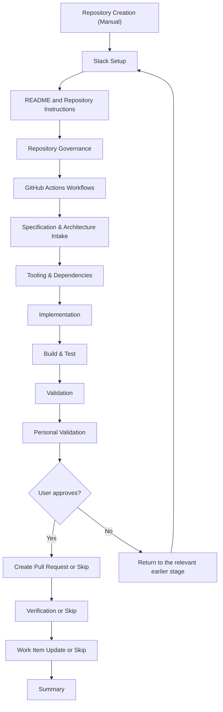
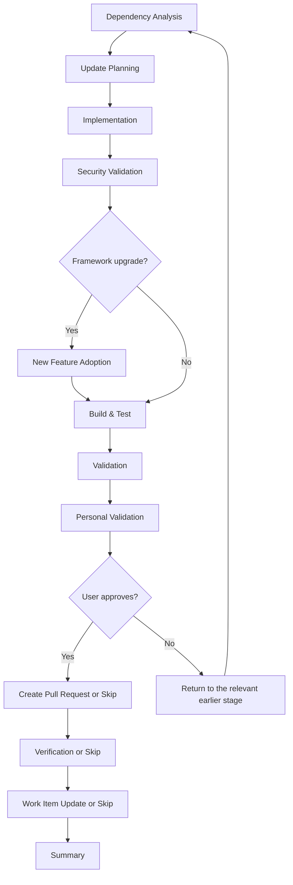
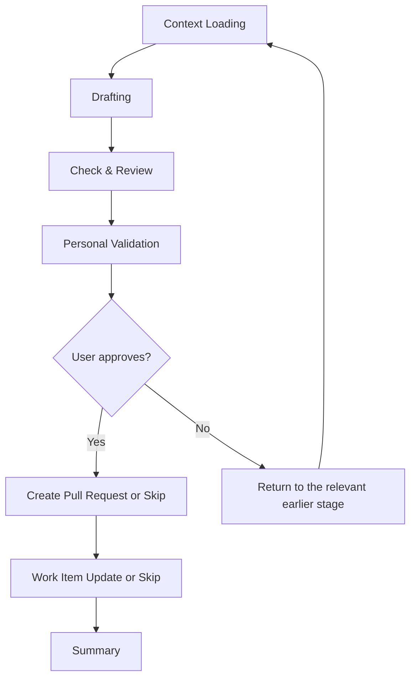
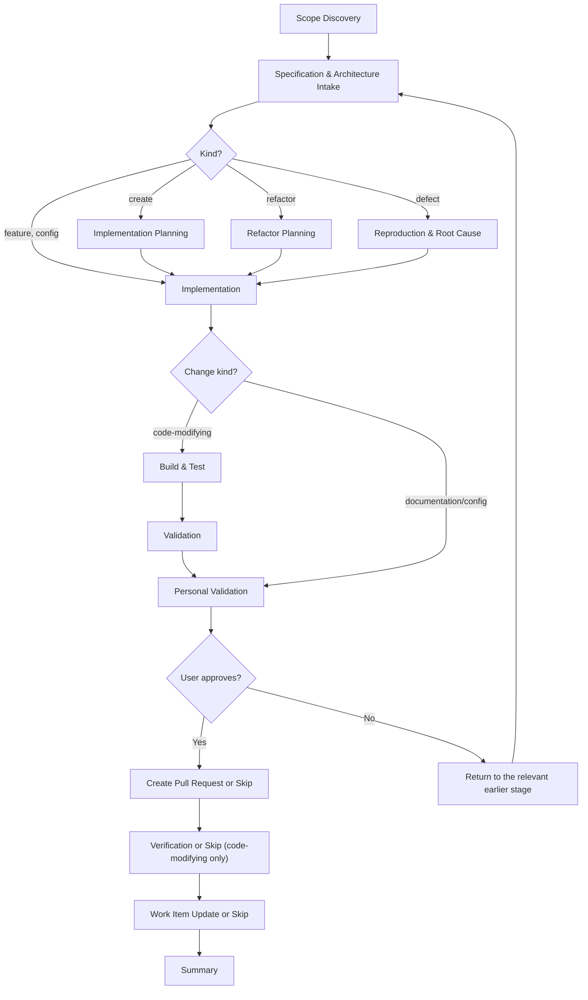

# Flow Diagrams

Every flow this plugin ships, drawn once. This keeps the
individual `SKILL.md` files focused on execution rules while preserving one reviewable
overview of stage order, approval gates, and PR handoff points.

Every diagram below starts at the flow's own first stage. **Update Base** runs before it in
every flow — the engine prepends that phase, so no diagram and no `SKILL.md` repeats it. See
**Phase: Update Base** in `resources/flow-phases.md`.

The **MCP servers** column names the engine's default servers by id, and *servers bound to a
point* for whatever the repository binds under `bindings["delivery.mcp"]` — none of which this
plugin ships. See **MCP Server Strategy** in `resources/flow-execution-model.md`.

## flow-project

| Phase | Roles & services | MCP servers |
|-------|--------|-------------|
| Repository Creation (Manual) | — | — |
| Stack Setup | the `implement` service, running `devbook-config:setup` | — |
| README and Repository Instructions | the `docs` role, the `implement` service | servers bound to `spec` |
| Repository Governance | *(default)*, through the `pr-lane` slot | servers bound to `spec` |
| GitHub Actions Workflows | the `implement` service | — |
| Specification & Architecture Intake | the `architecture` role | servers bound to `spec` |
| Tooling & Dependencies | the `implement` service | `microsoft-learn` |
| Implementation | the `implement` service | `microsoft-learn` |
| Build & Test | the `implement` service | `microsoft-learn` *(targeted remediation only)* |
| Validation | the `qa.run` provider, the runtime monitor, `aspire` | `playwright` *(capture for new functionality only)* |
| Personal Validation | — | — |
| Create Pull Request | *(default)* | — |
| Verification | the `verify` provider, or *(default)* | servers bound to `verify` |
| Work Item Update | *(default)* | — |
| Summary | `flow-runner` agent | — |

## flow-update-packages

| Phase | Roles & services | MCP servers |
|-------|--------|-------------|
| Dependency Analysis | the `implement` service | `microsoft-learn` |
| Update Planning | the `implement` service; the `architecture` role for a framework upgrade | `microsoft-learn` |
| Implementation | the `implement` service | `microsoft-learn` |
| Security Validation | the `implement` service | — |
| New Feature Adoption *(framework upgrade)* | the `implement` service, the `architecture` role | `microsoft-learn` |
| Build & Test | the `implement` service | `microsoft-learn` *(targeted remediation only)* |
| Validation | the `qa.run` provider, the runtime monitor, `aspire` | `playwright` *(smoke checks for a framework upgrade; otherwise only when new user-facing behavior is introduced)* |
| Personal Validation | — | — |
| Create Pull Request | *(default)* | — |
| Verification | the `verify` provider, or *(default)* | servers bound to `verify` |
| Work Item Update | *(default)* | — |
| Summary | `flow-runner` agent | — |

## flow-spec

| Phase | Roles & services | MCP servers |
|-------|--------|-------------|
| Context Loading | — | servers bound to `spec` |
| Drafting | the role the folder maps to — `architecture` for `arc42/` and `tech/`, `domain`, `ux` for `design/`, `docs` for `ai/` | servers bound to `spec` *(design source for `design/`)* |
| Check & Review | the same role | — |
| Personal Validation | — | — |
| Create Pull Request | *(default)* | — |
| Work Item Update | *(default)* | — |
| Summary | `flow-runner` agent | — |

## flow-code

| Phase | Roles & services | MCP servers |
|-------|--------|-------------|
| Scope Discovery | `flow-runner` agent, optionally the `architecture` role | servers bound to `spec` |
| Specification & Architecture Intake | the `architecture` role; the `domain` role when a create crosses a context boundary | servers bound to `spec` |
| Implementation Planning *(create)* | the `architecture` role | — |
| Refactor Planning *(refactor)* | the `architecture` role, the `implement` service | — |
| Reproduction & Root Cause *(defect)* | the `implement` service, the `app.start` service | `aspire` |
| Implementation | the `implement` service | `microsoft-learn` |
| Build & Test | the `implement` service | `microsoft-learn` *(targeted remediation only)* |
| Validation | the `qa.run` provider, the runtime monitor, `aspire` | `playwright` *(capture for new functionality only)* |
| Personal Validation | — | — |
| Create Pull Request | *(default)* | — |
| Verification | the `verify` provider, or *(default)* | servers bound to `verify` |
| Work Item Update | *(default)* | — |
| Summary | `flow-runner` agent | — |
