# Flow Diagrams

Every flow this plugin ships, drawn once. This keeps the
individual `SKILL.md` files focused on execution rules while preserving one reviewable
overview of stage order, approval gates, and PR handoff points.

Every diagram below starts at the flow's own first stage. **Update Base** runs before it in
every flow — the engine prepends that phase, so no diagram and no `SKILL.md` repeats it. See
**Phase: Update Base** in `resources/flow-phases.md`.

The **MCP servers** column names the engine's default servers by id, and *servers bound to a
point* for whatever the repository binds under `bindings["delivery.mcp"]` — none of which this
plugin ships. See **MCP Server Strategy** in `resources/flow-execution-model.md`.

## flow-repo

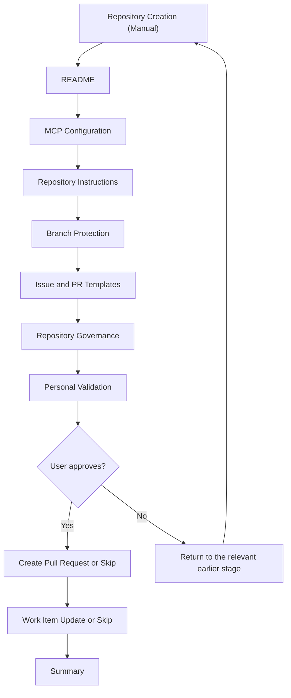

| Phase | Roles & services | MCP servers |
|-------|--------|-------------|
| Repository Creation (Manual) | — | — |
| README | the `docs` role, default agent | — |
| MCP Configuration | Default agent | writes `bindings["delivery.mcp"]` |
| Repository Instructions | Default agent | servers bound to `spec` |
| Branch Protection | Default agent | — |
| Issue and PR Templates | Default agent | servers bound to `spec` |
| Repository Governance | Default agent | — |
| Personal Validation | — | — |
| Create Pull Request | *(default)* | — |
| Work Item Update | *(default)* | — |
| Summary | `flow-runner` agent | — |

## flow-project

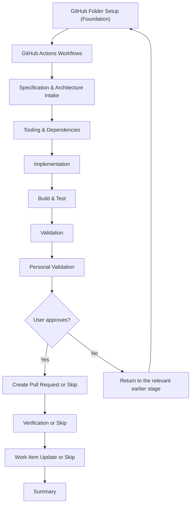

| Phase | Roles & services | MCP servers |
|-------|--------|-------------|
| GitHub Folder Setup (Foundation) | the `implement` service | servers bound to `implement` |
| GitHub Actions Workflows | the `implement` service | — |
| Specification & Architecture Intake | the `architecture` role | servers bound to `spec` |
| Tooling & Dependencies | the `implement` service | `microsoft-learn` |
| Implementation | the `implement` service | `microsoft-learn` |
| Build & Test | the `implement` service | `microsoft-learn` *(targeted remediation only)* |
| Validation | the `qa.run` provider, the runtime monitor, `aspire` | `playwright` *(capture for new functionality only)* |
| Personal Validation | — | — |
| Create Pull Request | *(default)* | — |
| Verification | the `verify` provider, or *(default)* | servers bound to `verify` |
| Work Item Update | *(default)* | — |
| Summary | `flow-runner` agent | — |

## flow-create-mvp

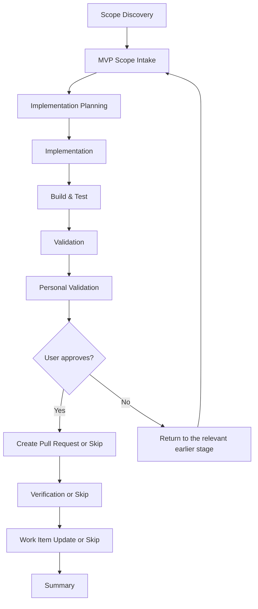

| Phase | Roles & services | MCP servers |
|-------|--------|-------------|
| Scope Discovery | `flow-runner` agent, optionally the `architecture` role | servers bound to `spec` |
| MVP Scope Intake | the `architecture` role | servers bound to `spec` |
| Implementation Planning | the `architecture` role | — |
| Implementation | the `implement` service | `microsoft-learn` |
| Build & Test | the `implement` service | `microsoft-learn` *(targeted remediation only)* |
| Validation | the `qa.run` provider, the runtime monitor, `aspire` | `playwright` *(capture for new functionality only)* |
| Personal Validation | — | — |
| Create Pull Request | *(default)* | — |
| Verification | the `verify` provider, or *(default)* | servers bound to `verify` |
| Work Item Update | *(default)* | — |
| Summary | `flow-runner` agent | — |

## flow-update-packages

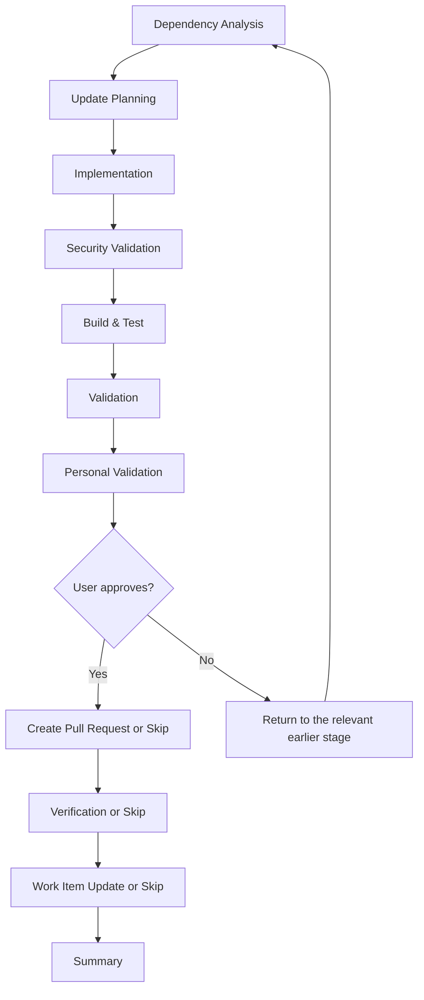

| Phase | Roles & services | MCP servers |
|-------|--------|-------------|
| Dependency Analysis | the `implement` service | `microsoft-learn` |
| Update Planning | the `implement` service | — |
| Implementation | the `implement` service | `microsoft-learn` |
| Security Validation | the `implement` service | — |
| Build & Test | the `implement` service | `microsoft-learn` *(targeted remediation only)* |
| Validation | the `qa.run` provider, the runtime monitor, `aspire` | `playwright` *(only when new user-facing behavior is introduced)* |
| Personal Validation | — | — |
| Create Pull Request | *(default)* | — |
| Verification | the `verify` provider, or *(default)* | servers bound to `verify` |
| Work Item Update | *(default)* | — |
| Summary | `flow-runner` agent | — |

## flow-aspire-update

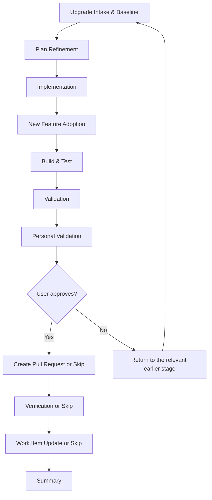

| Phase | Roles & services | MCP servers |
|-------|--------|-------------|
| Upgrade Intake & Baseline | the `implement` service | `microsoft-learn` |
| Plan Refinement | the `architecture` role | `microsoft-learn` |
| Implementation | the `implement` service | `microsoft-learn` |
| New Feature Adoption | the `implement` service, the `architecture` role | `microsoft-learn` |
| Build & Test | the `implement` service | `microsoft-learn` *(targeted remediation only)* |
| Validation | the `qa.run` provider, the runtime monitor, `aspire` | `playwright` *(capture only for adopted new functionality)* |
| Personal Validation | — | — |
| Create Pull Request | *(default)* | — |
| Verification | the `verify` provider, or *(default)* | servers bound to `verify` |
| Work Item Update | *(default)* | — |
| Summary | `flow-runner` agent | — |

## flow-arc42

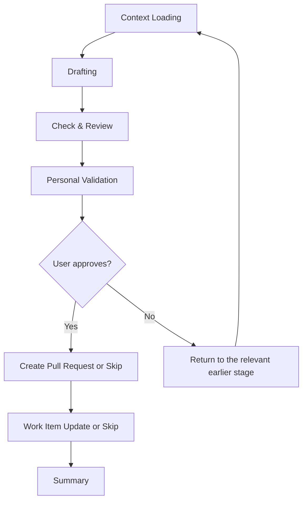

| Phase | Roles & services | MCP servers |
|-------|--------|-------------|
| Context Loading | — | servers bound to `spec` |
| Drafting | the `architecture` role | — |
| Check & Review | the `architecture` role | — |
| Personal Validation | — | — |
| Create Pull Request | *(default)* | — |
| Work Item Update | *(default)* | — |
| Summary | `flow-runner` agent | — |

## flow-domain

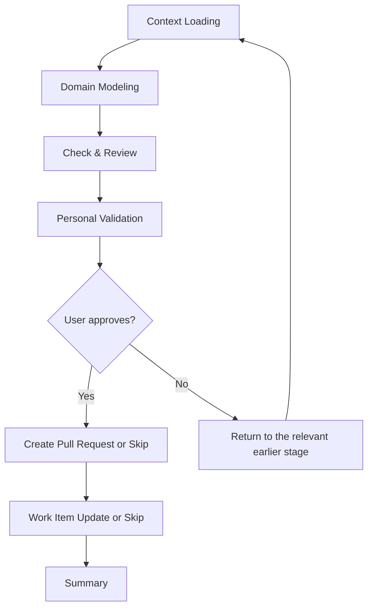

| Phase | Roles & services | MCP servers |
|-------|--------|-------------|
| Context Loading | — | — |
| Domain Modeling | the `domain` role | — |
| Check & Review | the `domain` role | — |
| Personal Validation | — | — |
| Create Pull Request | *(default)* | — |
| Work Item Update | *(default)* | — |
| Summary | `flow-runner` agent | — |

## flow-tech

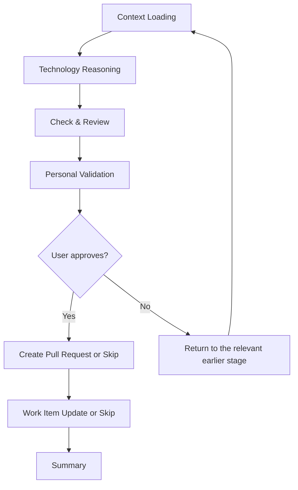

| Phase | Roles & services | MCP servers |
|-------|--------|-------------|
| Context Loading | — | — |
| Technology Reasoning | the `architecture` role | — |
| Check & Review | the `architecture` role | — |
| Personal Validation | — | — |
| Create Pull Request | *(default)* | — |
| Work Item Update | *(default)* | — |
| Summary | `flow-runner` agent | — |

## flow-design

| Phase | Roles & services | MCP servers |
|-------|--------|-------------|
| Context Loading | — | — |
| Authoritative Grounding | — | servers bound to `spec` |
| Design Authoring | the `ux` role | — |
| Check & Review | the `ux` role | — |
| Personal Validation | — | — |
| Create Pull Request | *(default)* | — |
| Work Item Update | *(default)* | — |
| Summary | `flow-runner` agent | — |

## flow-ai

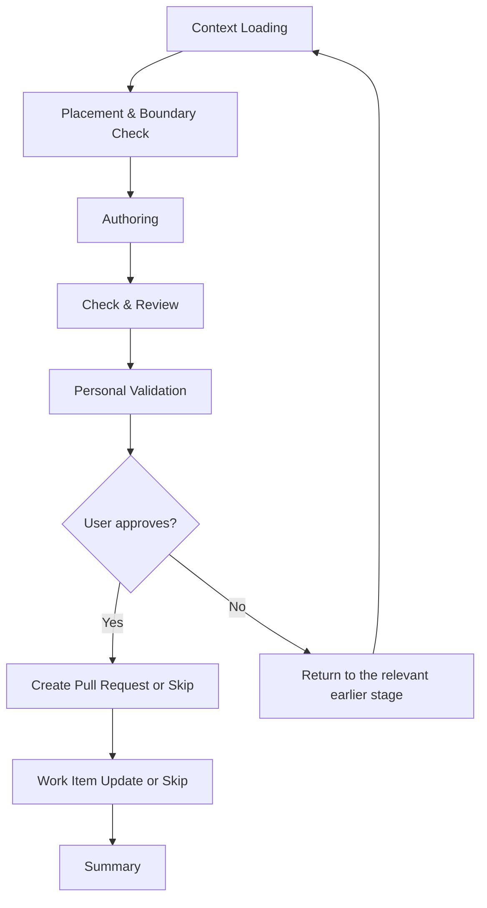

| Phase | Roles & services | MCP servers |
|-------|--------|-------------|
| Context Loading | — | — |
| Placement & Boundary Check | — | — |
| Authoring | the `docs` role | — |
| Check & Review | the `docs` role | — |
| Personal Validation | — | — |
| Create Pull Request | *(default)* | — |
| Work Item Update | *(default)* | — |
| Summary | `flow-runner` agent | — |

## flow-feature

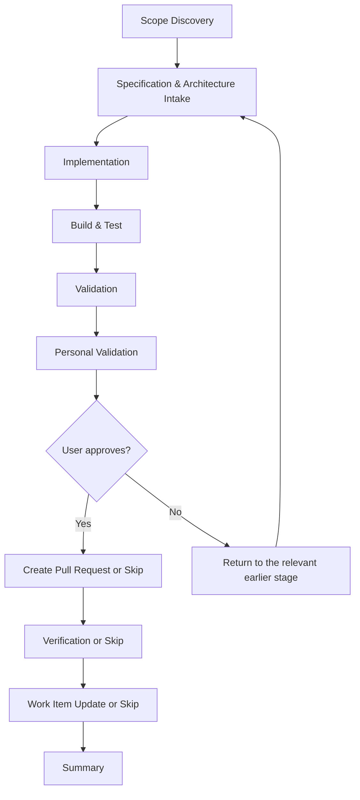

| Phase | Roles & services | MCP servers |
|-------|--------|-------------|
| Scope Discovery | `flow-runner` agent, optionally the `architecture` role | servers bound to `spec` |
| Specification & Architecture Intake | the `architecture` role | servers bound to `spec` |
| Implementation | the `implement` service | `microsoft-learn` |
| Build & Test | the `implement` service | `microsoft-learn` *(targeted remediation only)* |
| Validation | the `qa.run` provider, the runtime monitor, `aspire` | `playwright` *(capture for new functionality only)* |
| Personal Validation | — | — |
| Create Pull Request | *(default)* | — |
| Verification | the `verify` provider, or *(default)* | servers bound to `verify` |
| Work Item Update | *(default)* | — |
| Summary | `flow-runner` agent | — |

## flow-bug

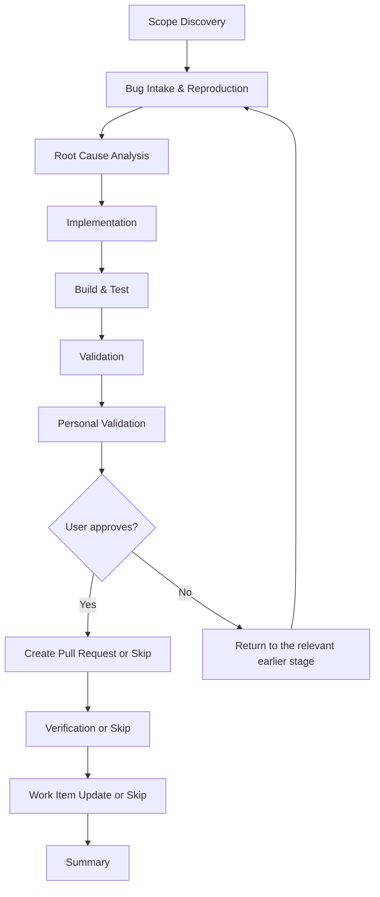

| Phase | Roles & services | MCP servers |
|-------|--------|-------------|
| Scope Discovery | `flow-runner` agent, optionally the `architecture` role | servers bound to `spec` |
| Bug Intake & Reproduction | the `implement` service, the `qa.run` provider (runtime repro) | — |
| Root Cause Analysis | the `implement` service | — |
| Implementation | the `implement` service | `microsoft-learn` |
| Build & Test | the `implement` service | `microsoft-learn` *(targeted remediation only)* |
| Validation | the `qa.run` provider, the runtime monitor, `aspire` | `playwright` *(capture only when needed for failure or on request)* |
| Personal Validation | — | — |
| Create Pull Request | *(default)* | — |
| Verification | the `verify` provider, or *(default)* | servers bound to `verify` |
| Work Item Update | *(default)* | — |
| Summary | `flow-runner` agent | — |

## flow-structure

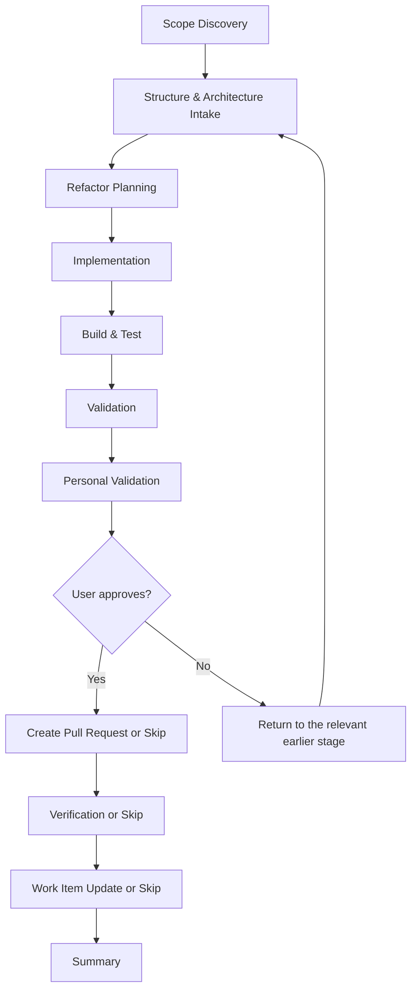

| Phase | Roles & services | MCP servers |
|-------|--------|-------------|
| Scope Discovery | `flow-runner` agent, optionally the `architecture` role | servers bound to `spec` |
| Structure & Architecture Intake | the `architecture` role | servers bound to `spec` |
| Refactor Planning | the `architecture` role, the `implement` service | — |
| Implementation | the `implement` service | `microsoft-learn` *(targeted remediation only)* |
| Build & Test | the `implement` service | `microsoft-learn` *(targeted remediation only)* |
| Validation | the `qa.run` provider, the runtime monitor, `aspire` | `playwright` *(targeted validation when a runnable surface exists)* |
| Personal Validation | — | — |
| Create Pull Request | *(default)* | — |
| Verification | the `verify` provider, or *(default)* | servers bound to `verify` |
| Work Item Update | *(default)* | — |
| Summary | `flow-runner` agent | — |

## flow-create-module

| Phase | Roles & services | MCP servers |
|-------|--------|-------------|
| Scope Discovery | `flow-runner` agent, optionally the `architecture` role | servers bound to `spec` |
| Specification Intake | the `architecture` role | servers bound to `spec` |
| Implementation Planning | the `architecture` role | — |
| Implementation | the `implement` service | `microsoft-learn` |
| Build & Test | the `implement` service | `microsoft-learn` *(targeted remediation only)* |
| Validation | the `qa.run` provider, the runtime monitor, `aspire` | `playwright` *(capture for new functionality only)* |
| Personal Validation | — | — |
| Create Pull Request | *(default)* | — |
| Verification | the `verify` provider, or *(default)* | servers bound to `verify` |
| Work Item Update | *(default)* | — |
| Summary | `flow-runner` agent | — |

## flow-create-service

| Phase | Roles & services | MCP servers |
|-------|--------|-------------|
| Scope Discovery | `flow-runner` agent, optionally the `architecture` role | servers bound to `spec` |
| Specification Intake | the `architecture` role | servers bound to `spec` |
| Implementation Planning | the `architecture` role | — |
| Implementation | the `implement` service | `microsoft-learn` |
| Build & Test | the `implement` service | `microsoft-learn` *(targeted remediation only)* |
| Validation | the `qa.run` provider, the runtime monitor, `aspire` | `playwright` *(capture for new functionality only)* |
| Personal Validation | — | — |
| Create Pull Request | *(default)* | — |
| Verification | the `verify` provider, or *(default)* | servers bound to `verify` |
| Work Item Update | *(default)* | — |
| Summary | `flow-runner` agent | — |

## flow-fallback

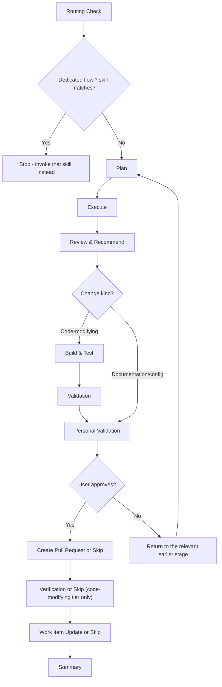

| Phase | Roles & services | MCP servers |
|-------|--------|-------------|
| Routing Check | `flow-runner` agent | — |
| Plan | The closest specialist agent for the task category | servers bound to `spec` *(when the task touches governed assets)* |
| Execute | The closest specialist agent for the task category | `microsoft-learn` *(targeted lookups only)* |
| Review & Recommend | The closest specialist agent for the task category | — |
| Build & Test | the `implement` service *(code-modifying change kind only)* | `microsoft-learn` *(targeted remediation only)* |
| Validation | the `qa.run` provider, the runtime monitor, `aspire` *(code-modifying change kind only)* | `playwright` *(targeted validation when a runnable surface exists)* |
| Personal Validation | — | — |
| Create Pull Request | *(default)* | — |
| Verification | the `verify` provider, or *(default)* *(code-modifying change kind only)* | servers bound to `verify` |
| Work Item Update | *(default)* | — |
| Summary | `flow-runner` agent | — |
